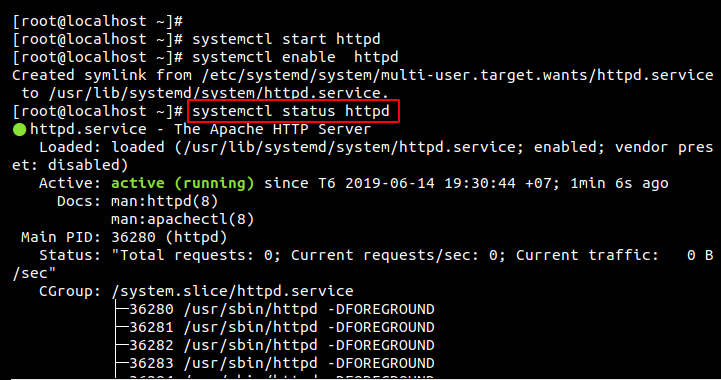
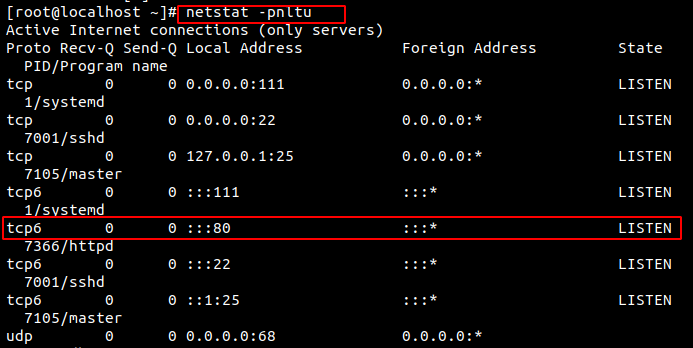

# HTTPD ( Hypertext Transfer Protocol daemon )

- Apache là phần mềm web server miễn phí mã nguồn mở, hiện đang là một trong những web server được sử dụng phổ biến trên thế giới. Tên chính thức của Apache là Apache HTTP Server, được điều hành và phát triển bởi Apache Software Foundation.  
## 2. Cài đặt Apache trên CentOS7
Cài đặt Apache đơn giản chạy lệnh:
```
sudo yum -y install httpd
```

Cấu hình Apache để bắt đầu khởi động:
```
# systemctl start httpd

# systemctl enable httpd

# systemctl status httpd
```  


Xem dịch vụ httpd (apache) và mpm prefork đã start hay chưa dùng lệnh sau.
```
cat /etc/httpd/logs/error_log | grep prefork
```

 

```
netstat -tulpn 
```
 

Kết quả như trên là đã start thành công rồi, Module pmp prefork, apache đã chạy với pid 7366 , Web server đang lắng nghe trên port 80.

Để truy cập được web server ta cần cấu hình firewall allow web traffic : 

 ``` firewall-cmd --zone=public --add-port=80/tcp --permanent ```


