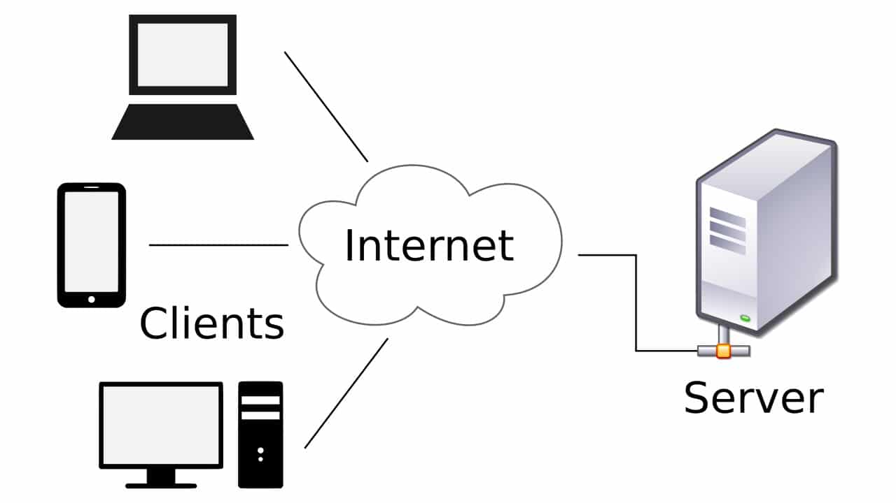

# Mục lục 

1. [Client server là gì](#a)
2. [Tìm hiểu về mô hình client server ?](#b)
3. [Mô hình client server hoạt động như thế nào?](#c)
4. [Ưu nhược điểm của mô hình client-server](#d)

<a name="a">

# Mô hình client - server </a>

## 1. Client server là gì ?

Server là gì: Là 1 hệ thống cung cấp các dịch vụ và xử lý dữ liệu trên một mạng máy tính hoặc trên môi trường internet.  

Client là gì : sử dụng các dịch vụ do server cung cấp.

Client server là một mô hình thông dụng trong mạng máy tính bao gồm 2 thành phần chính là máy chủ server và máy khách client

<b name="b">

## 2. Tìm hiểu về mô hình client server ? </b>

Trong mô hình client server thì máy khách là các máy tính, các thiết bị điện tử như máy in, máy fax,….các máy khách client gửi yêu cầu đến máy chủ server. máy chủ server tiếp nhận yêu cầu, xử lý các yêu cầu đó và trả về kết quả. 

Việc giao tiếp giữa Client và Server phải dựa trên các giao thức chuẩn. Các giao thức chuẩn được sử dụng phổ biến hiện nay là : giao thức TCP/IP, giao thức SNA của IBM, OSI,...

<c name="c">

## 3. Mô hình client server hoạt động như thế nào? </c>

Client sử dụng dịch vụ do server cung cấp  gửi 1 yêu cầu đến máy chủ (server), máy chủ nhận xử lý trả kết quả về cho client.

<d name="d">

## 4. Ưu nhược điểm của mô hình client-server</d>

### 4.1. Ưu điểm 

- Kiểm soát được lượng truy cập. 
- Quản lý tập trung: dữ liệu được lưu trữ tập trung trên server thay vì nằm rải rác trên nhiều máy, giúp đơn giản hóa việc truy xuất và cập nhật dữ liệu.
- Server có thể gửi yêu cầu cho server khác- Người dùng có thể sử dụng nhiều dịch vụ, do đó công việc tiến hành thuận lợi, dễ dàng.
- Hiệu suất mạng cao, tốc độ trao đổi dữ liệu trên mạng lớn.

### 4.2. Nhược điểm

- Đòi hỏi cấu hình của máy chủ phải cao- Nếu có quá nhiều client truy cập, server không thể cung cấp trả kết quả cho client, server có thể bị treo.
- Để đảm bảo tính an toàn trên mạng cho nên server này còn có vai trò như là một nhà quản lý toàn bộ quyền truy cập dữ liệu của các máy clients, nói cách khác đó là vai trò quản trị mạng.
- Tính bảo mật dữ liệu không cao.