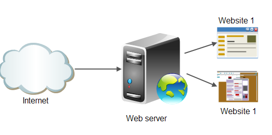

# Web Server
## 1. Khái niệm 

Máy chủ Web là máy chủ có dung lượng lớn, tốc độ cao, được dùng để lưu trữ thông tin như một ngân hàng dữ liệu, chứa những website đã được thiết kế cùng với những thông tin liên quan khác.

Tất cả các Web Server đều hiểu và chạy được các file *.htm và *.html. 

## 2. Đặc điểm web server
Web Server có khả năng gửi đến máy khách những trang Web thông qua môi trường Internet (hoặc Intranet) qua giao thức HTTP – giao thức được thiết kế để gửi các file đến trình duyệt Web (Web Browser), và các giao thức khác.  

Bất kỳ một máy tính – máy chủ nào cũng có thể trở thành một Web Server bởi việc cài đặt lên nó một chương trình phần mềm Server Software và sau đó kết nối vào Internet.

## 3. Nguyên tắc hoạt động của máy chủ web

Các bước cơ bản trong tiến trình truyền tải trang web đến màn hình của bạn được thể hiện theo mô hình sau:

Trình duyệt web tách địa chỉ website làm 3 phần:

- Tên giao thức: “http”

- Tên miền của máy chủ web: “http://nhanhoa.com.vn”

- Tên tệp HTML: “web-server.htm”  

a. Trình duyệt liên hệ với máy chủ tên miền (DNS Server) để chuyển đổi tên miền “http://nhanhoa.com.vn” ra địa chỉ IP tương ứng. Sau đó
trình duyệt sẽ gửi tiếp một kết nối tới máy chủ của website có địa chỉ IP này qua cổng 80

b. Trình duyệt yêu cầu URL đầy đủ: 
- Bây giờ trình duyệt web đã biết địa chỉ IP của trang web, nó có thể yêu cầu URL đầy đủ từ web server.
 
c. Web server gửi trang được yêu cầu   
- Web server phản hồi bằng cách gửi lại trang được yêu cầu. Nếu trang không tồn tại (hoặc có lỗi khác xảy ra), nó sẽ gửi lại thông báo lỗi thích hợp.

d.  Trình duyệt hiển thị trang web
- Trình duyệt web của bạn nhận được trang và hiển thị trang theo yêu cầu
