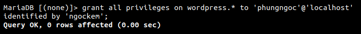
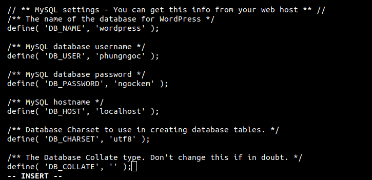
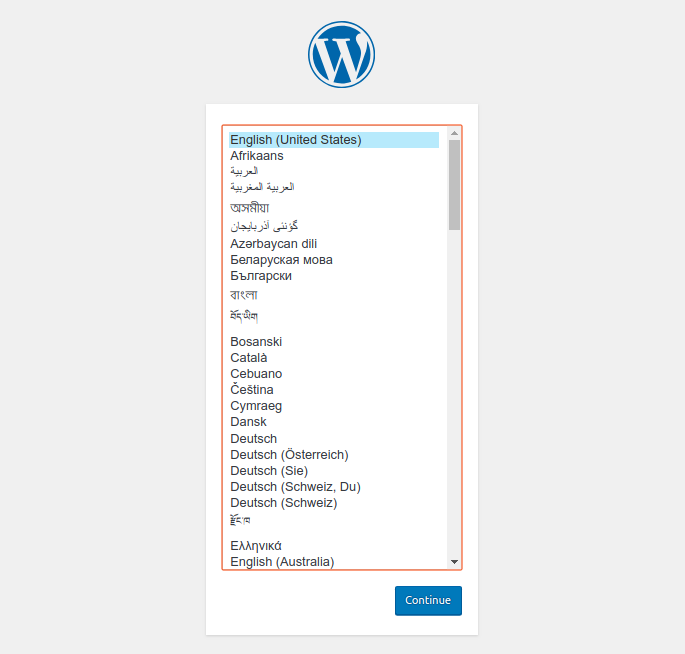
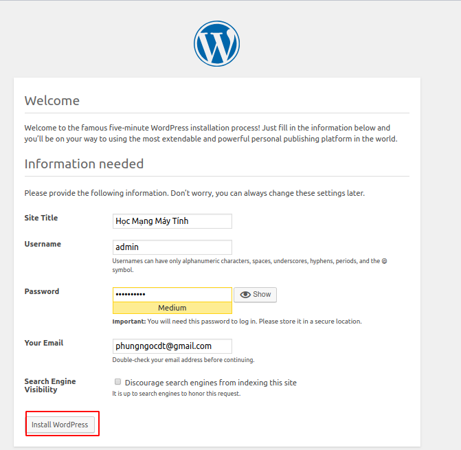
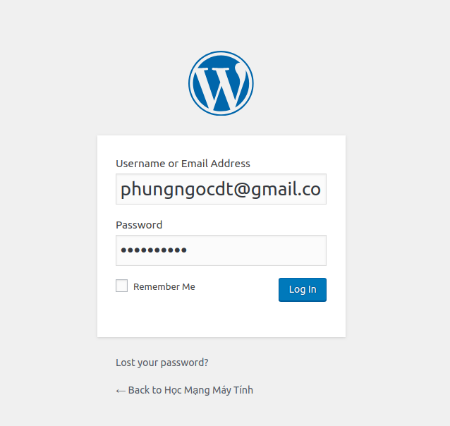
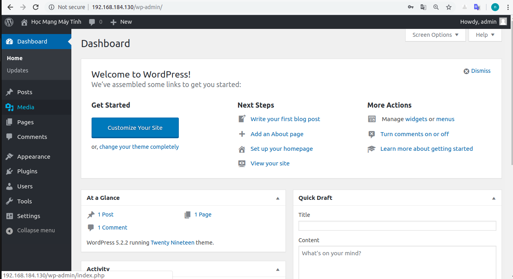

# Cài đặt và cấu hình WordPress với LAMP trên CentOS 7

# Mục lục

[1.Cài đặt LAMP(Linux, Apache, MySQL – MariaDB, PHP)](#a)  
[2.Cài đặt Wordpress](#b)  

<a name="a"></a>

# Cài đặt và cấu hình WordPress với LAMP trên CentOS 7

## 1. Cài đặt LAMP(Linux, Apache, MySQL – MariaDB, PHP)

### Apache 

#### Cài đặt Apache httpd
```
yum -y install httpd
```
### MySQL / MariaDB
#### Cài đặt và Cấu hình
1. Cài đặt gói máy chủ MariaDB:
```
yum -y install mariadb-server mariadb
```
2. Khởi động MariaDB
```
systemctl enable mariadb.service
systemctl start mariadb.service
```
3. Chạy lệnh `mysql_secure_installation` để bảo vệ MariaDB. Bạn sẽ được cung cấp tùy chọn để thay đổi mật khẩu root của MariaDB, xóa tài khoản người dùng ẩn danh, vô hiệu hóa đăng nhập root bên ngoài localhost và gỡ bỏ các cơ sở dữ liệu thử nghiệm và nạp lại quyền ưu tiên. Bạn nên trả lời yes cho các tùy chọn này:

```
mysql_secure_installation
```

### PHP
#### Cài đặt PHP
Thêm Remi repository CentOS.
```
rpm -Uvh http://rpms.remirepo.net/enterprise/remi-release-7.rpm
```
Cài đặt yum-utils vì chúng ta cần có tiện ích yum-config-manager.
```
yum -y install yum-utils
```
và chạy yum update để cập nhật
```
yum update
```
 Cài đặt PHP 7.0
Bạn có thể cài đặt PHP 7.0 và mô đun Apache PHP 7.0 như sau:
```
yum-config-manager --enable remi-php70
yum -y install php php-opcache
```
Khởi động lại Apache để áp dụng các thay đổi
```
systemctl restart httpd.service
```
### Hỗ trợ MySQL trong PHP

Để có được hỗ trợ MySQL trong PHP, chúng ta có thể cài đặt gói php71w-mysql  
Cài đặt chúng ta cần lệnh:
```
yum -y install php-mysql
```
Bây giờ hãy khởi động lại máy chủ web Apache:
```
systemctl restart httpd.service
```
Để kiểm tra phiên bản PHP đã cài đặt dùng lệch
```
php -v
```

<a name="b"></a>

## 2. Cài đặt Wordpress trên CentOS7
Vào thư mục /html của bạn trước khi tải về các tập tin wordpress mới nhất.
```
cd /var/www/html/
```
Và tải về các tập tin WordPress
```
wget https://wordpress.org/latest.tar.gz
```
Giải nén tập tin WordPress với đuôi *.tar.gz
```
tar xzvf latest.tar.gz
```
Và sau đó các bạn thiết lập quyền thích hợp cho các thư mục html:
```
sudo chown -R apache:apache /var/www/html/*
```
Sau khi giải nén sẽ có thư mục WordPress, bạn di chuyển các tập tin trong thư mục này là bên ngoài.
```
mv wordpress/* /var/www/html/
```
### Tạo cơ sở dữ liệu MySQL / MariaDB
#### 1. Đăng nhập vào MariaDB:
```
mysql -u root -p
```
#### 2. Tạo cơ sở dữ liệu và người dùng mới có quyền sử dụng nó:

Tạo database:
```
CREATE DATABASE wordpress;
GRANT ALL PRIVILEGES on wordpress.* to 'user'@'ip' identified by 'password';
```
Ví dụ:



Gõ lệnh sau để lưu cấu hình : 
```
FLUSH PRIVILEGES;
```

#### 3. Thoát khỏi MariaDB
```
exit
```

### Cấu hình WordPress kết nối với DATABASE

Đầu tiên, đổi tên và chỉnh sửa tệp cấu hình chính WordPress:
```
cd /var/www/html/
mv wp-config-sample.php wp-config.php
vi wp-config.php
```
Thay đổi các biến DB_NAME, DB_USER và DB_PASSWORD như dưới đây:

```
define('DB_NAME', 'wordpress');
define('DB_USER', 'user');
define('DB_PASSWORD', 'password');
```

Ta cần restart lại httpd :

```
systemctl restart httpd
```


Lưu và đóng tệp khi bạn hoàn tất.

Bật trình duyệt và truy cập vào 
```http:\\yourdomain.com ``` hoặc IP của bạn:

Tại giao diện cài đặt của Worpdress, chọn Ngôn ngữ ở đây:



Nhập các thông tin cho Website => Cài đặt Worpdress:






Như vậy là đã thành công cài đặt cài đặt và cấu hình WordPress trên CentOS 7 bằng LAMP.

 


