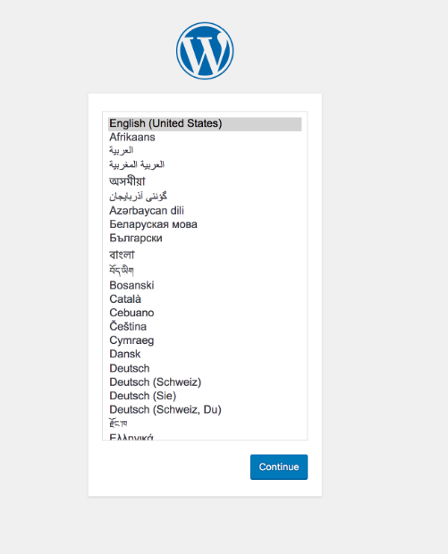
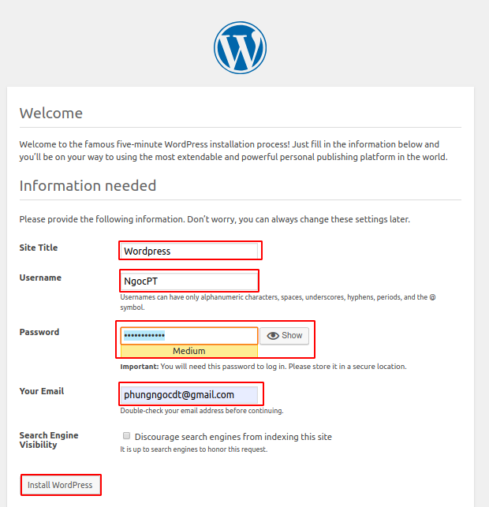
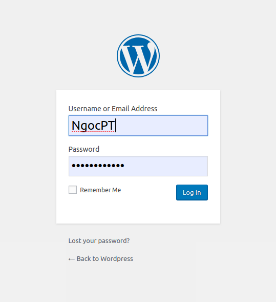
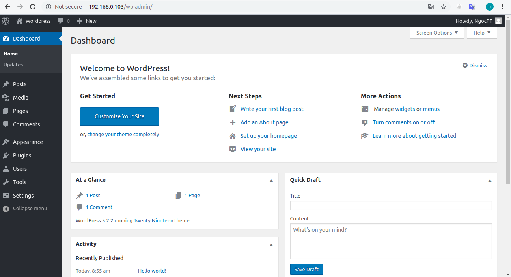

# Cài đặt Wordpress trên Ubuntu 18.04

## Điều kiện tiên quyết 
- Truy cập vào máy chủ Ubuntu 18.04 
- LAMP được cài đặt trên máy chủ của bạn 

## Bước 1: SSH vào ubuntu 18.04
```
ssh root@192.168.0.103
```
## Bước 2: Tạo cơ sở dữ liệu và người dùng MySQL cho WordPress
Login vào MariaDB Server
```
   sudo mysql -u root -p
```
Tạo user quản lý database:
```
CREATE user 'wordpress'@'localhost' identified by 'Xyzt123!@';
```

Tạo database:
```
CREATE DATABASE wordpress;
GRANT ALL PRIVILEGES on wordpress.* to 'wordpress'@'localhost' identified by 'Xyzt123!@';
```
Gõ lệnh sau để lưu cấu hình : 
```
FLUSH PRIVILEGES;
```
Thoát khỏi MariaDB
```
exit
```
## Bước 3: Cài đặt Wordpress

Vào thư mục /html của bạn trước khi tải về các tập tin wordpress mới nhất.
```
cd /var/www/html/
```
Và tải về các tập tin WordPress
```
sudo wget https://wordpress.org/latest.tar.gz
```
Giải nén tập tin WordPress với đuôi *.tar.gz
```
sudo tar xzvf latest.tar.gz
```

Sau khi giải nén sẽ có thư mục WordPress, bạn di chuyển các tập tin trong thư mục này là bên ngoài.
```
sudo mv wordpress/* /var/www/html/
```

## Bước 4: Cấu hình Wordpress
Đầu tiên, đổi tên và chỉnh sửa tệp cấu hình chính WordPress:
```
cd /var/www/html/
sudo mv wp-config-sample.php wp-config.php
sudo vi wp-config.php
```
Thay đổi các biến DB_NAME, DB_USER và DB_PASSWORD như dưới đây:

```
define('DB_NAME', 'database_name_here');
define('DB_USER', 'username_here');
define('DB_PASSWORD', 'password_here');
```
Lưu và đóng tệp khi bạn hoàn tất.

Ta cần restart lại apache2:

```
service apache2 restart
```
## Bước 5: Hoàn tất cài đặt thông qua giao diện Web
Bật trình duyệt và truy cập vào: 
```
https://server_domain_or_IP
```
Giả sử không có bất kỳ lỗi nào trong cấu hình WordPress hoặc Apache của bạn, bạn sẽ thấy trang giật gân lựa chọn ngôn ngữ WordPress. Chọn ngôn ngữ bạn muốn sử dụng:

 

Sau khi chọn ngôn ngữ của bạn, bạn sẽ thấy trang thiết lập chính.

 

Khi bạn nhấn vào trước, bạn sẽ được đưa đến một trang nhắc bạn đăng nhập:  



Khi bạn đăng nhập, bạn sẽ được đưa đến bảng điều khiển quản trị WordPress: 

 

