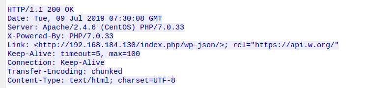

# Điều gì xảy ra khi bạn nhập google.com vào hộp địa chỉ trình duyệt của bạn và nhấn enter?

# Mục lục

1.[Phím g được nhấn](#a)  
2.[Phím enter chạm đáy](#b)    
3.[(Trên Windows) Một WM_KEYDOWN tin nhắn được gửi đến ứng dụng](#c)  
4.[Phân tích cú pháp URL](#d)  
5.[Kiểm tra danh sách HSTS](#e)  
6.[Tra cứu DNS](#f)  
7.[Quy trình ARP](#g)  
8.[Mở một ổ cắm](#h)  
9.[Bắt tay TLS](#i)  
10.[Giao thức HTTP](#k)  
11.[Xử lý yêu cầu máy chủ HTTP](#l)  
12.[Trình duyệt](#k)  


<a name="a">

## 1. Phím g được nhấn </a>
- Khi bạn nhấn phím "g", trình duyệt sẽ nhận được sự kiện và các chức năng tự động hoàn tất sẽ xuất hiện.  
- Các thuật toán này sắp xếp và ưu tiên kết quả dựa trên lịch sử tìm kiếm, dấu trang, cookie và các tìm kiếm phổ biến từ internet nói chung. Khi bạn đang gõ "google.com", nhiều khối mã sẽ chạy và các đề xuất sẽ được tinh chỉnh với mỗi lần nhấn phím.

<b name="b">

## 2. Phím enter chạm đáy</b>
Bộ điều khiển bàn phím sau đó mã hóa mã khóa để vận chuyển đến máy tính. Điều này hiện nay gần như phổ biến trên kết nối Universal serial Bus (USB) hoặc Bluetooth, nhưng trong lịch sử đã vượt qua các kết nối PS / 2 hoặc ADB.  
Trong trường hợp bàn phím USB:
- Mạch USB của bàn phím được cung cấp qua chân 1 từ bộ điều khiển máy chủ USB của máy tính.
- Bộ điều khiển USB máy chủ thăm dò ý kiến ​​"điểm cuối" cứ sau ~ 10ms (giá trị tối thiểu được khai báo bởi bàn phím),nó nhận được giá trị mã khóa được lưu trữ trên nó.
- Giá trị này được chuyển đến USB SIE
- Giá trị của khóa sau đó được chuyển vào lớp trừu tượng phần cứng của hệ điều hành.  

Trong trường hợp Bàn phím ảo :
- Khi người dùng đặt ngón tay lên màn hình cảm ứng điện dung hiện đại, một lượng nhỏ dòng điện sẽ được chuyển đến ngón tay.Tạo ra sự sụt giảm điện áp tại điểm đó trên màn hình. Sau screen controller đó tăng một báo cáo gián đoạn tọa độ của phím bấm.
-  HĐH di động thông báo cho ứng dụng tập trung hiện tại của một sự kiện báo chí vào một trong các thành phần GUI của nó (mà bây giờ là các nút ứng dụng bàn phím ảo).
- Bàn phím ảo giờ đây có thể đưa ra một ng
àn phím ảo giờ đây có thể đưa ra một ngắt phần mềm để gửi tin nhắn 'phím được nhấn' trở lại HĐH.  

<c name="c">

## 3. (Trên Windows) Một WM_KEYDOWN tin nhắn được gửi đến ứng dụng</c>
- Việc vận chuyển HID(Thiết bị giao diện con người) chuyển sự kiện xuống phím cho KBDHID.sys trình điều khiển chuyển đổi việc hành một `scancode`. 

<d name="d"
>
## 4. Phân tích cú pháp URL</d>
- URL là viết tắt của "Uniform Resource Locator" được sử dụng để tham chiếu tới tài nguyên trên mạng Internet. URL tạo nên khả năng siêu liên kết cho các website. Mỗi tài nguyên khác nhau lưu trữ trên Internet được gán bằng một địa chỉ chính xác, địa chỉ đó chính là URL.
```
Protocol "http"
Use 'Hyper Text Transfer Protocol'
Resource "/"
Retrieve main (index) page
```
<e name="e">

## 5. Kiểm tra danh sách HSTS</e>
- HSTS (HTTP Strict Transport Security) là một chính sách bảo mật cần thiết để bảo vệ các trang web bảo mật.
- Nếu trang web nằm trong danh sách, trình duyệt sẽ gửi yêu cầu của nó thông qua HTTPS thay vì HTTP. 

<f name="f">

## 6. Tra cứu DNS</f>
- Là Hệ thống phân giải tên miền 
- Nếu không tìm thấy, trình duyệt gọi gethostbyname chức năng thư viện để thực hiện tra cứu.

<g name="g">

## 7. Quy trình ARP</g>
- Để gửi ARP (Giao thức phân giải địa chỉ), thư viện ngăn xếp mạng cần có địa chỉ IP đích để tra cứu. Nó cũng cần biết địa chỉ MAC của giao diện mà nó sẽ sử dụng để gửi phát sóng ARP.

<h name="h">

## 8. Mở một ổ cắm</h>
- Khi trình duyệt nhận được địa chỉ IP của máy chủ đích, nó sẽ lấy số cổng đó và số cổng đã cho từ URL (giao thức HTTP mặc định thành cổng 80 và HTTPS sang cổng 443) và thực hiện cuộc gọi đến chức năng thư viện hệ thống có tên socketvà yêu cầu luồng socket TCP

<i name="i">

## 9. Bắt tay TLS </i>
- TLS (Transport Layer Security), nó cũng giúp bảo mật thông tin truyền giống.
- Máy tính khách gửi ClientHellotin nhắn đến máy chủ với phiên bản TLS (Transport Layer Security), danh sách các thuật toán mã hóa và phương thức nén có sẵn.
- Máy chủ trả lời bằng một ServerHellotin nhắn cho khách hàng.

<k name="k">

## 10. Giao thức HTTP</k>
- Nếu máy khách đang sử dụng giao thức HTTP và không hỗ trợ SPDY, nó sẽ gửi yêu cầu đến máy chủ có dạng:
```
GET / HTTP / 1.1 
Host: google.com 
Kết nối: đóng 
[các tiêu đề khác]
```
Ví dụ: 


- Sau khi gửi yêu cầu và tiêu đề, trình duyệt web sẽ gửi một dòng mới trống đến máy chủ cho biết nội dung của yêu cầu đã được thực hiện.
- Máy chủ trả lời bằng mã phản hồi biểu thị trạng thái của yêu cầu và trả lời bằng phản hồi của biểu mẫu:
```
200 OK 
[tiêu đề phản hồi]
```
Ví dụ:



<l name="l">

## 11. Xử lý yêu cầu máy chủ HTTP</l>
- Máy chủ HTTPD (HTTP Daemon) là máy chủ xử lý các yêu cầu / phản hồi ở phía máy chủ. Các máy chủ HTTPD phổ biến nhất là Apache hoặc nginx cho Linux và IIS cho Windows.
- HTTPD (HTTP Daemon) nhận được yêu cầu:

<k name="k">

## 12. Trình duyệt </k>
- Tài nguyên thường là một tài liệu HTML, nhưng cũng có thể là PDF, hình ảnh hoặc một số loại nội dung khác. Vị trí của tài nguyên được chỉ định bởi người dùng bằng cách sử dụng URI (Mã định danh tài nguyên đồng nhất)
- Tài nguyên thường là một tài liệu HTML, nhưng cũng có thể là PDF.