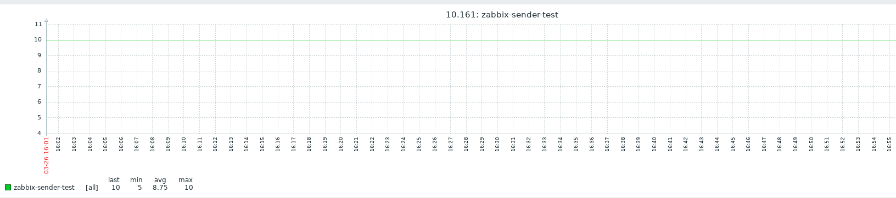

## Zabbix sender

Zabbix_sender là môt câu lệnh dùng để gửi thông tin từ agent về cho zabbix server.

Câu lệnh này sẽ có ích khi ta tạo script trên các host và liên tục gửi dữ liệu từ host về zabbix server.

Để sử dụng câu lệnh này trước tiên cần cài đặt nó

```
yum install zabbix-sender
```

Để gửi được thì ta cần cấu hình cho item thuộc kiểu `trapper item` 

Cách sử dụng

```
zabbix_sender -z IP-server -s "name" -p port -k key -o giá-trị
```

Trong đó

 * `IP-server` là địa chỉ của máy zabbix server
 * `name` là tên của của máy ta đang đứng được khai báo trên zabbix server. 
 * `port` chỉ ra port mà trên server để kết nối tới. Nếu ko khai báo sẽ sử dụng port default là 10051
 * `key` là item key
 * `giá trị` khai báo giá trị để gửi nó lên server

Hoặc thay vì khai báo lần lượt các giá trị như bên trên ta có thể cho nó đọc trực tiếp ở trong file config của agent

```
zabbix_sender -c /etc/zabbix/zabbix_agentd.conf -k key -o giá-trị
```

Ví dụ

Tôi tạo một item


```
[root@niemdt1 ~]# zabbix_sender -z 10.10.10.160 -p 10051 -s "10.161" -k sender -o 10 
info from server: "processed: 1; failed: 0; total: 1; seconds spent: 0.000421"
sent: 1; skipped: 0; total: 1
```

Tôi thấy kết quả trên web



## Zabbix get

Zabbix_get là một câu lệnh được sử dụng trên zabbix server để trả về thông tin của host zabbix-agent. Trước tiên cần cài đặt nó

```
yum install zabbix-sender
```

Cách sử dụng

```
zabbix_sender -s IP-host -k key
```

Trong đó

 * `IP-host` là IP của máy host cài zabbix-agent mà ta muốn lấy thông tin
 * `key` là item key

Ví dụ

```
[root@niemdt0 ~]# zabbix_get -s 10.10.10.161 -k vm.memory.size[total]
1039659008
```

Câu lệnh trên tôi kiểm tra tổng dung lượng RAM của máy 10.10.10.160
