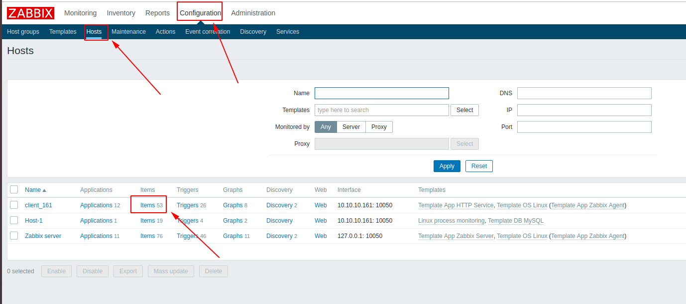
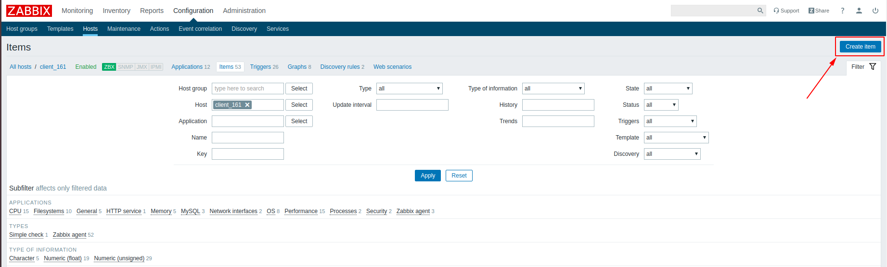
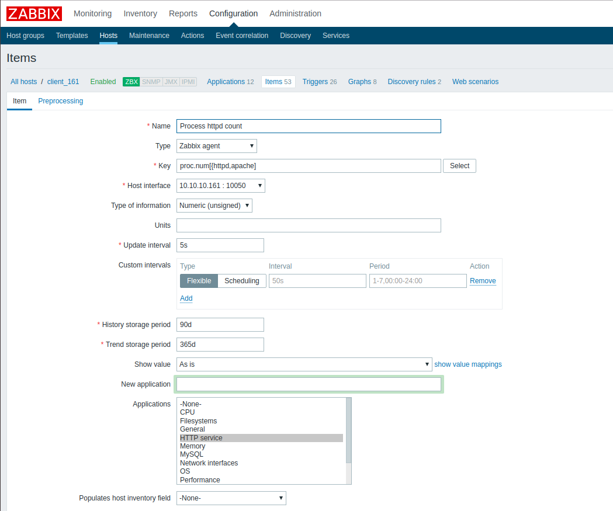
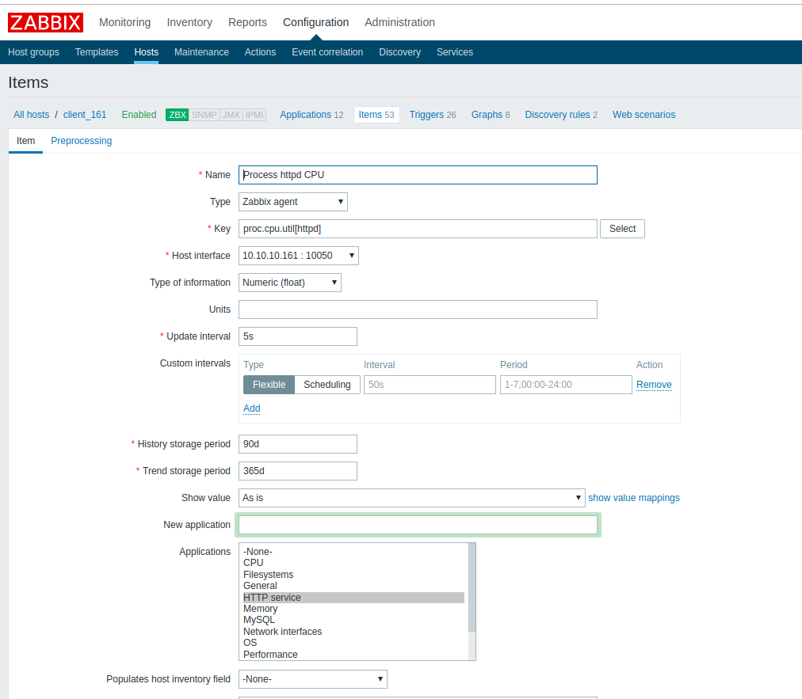
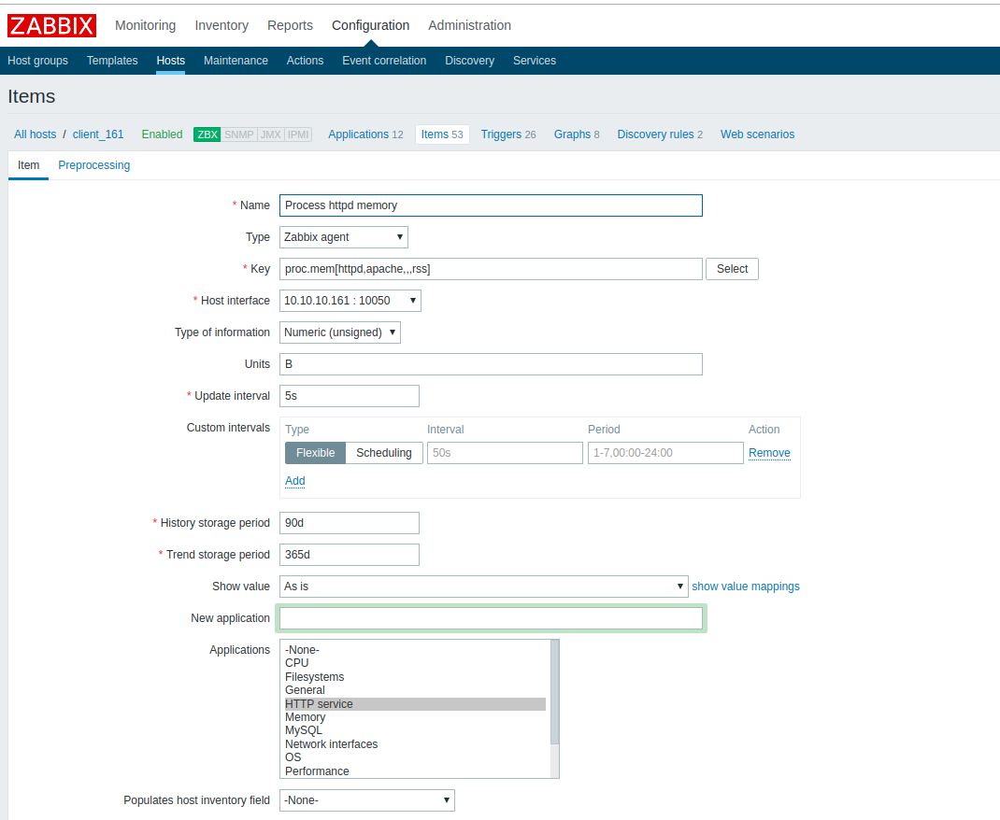
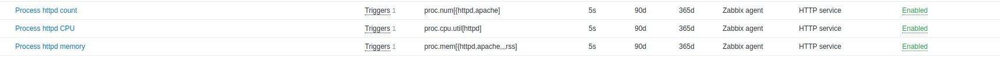
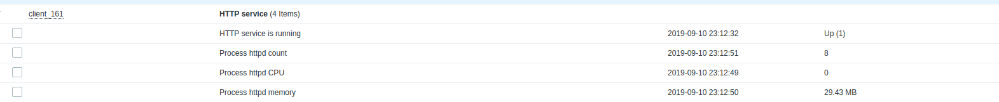

# Hướng dẫn monitor từng service sử dụng zabbix

Có đôi lúc bạn muốn giám sát từng service đang chạy trên server. Xem service đó đang sử dụng bao nhiêu RAM, sử dụng bao nhiêu phần trăm CPU, và có bao nhiêu process đang được sử dụng cho service này.

## Add item

Tạo item trên host có service muốn monitor



Chọn `Create item`



**Đếm số process sử dụng cho service**



Key ở đây được sử dụng là 

```
proc.num[httpd,apache]
```

Trong đó: 
* `httpd` là tên của service
* `apache` là tên của user sử dụng cho service này

**Phần trăm CPU mà service này sử dụng**



Key ở đây là

```
proc.cpu.util[httpd]
```

Ở đây phần trăm được tính trên từng core của CPU. Nên nếu service này sử dụng hết CPU 2 core thì giá trị sẽ là 200%.

**Lượng RAM sử dụng cho service**



Key được sử dụng ở đây là:

```
proc.mem[httpd,apache,,,rss]
```

Trong đó:
* `httpd` tên của service
* `apache` user chạy service
* `rss` để chỉ ra tính lượng RAM thực tế được sử dụng cho từng process

Các item sau khi được add



Ta có thể thấy kết quả trong `Monitoring-> Latest data`

