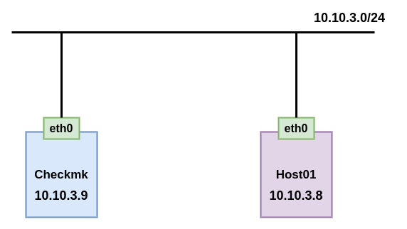
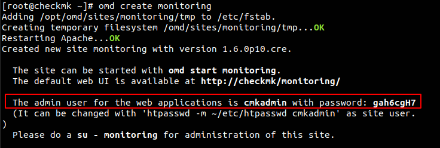
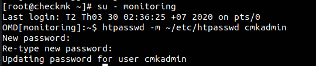
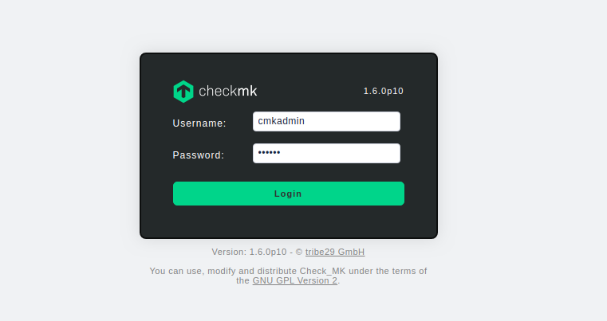
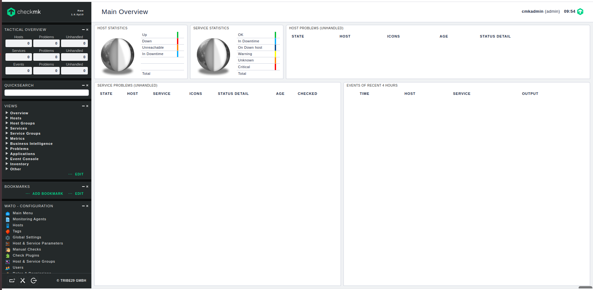

# Cài đặt Checkmk trên Centos7

## 1. Mô hình



### IP Planning

| Hostname | OS | Interface | IP | CPU | RAM | Disk |
| -------- | -- | --------- | -- | --- | --- | ---- |
| checkmk  | CenOS7 | eth0 | 10.10.3.9 | 2 | 2G | 20G |
| Host01 | CentOS7 | eth0 | 10.10.3.8 | 1 | 1G | 10G |

## 2. Cài đặt trên server

Cài đặt các gói cần thiết

```
yum install -y epel-release wget
```

Download file cài đặt

```
wget https://checkmk.com/support/1.6.0p10/check-mk-raw-1.6.0p10-el7-38.x86_64.rpm
```

Cài đặt checkmk

```
yum install -y check-mk-raw-1.6.0p10-el7-38.x86_64.rpm
```

Tạo site

```
omd create monitoring
```

Sau khi tạo ta thấy user và password để đăng nhập site



Khởi động site

```
omd start monitoring
```

Đổi mật khẩu cho user `cmkadmin` 

```
su - monitoring
htpasswd -m ~/etc/htpasswd cmkadmin
```



Quay trở lại user `root` để thực hiện tiếp các bước sau

Mở port cho httpd

```
firewall-cmd --permanent --add-port=80/tcp
firewall-cmd --reload
```

Tắt SElinux

```
sed -i 's/SELINUX=enforcing/SELINUX=disabled/g' /etc/sysconfig/selinux
sed -i 's/SELINUX=enforcing/SELINUX=disabled/g' /etc/selinux/config
setenforce 0
```

Vào trình duyệt và truy cập địa chỉ

```
http://10.10.3.9/monitoring
```

Sử dụng user `cmkadmin` và password là pass bạn vừa đôi để đăng nhập



