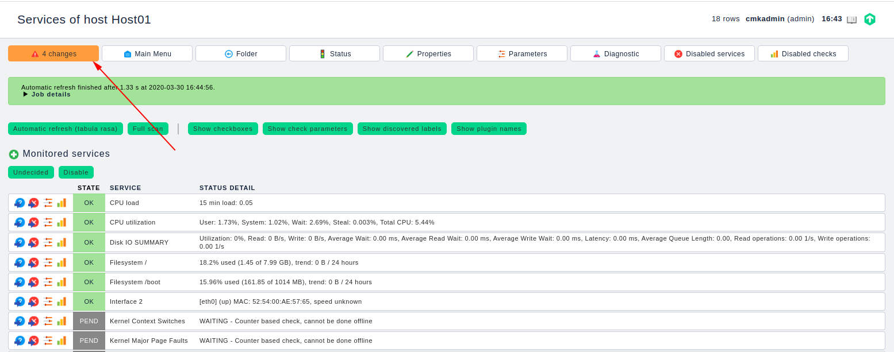

# Cài đặt agent trên centos7

## 1. Mô hình


## Chuẩn bị 

Trước tiên cần cài đặt checkmk server. Nếu chưa cài đặt tham khảo [tại đây](01.Cai-dat-checkmk-centos7.md)

## Cài đặt

Truy cập vào web để tải agent cho client


Thực hiện copy link để download agent

### Thực hiện đăng nhập vào agent (Host01) để thực hiện các bước sau

Download file agent

```
yum install -y wget
wget http://10.10.3.9/monitoring/check_mk/agents/check-mk-agent-1.6.0p10-1.noarch.rpm
```

Cài đặt agent

```
rpm -ivh check-mk-agent-1.6.0p10-1.noarch.rpm
```

Cài đặt `xinetd`

```
yum install xinetd -y
```

Khởi động `xinetd`

```
systemctl start xinetd
systemctl enable xinetd
```

Sửa file cấu hình xinetd của checkmk

```
vi /etc/xinetd.d/check_mk
```

Thêm vào địa chỉ IP của checkmk server


Khởi động lại xinetd

```
systemctl restart xinetd
```

Mở port

```
firewall-cmd --add-port=6556/tcp --permanent
firewall-cmd --reload
```

Tắt selinux

```
sed -i 's/SELINUX=enforcing/SELINUX=disabled/g' /etc/sysconfig/selinux
sed -i 's/SELINUX=enforcing/SELINUX=disabled/g' /etc/selinux/config
setenforce 0
```

Kiểm tra

```
[root@Host01 ~]# check_mk_agent | head
<<<check_mk>>>
Version: 1.6.0p10
AgentOS: linux
Hostname: Host01
AgentDirectory: /etc/check_mk
DataDirectory: /var/lib/check_mk_agent
SpoolDirectory: /var/lib/check_mk_agent/spool
PluginsDirectory: /usr/lib/check_mk_agent/plugins
LocalDirectory: /usr/lib/check_mk_agent/local
<<<df>>>
```

<a name='add_web'>

### Truy cập lại web để add host

Click `Host` -> `New host`


Điền các thông tin cần thiết sau đó chọn `Save & Test` để kiểm tra


Ta thấy `agent` có kết quả trả về chọn `Save & Exit`


Chọn `Save & go to Service` tại đây ta chọn `Automatic refresh`


Ta thấy có những thay đổi click vào để xem những thay đổi này



Chọn `Activate selected` để những thay đổi được áp dụng


Vào `Host` -> `All host` để xem host đã được add

