# Cài đặt agent trên centos7

## 1. Mô hình

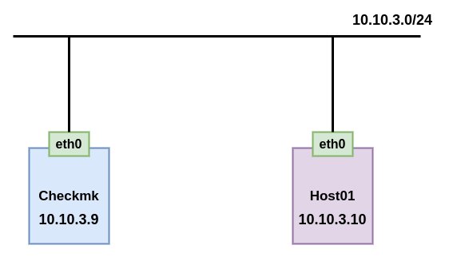

## Chuẩn bị 

Trước tiên cần cài đặt checkmk server. Nếu chưa cài đặt tham khảo [tại đây](01.Cai-dat-checkmk-centos7.md)

## Cài đặt

Truy cập vào web để tải agent cho client:
 * Chọn 1 để vào Monitor Agent
 * Chọn 2 để copy link download agent trên Centos

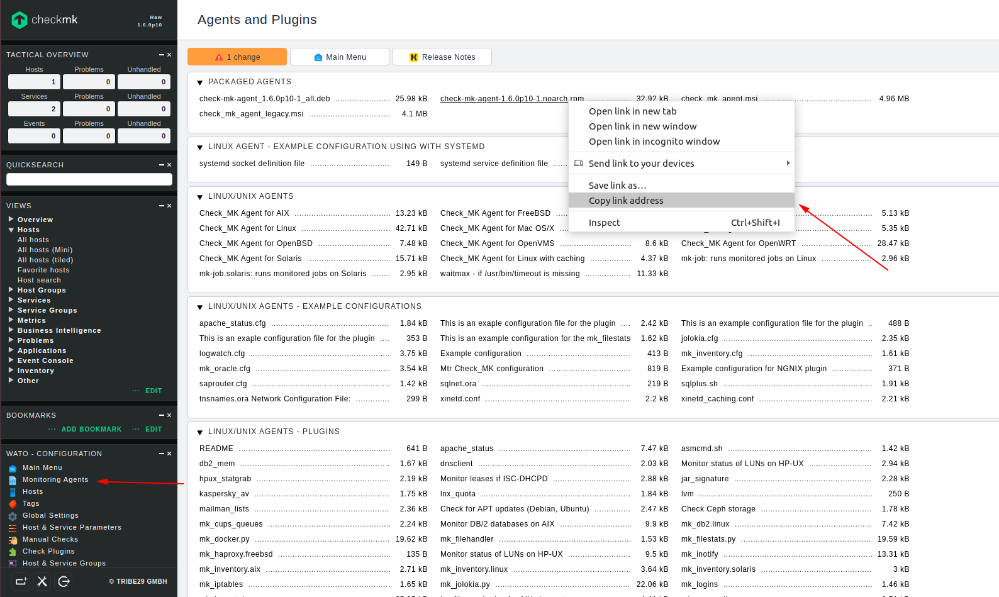

### Thực hiện đăng nhập vào agent (Host01) để thực hiện các bước sau

Download file agent

```
yum install -y wget
wget http://10.10.3.9/monitoring/check_mk/agents/check-mk-agent-1.6.0p10-1.noarch.rpm
```

Cài đặt agent

```
rpm -ivh check-mk-agent-1.6.0p10-1.noarch.rpm
```

Cài đặt `xinetd`

```
yum install xinetd -y
```

Khởi động `xinetd`

```
systemctl start xinetd
systemctl enable xinetd
```

Sửa file cấu hình xinetd của checkmk

```
vi /etc/xinetd.d/check_mk
```

Thêm vào địa chỉ IP của checkmk server

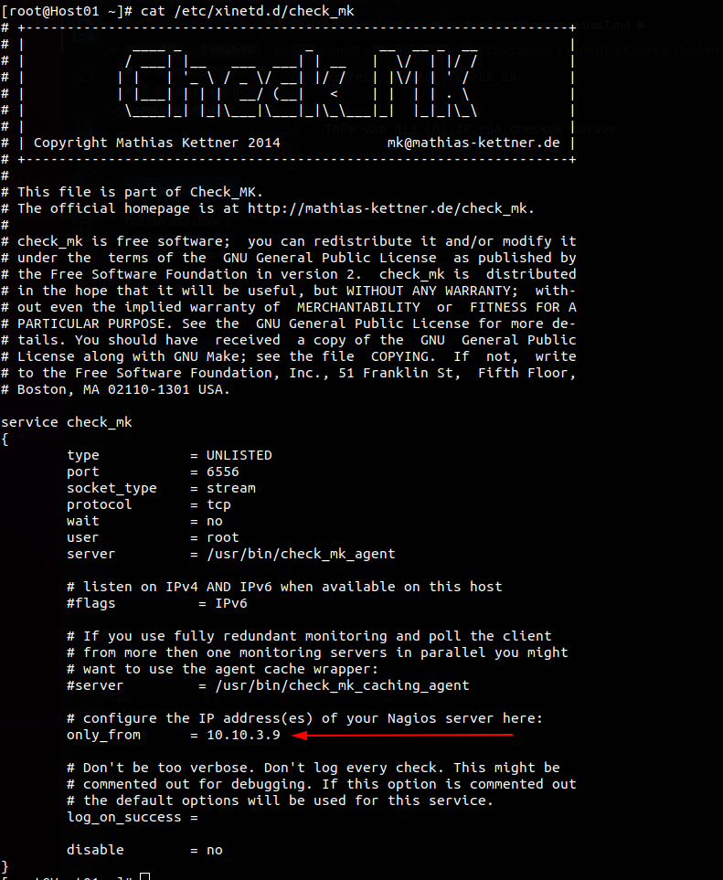

Khởi động lại xinetd

```
systemctl restart xinetd
```

Mở port

```
firewall-cmd --add-port=6556/tcp --permanent
firewall-cmd --reload
```

Tắt selinux

```
sed -i 's/SELINUX=enforcing/SELINUX=disabled/g' /etc/sysconfig/selinux
sed -i 's/SELINUX=enforcing/SELINUX=disabled/g' /etc/selinux/config
setenforce 0
```

Kiểm tra

```
[root@Host01 ~]# check_mk_agent | head
<<<check_mk>>>
Version: 1.6.0p10
AgentOS: linux
Hostname: Host01
AgentDirectory: /etc/check_mk
DataDirectory: /var/lib/check_mk_agent
SpoolDirectory: /var/lib/check_mk_agent/spool
PluginsDirectory: /usr/lib/check_mk_agent/plugins
LocalDirectory: /usr/lib/check_mk_agent/local
<<<df>>>
```

<a name='add_web'>

### Truy cập lại web để add host

 * Chọn 1 để vào mục quản lý các host
 * Chọn 2 để Add host


Điền các thông tin cần thiết

 * Mục 1: khai báo tên host
 * Mục 2: Địa chỉ của host
 * Mục 3: Chọn agent
 * Sau đó chọn 4 để kiểm tra

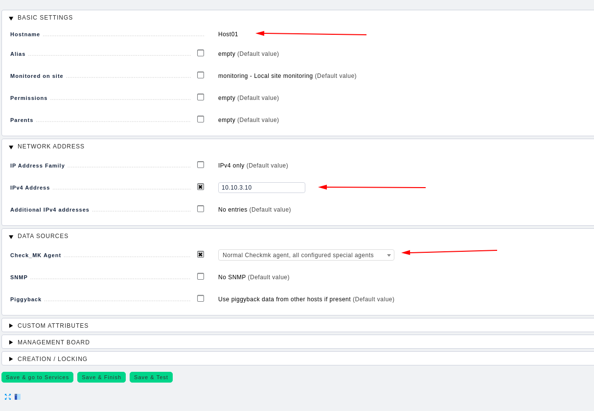

Ta thấy `agent` có kết quả trả về
 
 * Chọn 1 

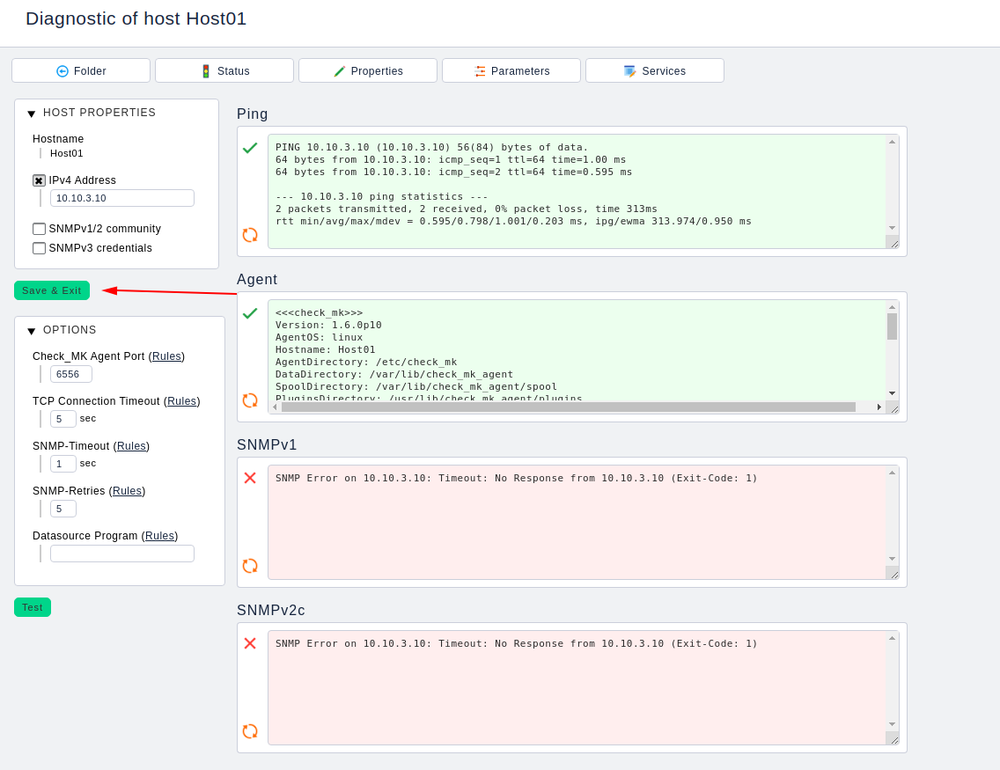

Chọn 1

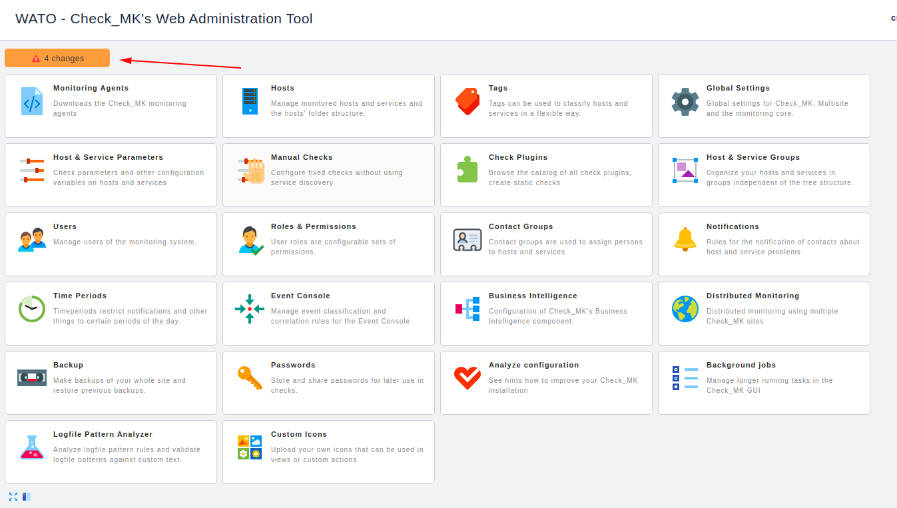

Chọn 1 để Fix những dữ liệu chưa đc cập nhật

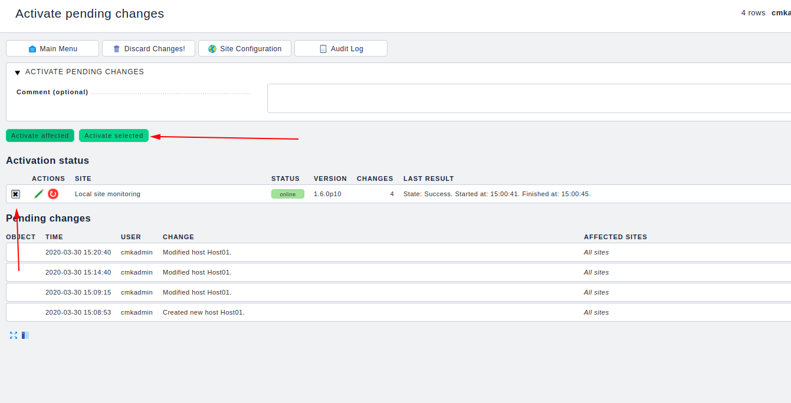

Chọn 1 để tự động cập nhật các thông số

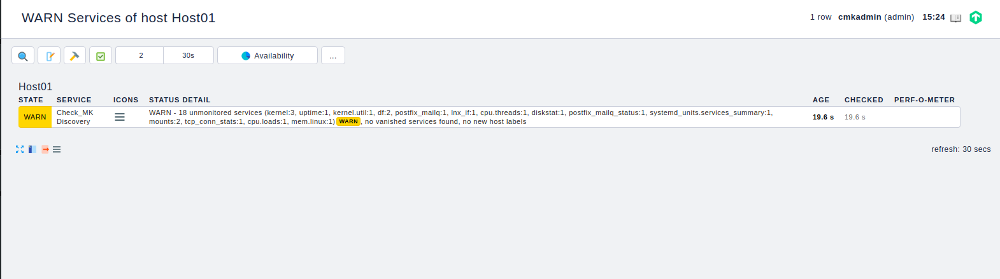

Ta thấy có những thay đổi click vào để xem những thay đổi này

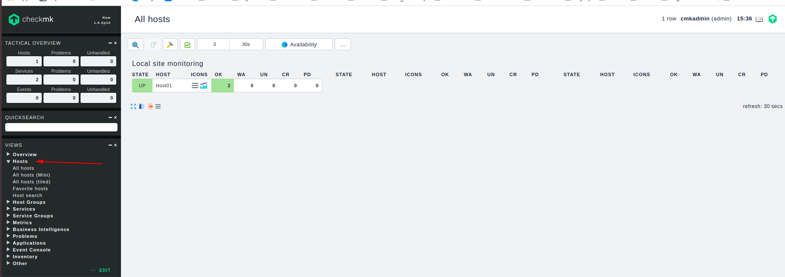

 * Mục 1: Mô tả cho những thay đổi này
 * Lựa chọn những thay đổi muốn cập nhật trong mục 2
 * Chọn 3 để áp dụng những thay đổi vừa chọn ở mục 2

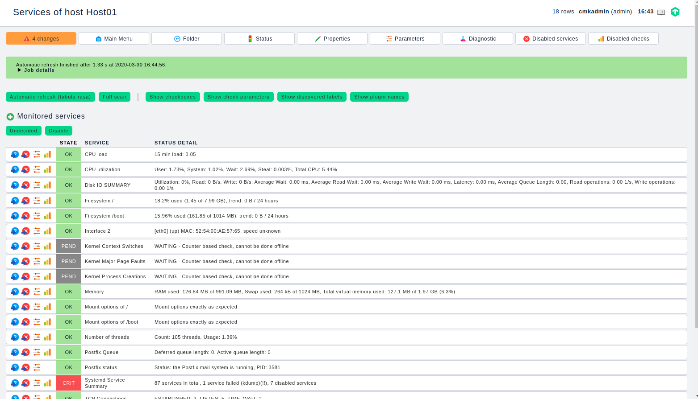

Vào 1 để xem host đã được add

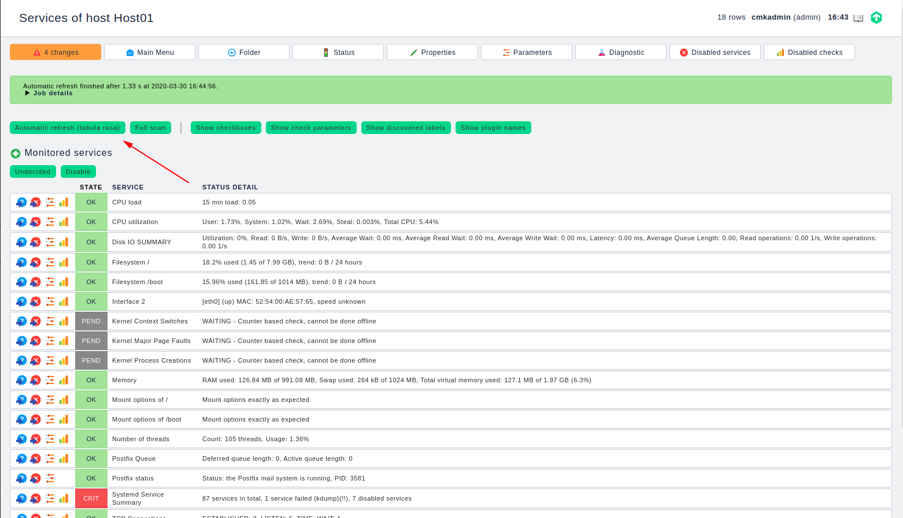