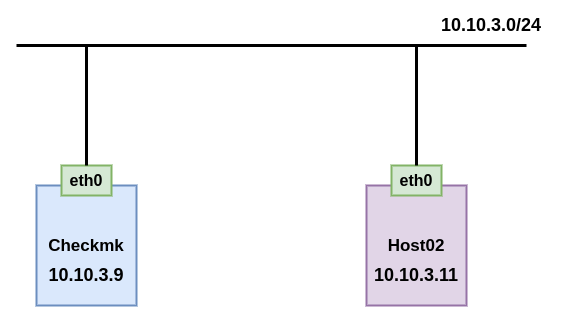
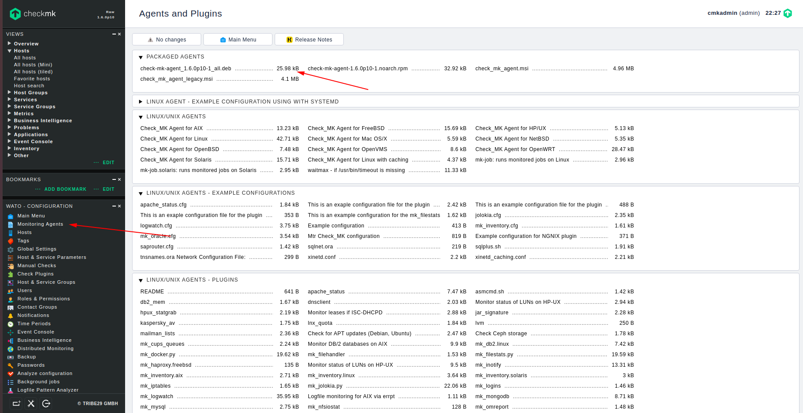
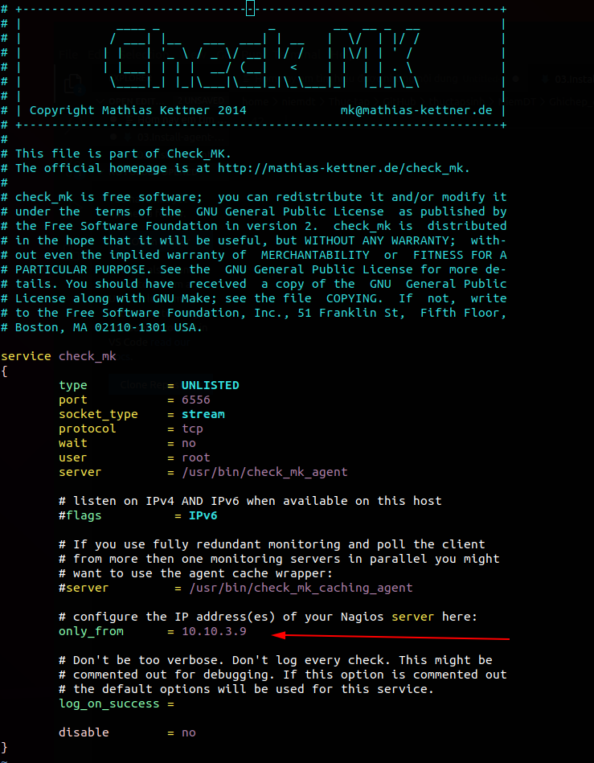

# Cài đặt agent trên ubuntu 16

## 1. Mô hình



## Cài đặt

Truy cập vào web để tải agent cho client:
 * Chọn 1 để vào Monitor Agent
 * Chọn 2 để copy link download agent trên Ubuntu



Copy đường dẫn của file `.deb`

### Đăng nhập host cần cài đặt để thực hiện các bước tiếp theo

Download file agent

```
apt-get install -y wget
wget http://10.10.3.9/monitoring/check_mk/agents/check-mk-agent_1.6.0p10-1_all.deb
```

Cài đặt agent

```
dpkg -i check-mk-agent_1.6.0p10-1_all.deb
```

Cài đặt xinetd

```
apt-get install -y xinetd
```

Start và enable xinetd

```
systemctl start xinetd
systemctl enable xinetd
```

Khai báo địa chỉ của checkmk server

```
vi /etc/xinetd.d/check_mk
```



Khởi động lại xinetd

```
systemctl restart xinetd
```

Kiểm tra 

```
root@Host02:~# check_mk_agent | head
<<<check_mk>>>
Version: 1.6.0p10
AgentOS: linux
Hostname: Host02
AgentDirectory: /etc/check_mk
DataDirectory: /var/lib/check_mk_agent
SpoolDirectory: /var/lib/check_mk_agent/spool
PluginsDirectory: /usr/lib/check_mk_agent/plugins
LocalDirectory: /usr/lib/check_mk_agent/local
<<<df>>>
```

Mở port

```
ufw allow 6556/tcp
ufw reload
```

### Truy cập vào web để thực hiện add host

Tham khảo [tại đây](https://github.com/niemdinhtrong/thuctapsinh/blob/master/NiemDT/Ghichep_checkmk/docs/02.Install-agent-centos7.md#add_web)