# Cài đặt agent trên win server 2012

## Mô hình

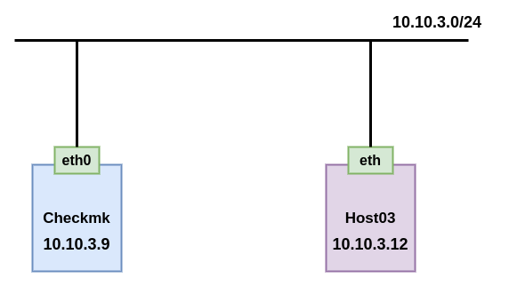

## Cài đặt

Truy cập vào web để tải agent cho client:
 * Chọn 1 để vào Monitor Agent
 * Chọn 2 để copy link download agent trên Windows

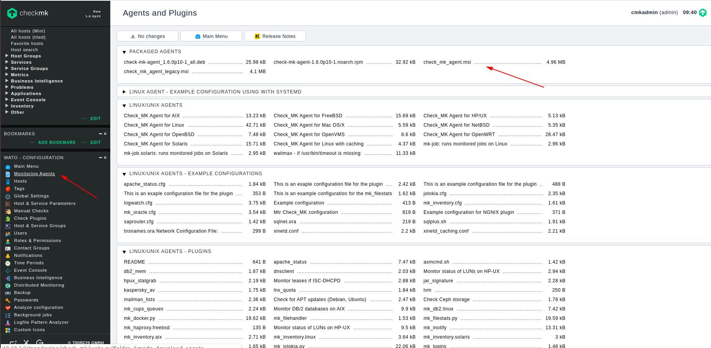

### Đăng nhập vào máy windows cần cài agent để thực hiện các bước tiếp theo

Mở PowerShell để download file agent

```
Invoke-WebRequest -OutFile check_mk_agent.msi http://10.10.3.9/monitoring/check_mk/agents/windows/check_mk_agent.msi
```

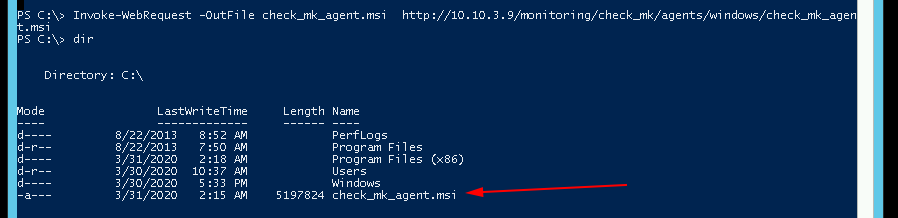

Kiểm tra file trong ổ C

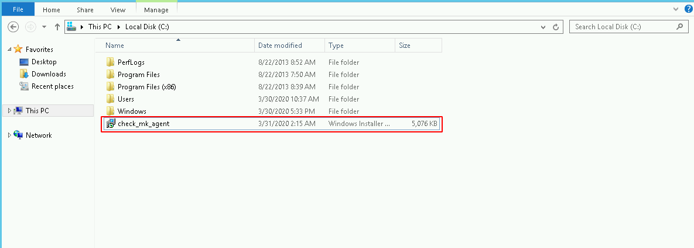

Click vào file để cài đặt

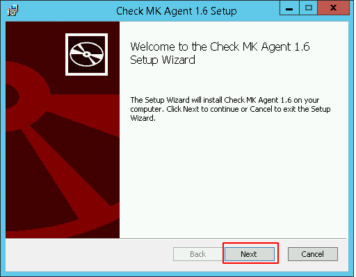

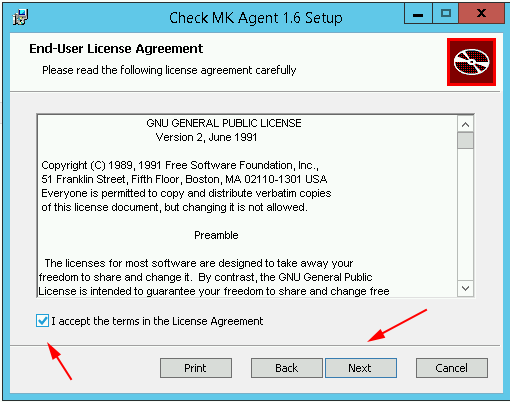

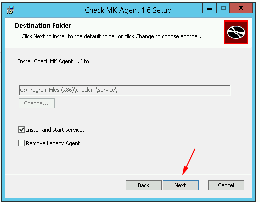

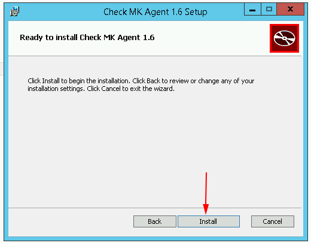

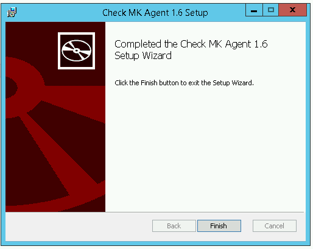

Kiểm tra agent đã hoạt động

```
cd '.\Program Files (x86)\checkmk\service'
.\check_mk_agent.exe test
```

Kết quả như sau kết là agent đã hoạt động

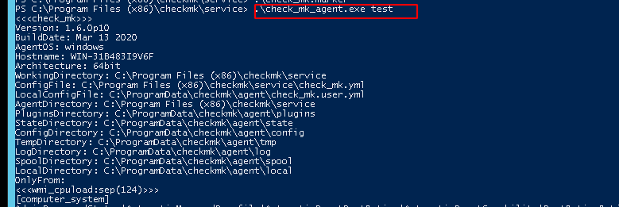

Tắt firewall

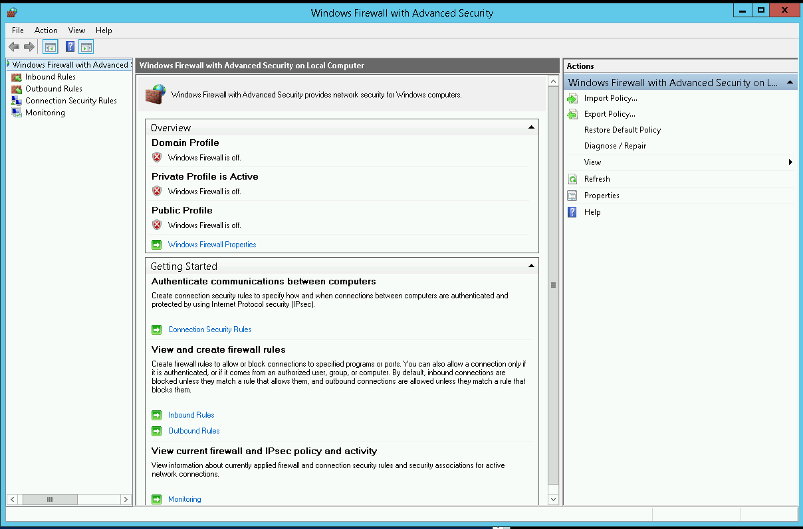

### Truy cập vaò web để thực hiện add host

Tham khảo [tại đây](https://github.com/niemdinhtrong/thuctapsinh/blob/master/NiemDT/Ghichep_checkmk/docs/02.Install-agent-centos7.md#add_web)