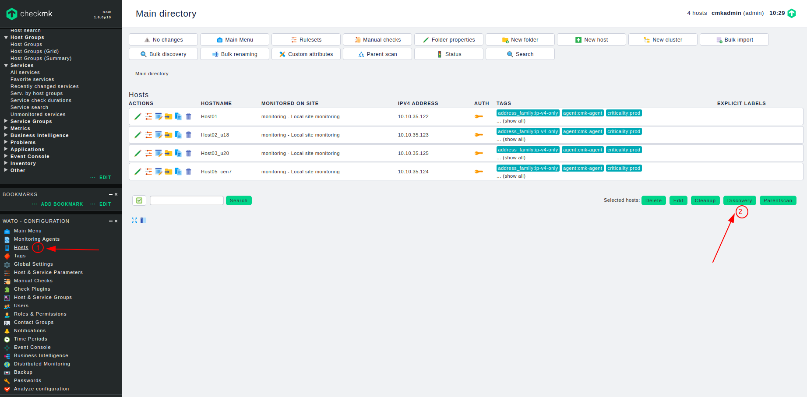
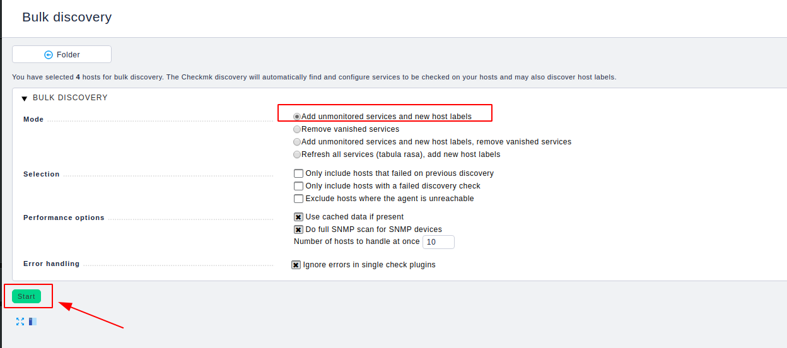
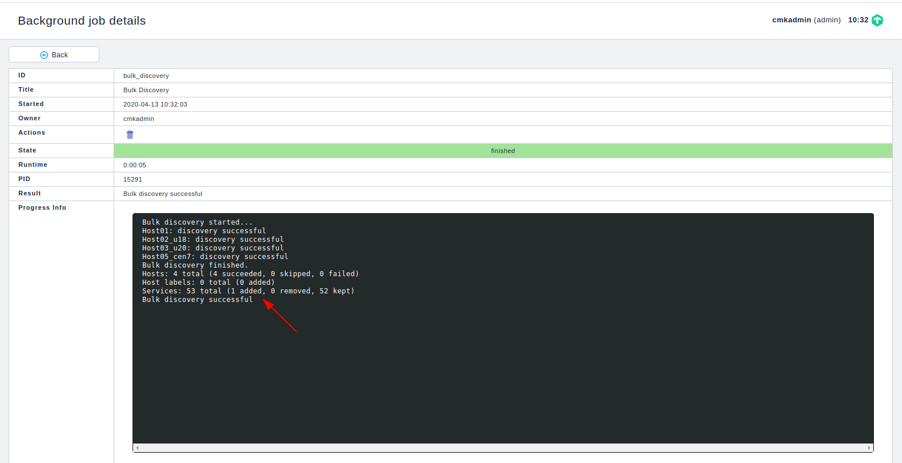
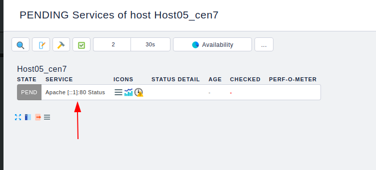
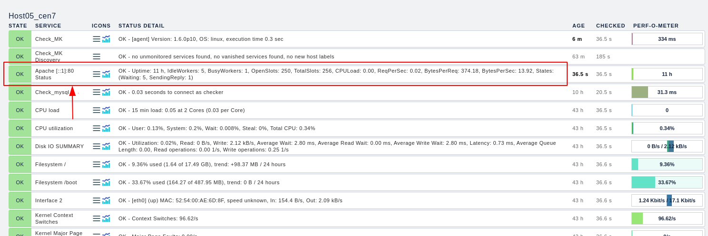

# Giám sát apache

Bài viết này sẽ hướng dẫn bạn cách dịch vụ httpd trên checkmk. Trước tiên bạn cần cài agent lên máy cần giám sát và add host vào checkmk server.

## Thực hiện tại agent

Trên file cấu hình của apache `/etc/httpd/conf/httpd.conf` thêm vào nội dung sau:

```
<IfModule mod_status.c>
<Location /server-status>
SetHandler server-status
Order deny,allow
Deny from all
Allow from 127.0.0.1 ::1
</Location>
# Keep track of extended status information for each request
ExtendedStatus On
</IfModule>
```

Thực hiện restart lại httpd

```
systemctl restart httpd
```

Kiểm tra 

```
curl http://127.0.0.1/server-status
```

Kết qủa trả về như sau:

```
[root@localhost plugins]# curl http://127.0.0.1/server-status
<!DOCTYPE HTML PUBLIC "-//W3C//DTD HTML 3.2 Final//EN">
<html><head>
<title>Apache Status</title>
</head><body>
<h1>Apache Server Status for 127.0.0.1 (via 127.0.0.1)</h1>

<dl><dt>Server Version: Apache/2.4.6 (CentOS)</dt>
<dt>Server MPM: prefork</dt>
<dt>Server Built: Aug  8 2019 11:41:18
</dt></dl><hr /><dl>
<dt>Current Time: Monday, 13-Apr-2020 03:10:36 +07</dt>
<dt>Restart Time: Sunday, 12-Apr-2020 15:56:15 +07</dt>
<dt>Parent Server Config. Generation: 1</dt>
<dt>Parent Server MPM Generation: 0</dt>
<dt>Server uptime:  11 hours 14 minutes 21 seconds</dt>
<dt>Server load: 0.00 0.01 0.05</dt>
<dt>Total accesses: 686 - Total Traffic: 236 kB</dt>
<dt>CPU Usage: u.56 s.21 cu0 cs0 - .0019% CPU load</dt>
<dt>.017 requests/sec - 5 B/second - 352 B/request</dt>
...
```

Cài một số gói cần thiết

```
yum install net-tools
```


Copy file plugin từ checkmk server (/omd/versions/1.6.0p10.cre/share/check_mk/agents/plugins/apache_status) sang thư mục (/usr/lib/check_mk_agent/plugins) trên agent.

Cấp quyền thực thi cho file

```
chmod +x /usr/lib/check_mk_agent/plugins/apache_status
```

Kiểm tra

```
check_mk_agent | grep -A apache_status
```

Nếu thấy kết quả trả về như sau thì agent đã check thành công

```
<<<apache_status:sep(124)>>>
[::1]|80||Total Accesses: 705
[::1]|80||Total kBytes: 253
[::1]|80||CPULoad: .00191436
[::1]|80||Uptime: 41267
[::1]|80||ReqPerSec: .0170839
```

## Cấu hình trên WATO

Thao tác trên web



Chọn 1 để vào danh sách các host
Chọn 2 để thực hiện tìm kiếm các host và service mới

Start discovery



Ta thấy có 1 service đã được add



Áp dụng thay đổi


Ta thấy service mới được add



Đợi để agent gửi thông tin về. Ta thấy dịc vụ vừa add đã có dữ liệu

