# Cấu hình giám sát Volume group và Logical Volume

Như agent mặc định của checkmk bạn chỉ có thể giám sát một số thông số như **Disk IO SUMMARY**, **Filesystem /**, **Filesystem /boot** mà bạn ko thể giám sát IO trên từng disk vật lý hay IO trên từng Logical Volume (với LVM).

## Thêm giám sát IO trên từng disk vật lý và Logical Volume

 * Chọn 1 để vào `Host & Service Parameters`
 * Chọn 2 để vào `Parameters for discovered services`

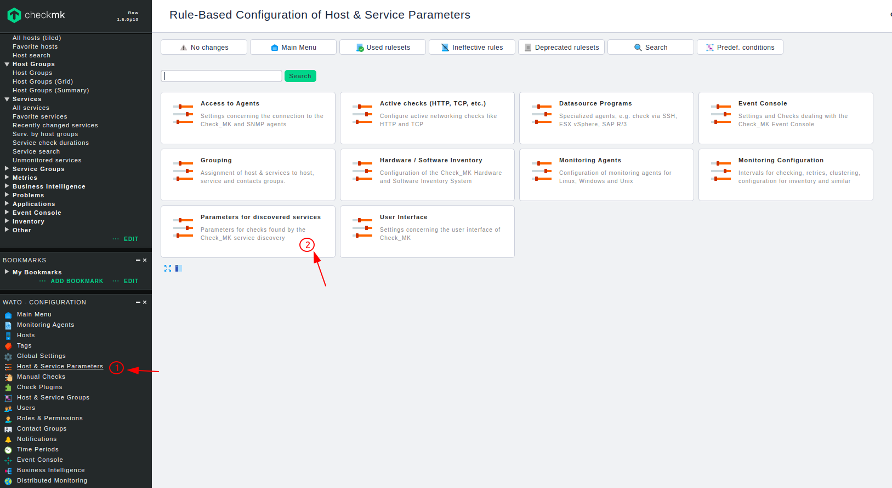

Tìm kiếm `Disk` trên thanh tìm kiếm sau đó chọn `Discovary mode for Disk IO check`

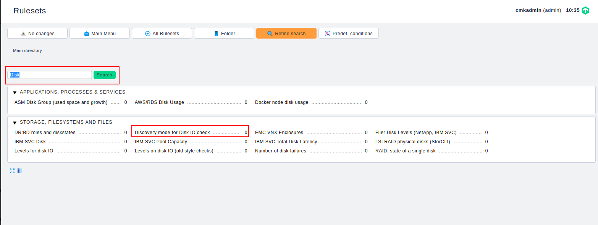

 * Chọn 1 để tạo rule

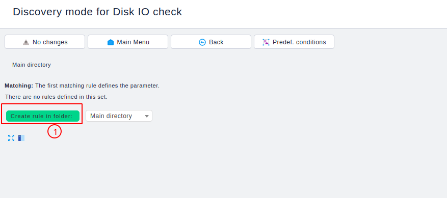

Khai báo các thông tin cho rule
 
 * Mục 1: Mô tả cho rule
 * Mục 2: Các thông số muốn giám sát
 * Sau đó chọn 3 để lưu

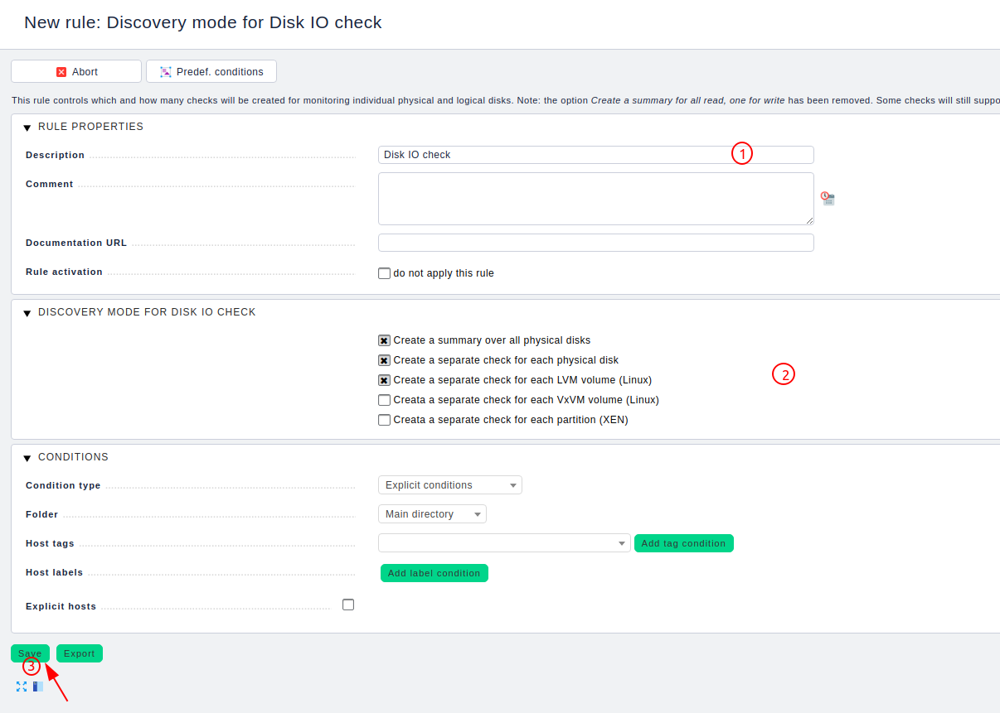

Thực hiện discovery để tìm kiếm những service mới
 * Chọn 1 để vào mục quản lý host
 * Chọn 2 để thực hiện discovery

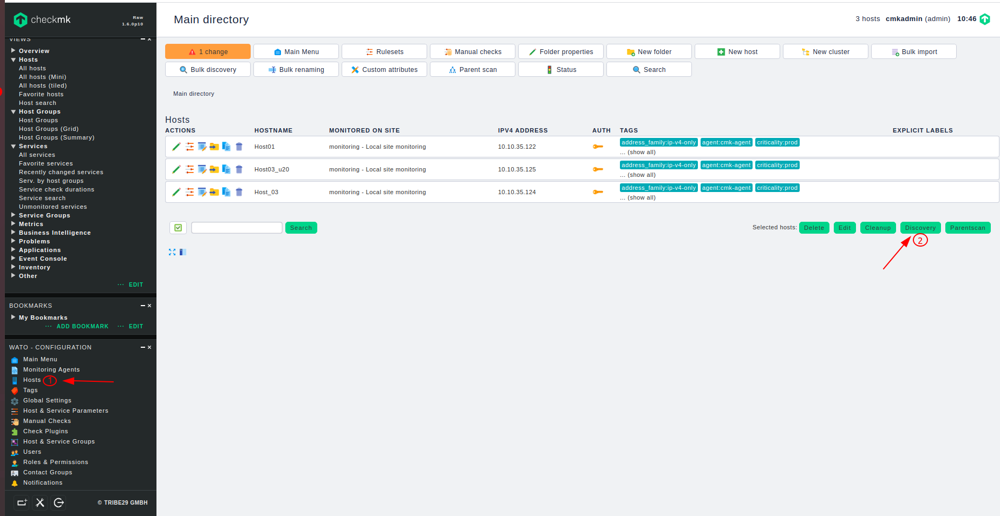

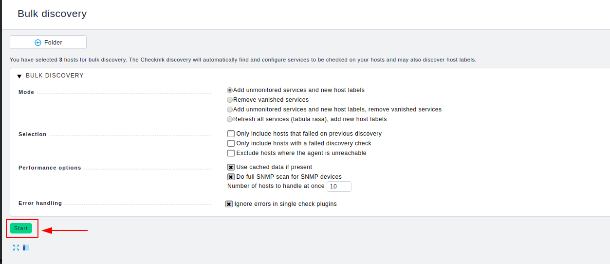

Ta thấy có service mới được tìm thấy

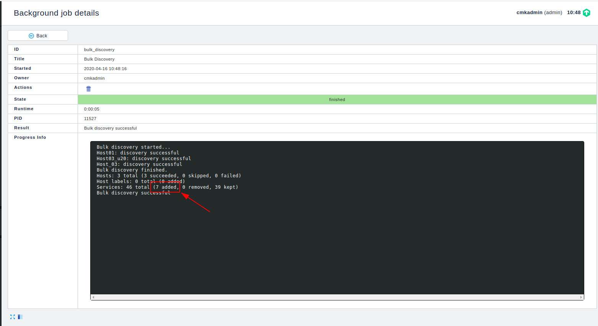

Áp dụng những thay đổi

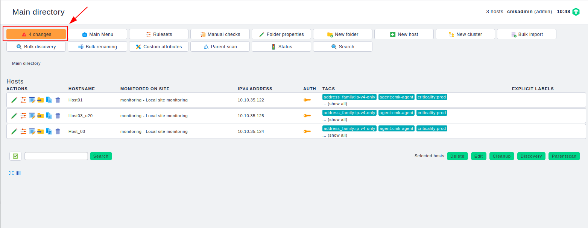

Bây giờ ta có thể giám sát được I/O của các disk vật lý và Logical Volume

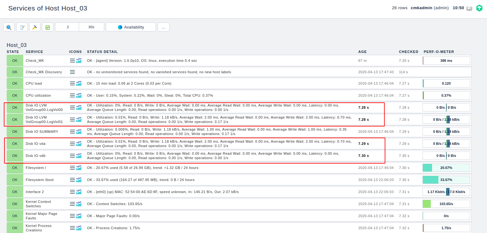

## Kiểm tra dung lượng của Volume Group

Trên checkmk server copy plugin `lvm` trong đường dẫn `/opt/omd/versions/1.6.0p10.cre/share/check_mk/agents/plugins/lvm` sang thư mục `/usr/lib/check_mk_agent/plugins` bên phía agent

Trên agent ta có thể thực hiện lệnh sau để kiểm tra

```
check_mk_agent
```

Nếu trong kết quả trả về ta thấy có dòng như sau thì plugin đã chạy

```
...
<<<lvm_vgs>>>
  VolGroup00	2	2	0	wz--n-	31666995200	532676608
<<<lvm_lvs:sep(124)>>>
  LogVol00|VolGroup00|-wi-ao----|2147483648||||||||
  LogVol01|VolGroup00|-wi-ao----|28986834944||||||||
```

Truy cập vào Web UI để add service

Thực hiện discovery service

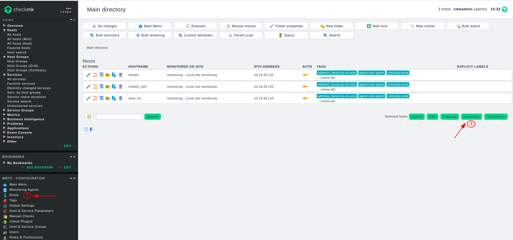

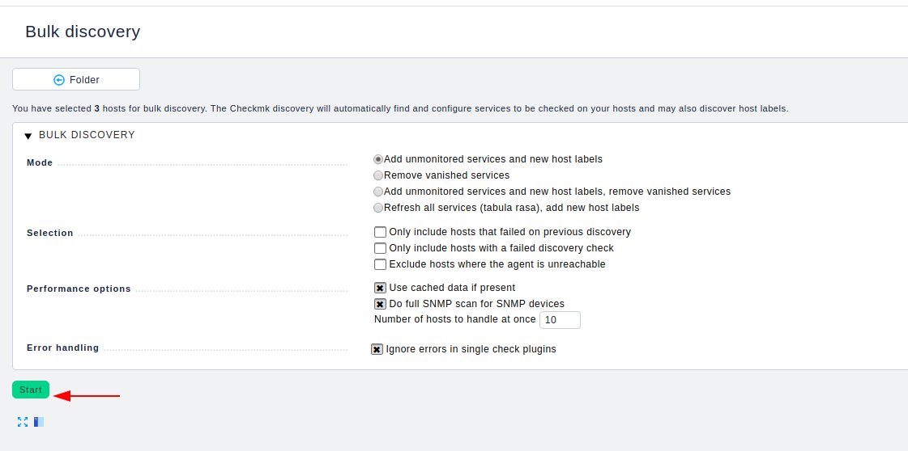

Ta thấy có service đã được add


Áp dụng những thay đổi

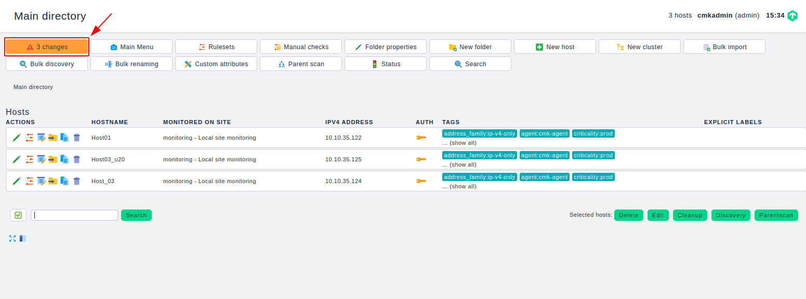

Ở đây trên host chỉ có 1 Volume Group và đã được cấp hết dung lượng cho các Logical Volume

