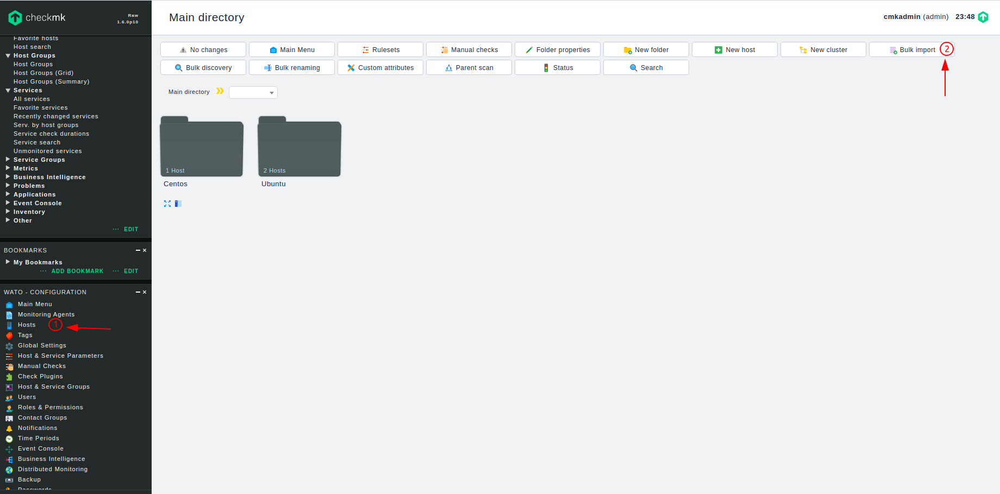
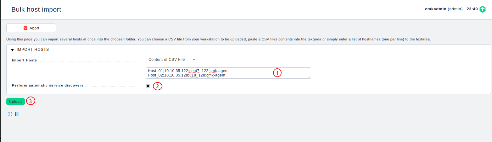
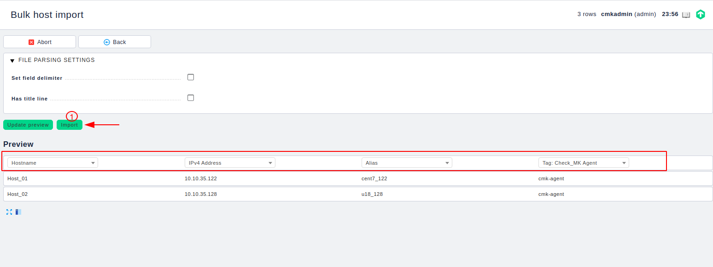
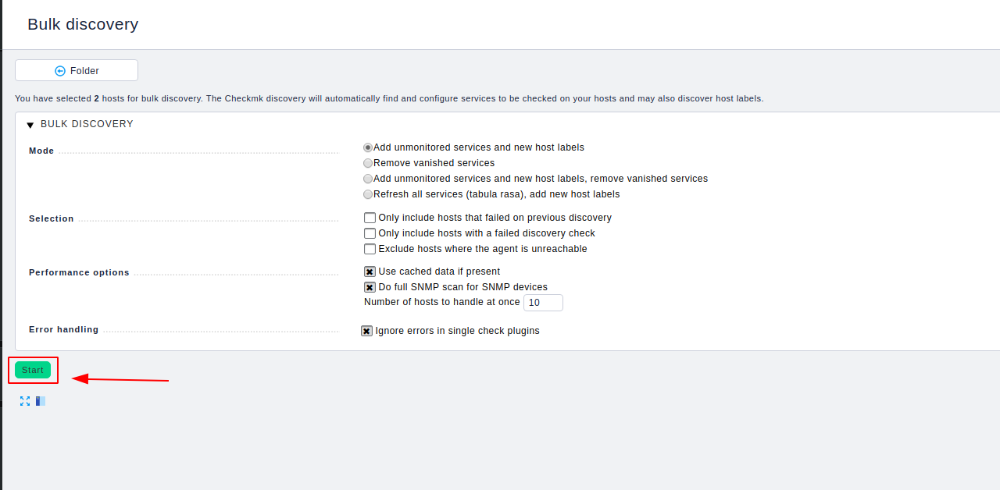
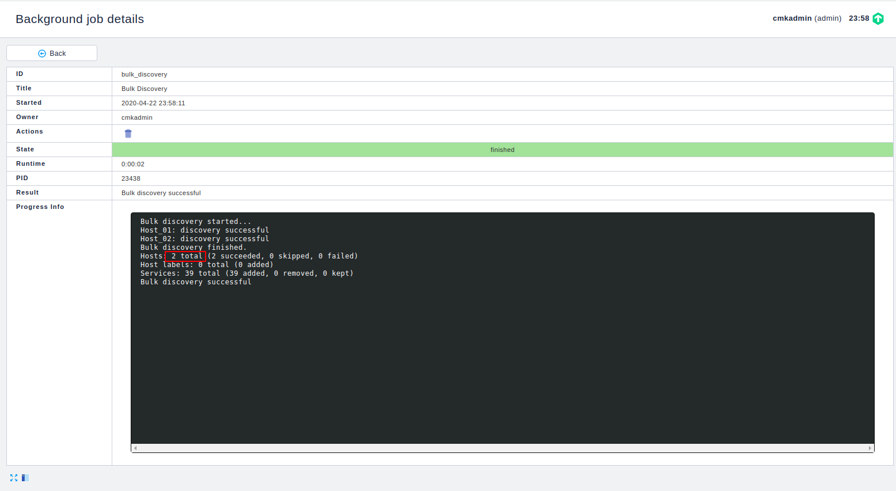
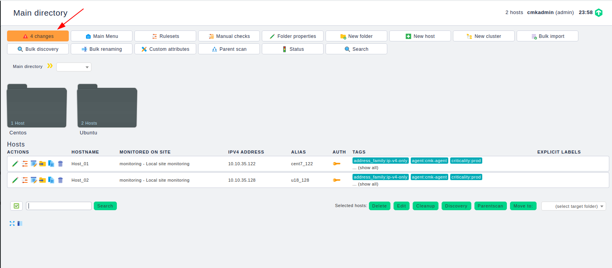
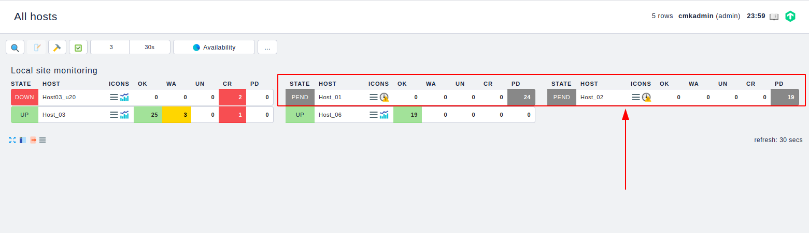

# Hướng dẫn add nhiều host trên checkmk

Bình thường nếu muốn add một host để thực hiện giám sát bạn cần cài đặt agent sau đó lại truy cập vaò host để thực hiện add tưng host. Như vậy nếu số lượng host lớn thì sẽ mất rất nhiều thời gian. Checkmk hỗ trợ bạn add một lúc nhiều host bằng cách import csv

Trước tiên cần cài agent lên các host cần giám sát. Có thể tham khảo [script này](https://raw.githubusercontent.com/niemdinhtrong/thuctapsinh/master/NiemDT/Ghichep_checkmk/scripts/install_agent_checkmk.sh) để cài agent trên các host.

Sau khi cài agent trên các host xong ta quay trở lại Web UI để thực hiện add host

 * Chọn 1 để vào mục quản lý host
 * Chọn 2 để thực hiện import



Có 2 cách để import. Bạn có thể khai báo thông tin ra một file sau đó upload file đó hoặc bạn chọn `Content of CSV File` sau đó điền nội dung vào mục 1



Tích vào mục 2 để thực hiện discovery các service. Sau đó chọn 3 để thực hiện upload

Nội dung của file hoặc nôi dung trong mục 1 khai báo lần lượt các trường và các trường cách nhau bới dấu `;`. Bạn có thể khai báo nhiều trường. Như ví dụ tôi thực hiện add 2 host như sau

```
Host_01;10.10.35.122;cent7_122;cmk-agent
Host_02;10.10.35.128;u18_128;cmk-agent
```
Định nghĩa tên của các trường cho các khai báo trước đó. Sau đó thì chon 1 để import



Thực hiện discovery



Ta thấy 2 host mới đã được add



Cập nhật thay đổi



Ta thấy 2 host đã được add thành công

