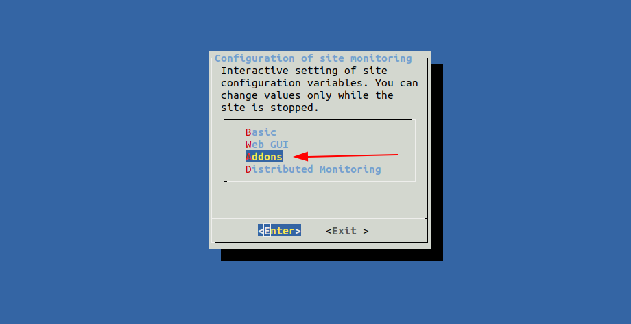
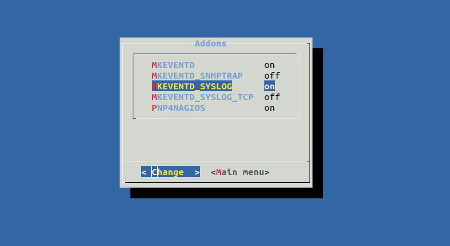
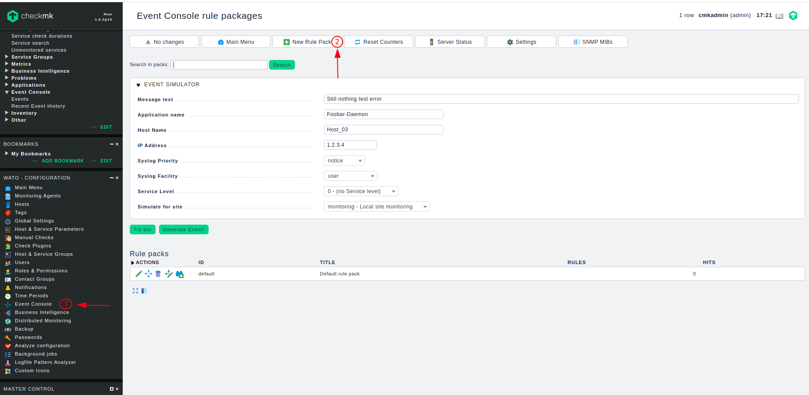
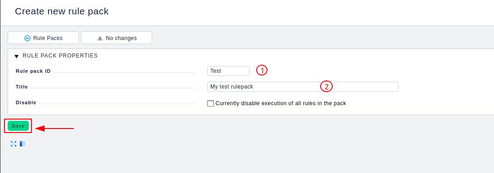
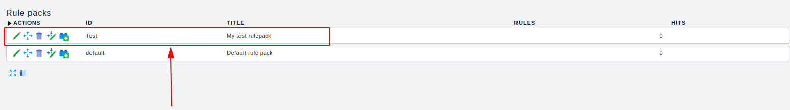
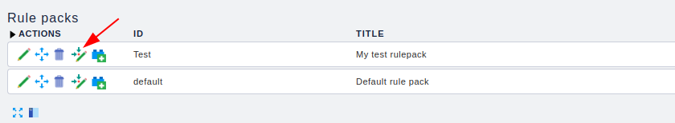
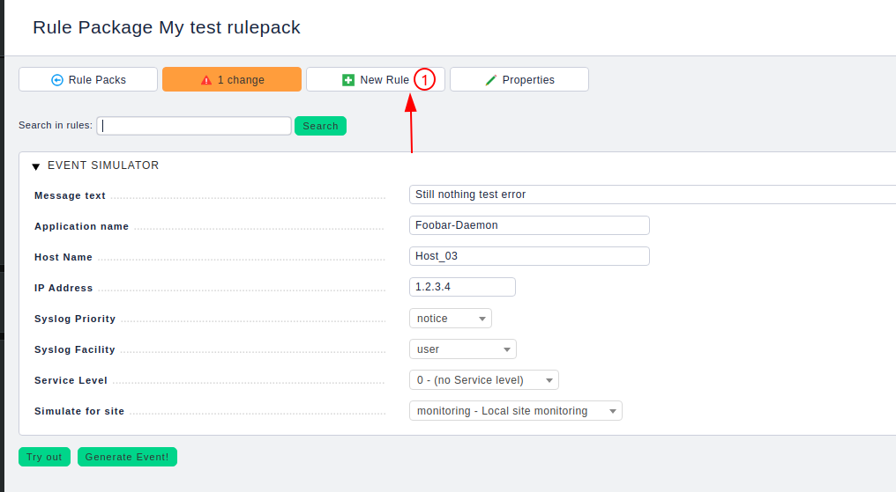
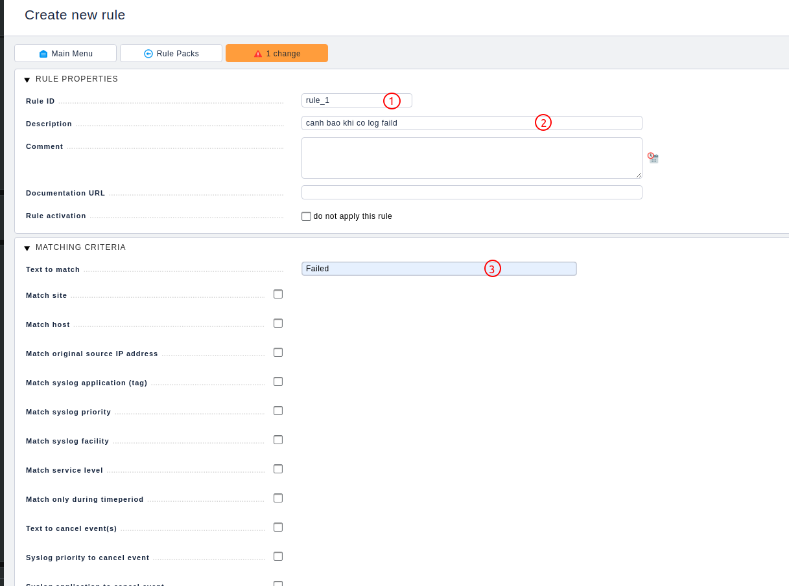
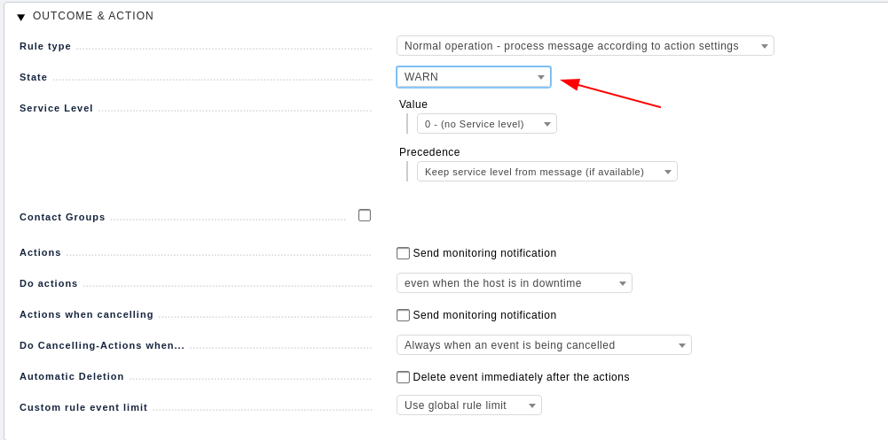
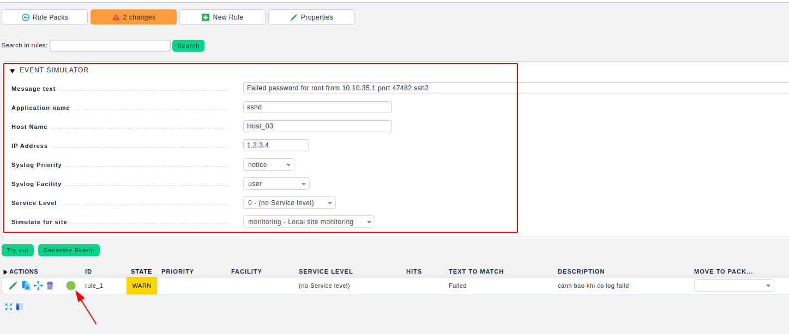

# Event console

## Giới thiệu

Ngoài việc giám sát các service thông qua các metric. Checkmk còn có một kiểu giám sát khác làm việc với sự kiện (Event). Với **Event console**, checkmk tích hợp một hệ thống độc lập với lõi giám sát - Event Deamon (mkeventd) được dùng để giám sát các sự kiện từ các nguồn như Syslog, SNMP Traps, Windows event log, file log và các ứng dụng của người dùng. Nó có thể nhận các message trực tiếp từ các nguồn như Syslog hay SNMP và dựa vào các rule sẽ đưa ra các cảnh báo.

## Thiết lập

Cho phép checkmk nhận log từ syslog

```
omd config
```

Vào `Addons`



Bật `MKEVENTD` và `MKEVENTD_SYSLOG` để cho phép checkmk nhận log từ syslog thông qua post 514 UDP



Lưu thay đổi sau đó khởi động omd

```
OMD[monitoring]:~$ omd start
Starting mkeventd (builtin: syslog-udp)...Already running.
Starting rrdcached...Already running.
npcd already started...
Starting nagios...Already running.
Starting apache...(already running: 29064)...OK
Initializing Crontab...OK

```

Bây giờ truy cập Web UI để tạo rule

 * Chọn 1 để vào Event console
 * Chọn 2 để tạo một rule pack. Rule Pack là một gói nhóm các rule để tiện quản lý



Điền thông tin của Rule Pack sau đó lưu lại



Ta thấy rule pack đã được tạo



Tạo các rule trong rule pack



Chọn 1 để tạo rule mới



Điền thông tin cho rule

 * 1 là rule ID dùng để định danh rule và phân biệt với các rule khác
 * 2 là mô tả về rule
 * 3 là điều kiện để match rule. Ở đây tôi chỉ để diều kiện match rule là trong bản tin log có từ `Failed`



Chọn các action khi bản tin match với rule ở trên. Ở đây tôi chỉ đặt trang thái của event là `WARNING`



Sau đó lưu lại

Bạn có thể fake một bản tin để xem rule của bạn có hoạt động đúng như mong muốn. Khai báo các giá trị muốn fake trong trường `EVENT SIMULATOR` và chọn `Try out`. Nếu thấy biểu tượng như sau thì đã match



### Bây giờ vào máy client muốn thu thập log để thao tác

Cấu hình gửi log đến checkmk server

```
echo '*.*  @IP_checkmk_server:514;RSYSLOG_SyslogProtocol23Format' >> /etc/rsyslog.conf
```

Restart lại rsyslog

```
systemctl restart rsyslog
```

Bây giờ khi có một bản tin log trên client có từ `Failed` thì sẽ có event trên checkmk


Ở đây khi tôi ssh Faild thì đã thấy xuất hiện event.