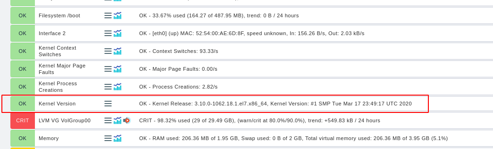

# Cài đặt plugin uname

## Đăng nhập checkmk server để thao tác

Download file mkp

```
cd /tmp
wget https://github.com/HeinleinSupport/check_mk_extensions/raw/master/uname/uname-3.0.mkp
```

Cài đặt plugin

```
su - monitoring
mkp install uname
```

Sau khi cài xong có thể dùng lệnh sau để kiểm tra

```
mkp list
```

Thực hiện copy file `uname` trong đường dẫn `/opt/omd/sites/monitoring/local/share/check_mk/agents/plugins/uname` sang thư mục `/lib/check_mk_agent/plugins/` trên máy client

## Đăng nhập vào Web UI để add service

Sau khi thực hiện discovery ta thấy service được add trên host

