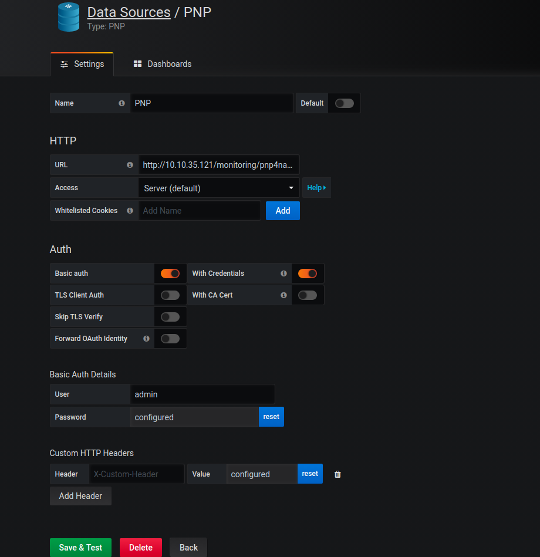
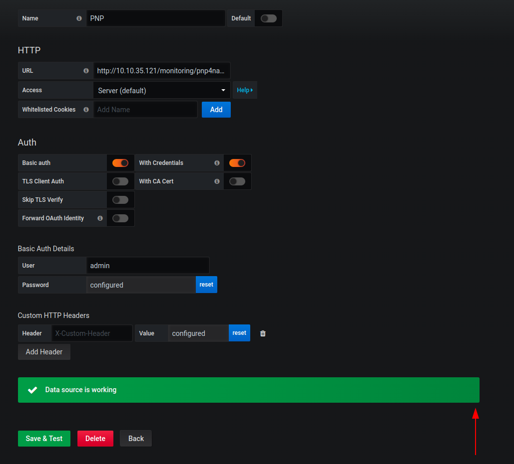
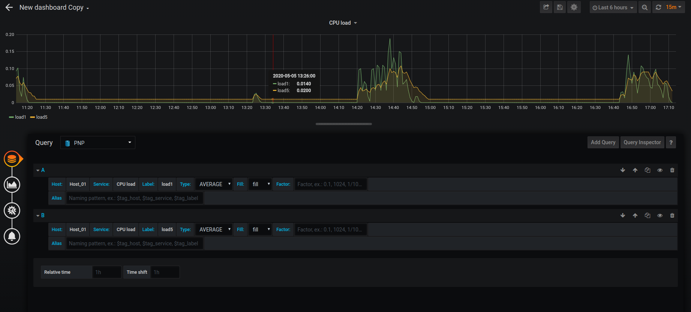

# Hiển thị biếu đồ trên grafana

Với phiên bản Checkmk Raw Edition để hiển thị được biểu đồ trên grafana ta phải sử dụng plugin PNP4nagios.

## Trên server grafana

Thực hiện add plugin PNP

```
cd /var/lib/grafana/plugins
git clone https://github.com/sni/grafana-pnp-datasource.git
```

restart lại grafana

```
systemctl restart grafana-server
```

## Trên checkmk server

Download API

```
cd /omd/versions/1.6.0p10.cre/share/pnp4nagios/htdocs/application/controllers
wget https://github.com/lingej/pnp-metrics-api/raw/master/application/controller/api.php
```

Sửa file `config.php`

```
vi /omd/sites/monitoring/etc/pnp4nagios/config.php
```

Tại dòng 103 sửa `$conf[‘auth_enabled’] = TRUE;` thành `$conf[‘auth_enabled’] = FALSE;`

Tại dòng 109 sửa `$conf[‘auth_multisite_enabled’] = TRUE;` thành `$conf[‘auth_multisite_enabled’] = FALSE; `

Vào thư mục `/omd/sites/monitoring/etc/pnp4nagios/config.d` đổi tên file `authorisation.php` thành `authorisation.php_old` và `cookie_auth.php` thành `cookie_auth.php_old`

Thực hiện restart lại omd

```
OMD[monitoring]:~$ omd restart
```

## Đăng nhập vào grafana

Add data source



Trong đó url như sau:

```
http://IP_checkmk/site_name/pnp4nagios/
```

Sau khi test và lưu kết quả như sau là ok



Tạo dashboad và biểu đồ

