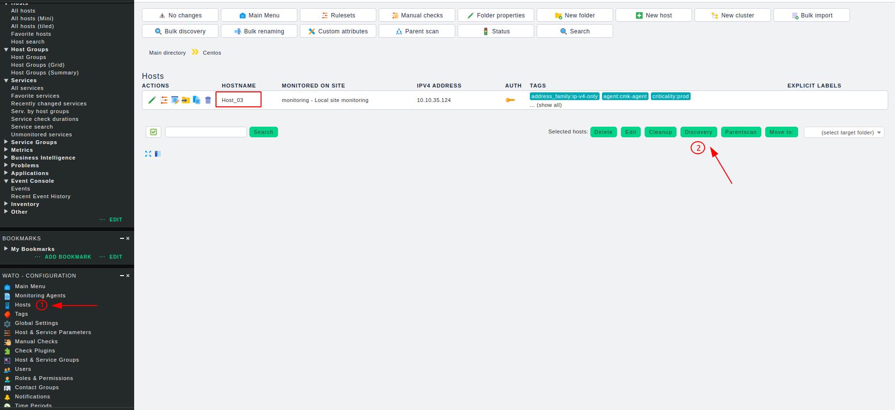
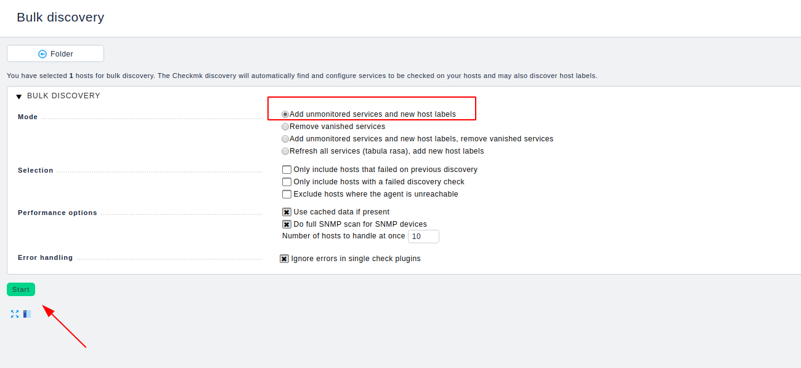
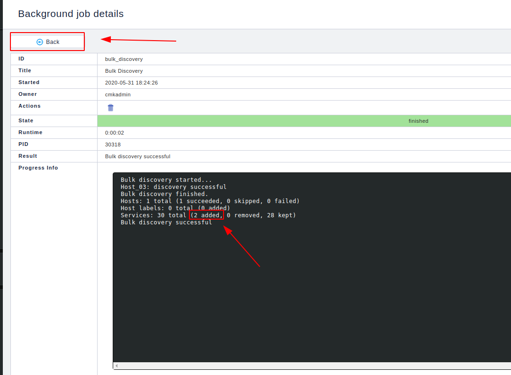
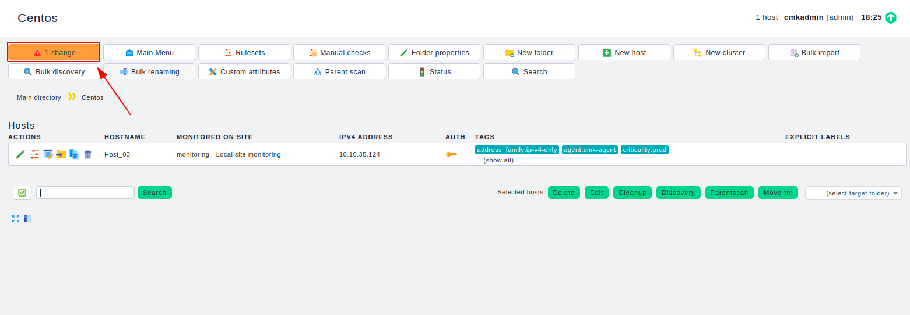
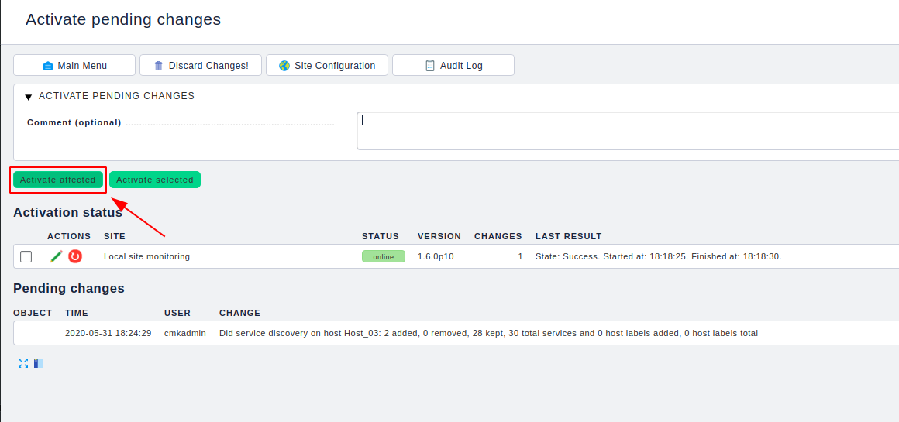
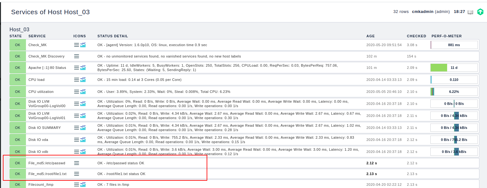

# Sử dụng plugin kiểm tra sự thay đổi của file

## Thực hiện trên agent

Download plugin

```
cd /usr/lib/check_mk_agent/local
wget https://raw.githubusercontent.com/niemdinhtrong/thuctapsinh/master/NiemDT/Ghichep_checkmk/scripts/check_file_md5.py
```

Khai báo những file cần kiểm tra

Mở file `check_file_md5.py` để chỉnh sửa

```
vi check_file_md5.py
```

Khai báo những file cần kiểm tra vào dòng `FILES = []` lưu ý cần khai báo rõ đường dẫn đến file. Ví dụ kiểm tra 2 file `/root/file1.txt` và `/etc/passwd` thì khai báo như sau:

```
FILES = ['/root/file1.txt', '/etc/passwd']
```

Sau đó lưu lại và cấp quyền thực thi cho file 

```
chmod +x check_file_md5.py
```

Kiểm tra

```
check_mk_agent | grep "File_md5"
```

Nếu có kết quả trả về là ok

```
0 File_md5:/root/file1.txt - /root/file1.txt status OK
0 File_md5:/etc/passwd - /etc/passwd status OK
```

## Thực hiện trên web

Thực hiện discovery trên host vừa add plugin





Ta thấy có service mới được add



Kích hoạt thay đổi





Quay trở lại host vừa add ta thấy service đã được check

