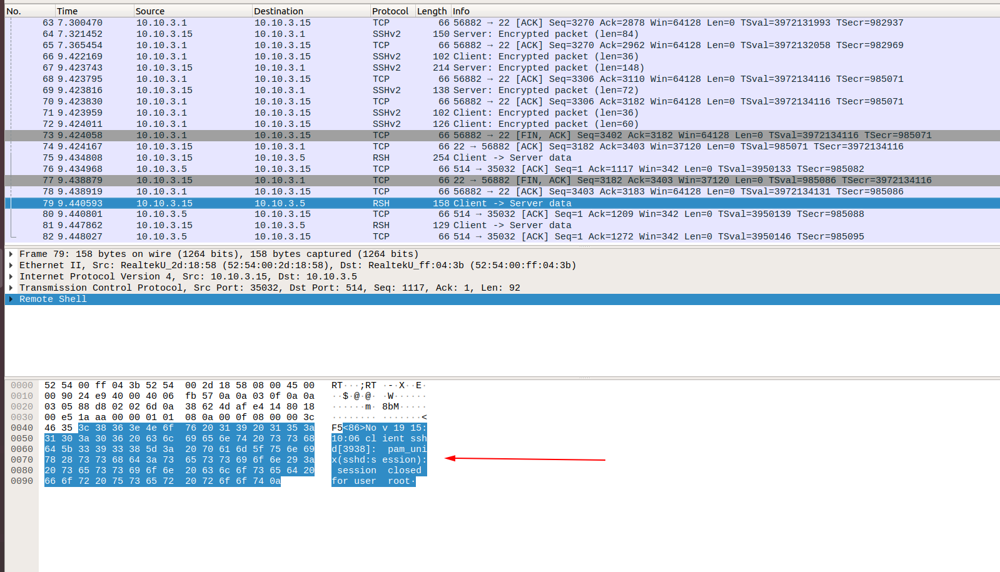
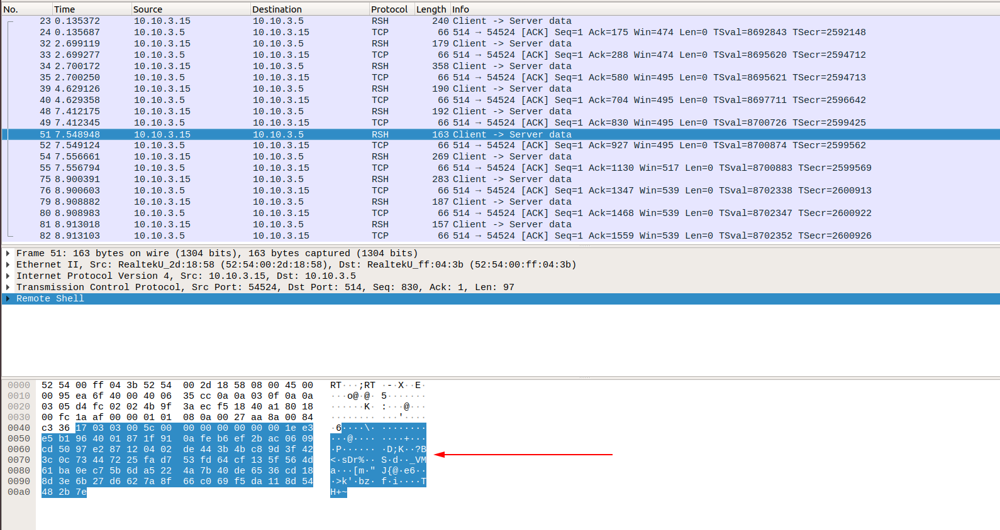

## Tạo chứng chỉ CA

Ta có thể tạo trên server rsyslog hoặc trên một server khác

Cài gói cần thiết

```
apt-get install gnutls-utils
(or)
apt-get install gnutls-bin
```

Tạo private key cho CA

```
certtool --generate-privkey --outfile CA-key.pem
```

Tạo public key cho CA

```
certtool --generate-self-signed --load-privkey CA-key.pem --outfile CA.pem
```

```
Common name: Niemdt
The certificate will expire in (days): 3650
Does the certificate belong to an authority? (y/N): y
Will the certificate be used to sign other certificates? (y/N): y
Is the above information ok? (Y/N): y
```

Ta cần trả lời một số câu hỏi như trên. Những câu hỏi còn laị ta có thể để trống

## Tạo private/public key cho server

```
certtool --generate-privkey --outfile server-key.pem --bits 2048
```
```
certtool --generate-request --load-privkey server-key.pem --outfile server-request.pem
```

```
Common name: server.com.vn
Enter a dnsName of the subject of the certificate: server.com.vn
Does the certificate belong to an authority? (y/N): n
Is this a TLS web client certificate? (y/N): y
Is this also a TLS web server certificate? (y/N): y
```

```
certtool --generate-certificate --load-request server-request.pem --outfile server-cert.pem --load-ca-certificate CA.pem --load-ca-privkey CA-key.pem
```

```
The certificate will expire in (days): 3650
Does the certificate belong to an authority? (y/N): n
Is this a TLS web client certificate? (y/N): y
Is this also a TLS web server certificate? (y/N): y
Enter a dnsName of the subject of the certificate: server.com.vn
Is the above information ok? (Y/N): y
```

```
rm -rf server-request.pem
```

## Tạo private/public key cho client

```
certtool --generate-privkey --outfile client-key.pem --bits 2048
```

```
certtool --generate-request --load-privkey client-key.pem --outfile client-request.pem
```

```
Common name: client.com.vn
Enter a dnsName of the subject of the certificate: client.com.vn
Does the certificate belong to an authority? (y/N): n
Is this a TLS web client certificate? (y/N): y
Is this also a TLS web server certificate? (y/N): y
```

```
certtool --generate-certificate --load-request client-request.pem --outfile client-cert.pem --load-ca-certificate CA.pem --load-ca-privkey CA-key.pem
```

```
The certificate will expire in (days): 3650

Does the certificate belong to an authority? (y/N): n
Is this a TLS web client certificate? (y/N): y
Is this also a TLS web server certificate? (y/N): y
Enter a dnsName of the subject of the certificate: client.com.vn
Is the above information ok? (Y/N): y
```

## Copy file CA.pem và client-* tới client

Ta có thể sử dụng scp để thực hiện việc này

```
scp CA.pem root@ip-client:/etc/pki/tls/private
scp client-cert.pem root@ip-client:/etc/pki/tls/private
scp client-key.pem root@ip-client:/etc/pki/tls/private
```

## Copy file CA.pem và server-* tới rsyslog server

```
scp CA.pem root@ip-server:/etc/pki/tls/private
scp server-cert.pem root@ip-server:/etc/pki/tls/private
scp server-key.pem root@ip-server:/etc/pki/tls/private
```

## Cấu hình rsyslog

**Trên rsyslog server**

Cài gói cần thiết

```
yum install rsyslog-gnutls
```

Sửa file `/etc/rsyslog.conf`

Thêm vào những dòng sau

```
# GTLS driver
$DefaultNetstreamDriver gtls
# Certificates
$DefaultNetstreamDriverCAFile /etc/pki/tls/private/CA.pem
$DefaultNetstreamDriverCertFile /etc/pki/tls/private/server-cert.pem
$DefaultNetstreamDriverKeyFile /etc/pki/tls/private/server-key.pem
# Authentication mode
$InputTCPServerStreamDriverAuthMode x509/name
$InputTCPServerStreamDriverPermittedPeer *.devconnected.com
# Only use TLS
$InputTCPServerStreamDriverMode 1
```

File cấu hình lúc này

```
# rsyslog configuration file

# For more information see /usr/share/doc/rsyslog-*/rsyslog_conf.html
# If you experience problems, see http://www.rsyslog.com/doc/troubleshoot.html

#### MODULES ####

# The imjournal module bellow is now used as a message source instead of imuxsock.
$ModLoad imuxsock # provides support for local system logging (e.g. via logger command)
$ModLoad imjournal # provides access to the systemd journal
#$ModLoad imklog # reads kernel messages (the same are read from journald)
$ModLoad immark  # provides --MARK-- message capability

# Provides UDP syslog reception
#$ModLoad imudp
#$UDPServerRun 514

# Provides TCP syslog reception
#$ModLoad imtcp
#$InputTCPServerRun 514


#### GLOBAL DIRECTIVES ####

# Where to place auxiliary files
$WorkDirectory /var/lib/rsyslog

# Use default timestamp format
$ActionFileDefaultTemplate RSYSLOG_TraditionalFileFormat

# File syncing capability is disabled by default. This feature is usually not required,
# not useful and an extreme performance hit
#$ActionFileEnableSync on

# Include all config files in /etc/rsyslog.d/
$IncludeConfig /etc/rsyslog.d/*.conf

# Turn off message reception via local log socket;
# local messages are retrieved through imjournal now.
$OmitLocalLogging on

# File to store the position in the journal
$IMJournalStateFile imjournal.state

$DefaultNetstreamDriver gtls

$DefaultNetstreamDriverCAFile /etc/pki/tls/private/CA.pem
$DefaultNetstreamDriverCertFile /etc/pki/tls/private/server-cert.pem
$DefaultNetstreamDriverKeyFile /etc/pki/tls/private/server-key.pem

$ModLoad imtcp

$InputTCPServerStreamDriverAuthMode anon
$InputTCPServerStreamDriverMode 1 # run driver in TLS-only mode

$ActionSendStreamDriverAuthMode x509/name
$ActionSendStreamDriverPermittedPeer *.com.vn
$ActionSendStreamDriverMode 1

$InputTCPServerRun 514

# Increase the amount of open files rsyslog is allowed, which includes open tcp sockets
# This is important if there are many clients.
# http://www.rsyslog.com/doc/rsconf1_maxopenfiles.html
$MaxOpenFiles 2048

#### RULES ####

# Log all kernel messages to the console.
# Logging much else clutters up the screen.
#kern.*                                                 /dev/console

# Log anything (except mail) of level info or higher.
# Don't log private authentication messages!
*.info;mail.none;authpriv.none;cron.none                /var/log/messages

# The authpriv file has restricted access.
authpriv.*                                              /var/log/secure

# Log all the mail messages in one place.
mail.*                                                  -/var/log/maillog


# Log cron stuff
cron.*                                                  /var/log/cron

# Everybody gets emergency messages
*.emerg                                                 :omusrmsg:*

# Save news errors of level crit and higher in a special file.
uucp,news.crit                                          /var/log/spooler

# Save boot messages also to boot.log
local7.*                                                /var/log/boot.log


# ### begin forwarding rule ###
# The statement between the begin ... end define a SINGLE forwarding
# rule. They belong together, do NOT split them. If you create multiple
# forwarding rules, duplicate the whole block!
# Remote Logging (we use TCP for reliable delivery)
#
# An on-disk queue is created for this action. If the remote host is
# down, messages are spooled to disk and sent when it is up again.
#$ActionQueueFileName fwdRule1 # unique name prefix for spool files
#$ActionQueueMaxDiskSpace 1g   # 1gb space limit (use as much as possible)
#$ActionQueueSaveOnShutdown on # save messages to disk on shutdown
#$ActionQueueType LinkedList   # run asynchronously
#$ActionResumeRetryCount -1    # infinite retries if host is down
# remote host is: name/ip:port, e.g. 192.168.0.1:514, port optional
#*.* @@remote-host:514
# ### end of the forwarding rule ###
$template TmplAuth,"/var/log/%HOSTNAME%/%PROGRAMNAME%.log"
*.*     ?TmplAuth
```

Restart lại rsyslog

```
systemctl restart rsyslog
```

**Cấu hình trên client**

Cài gói cần thiết

```
yum install rsyslog-gnutls
```

Sửa file `/etc/rsyslog.conf`

Thêm vào các dòng sau

```
# GTLS driver
$DefaultNetstreamDriver gtls
# Certificates
$DefaultNetstreamDriverCAFile /etc/ssl/rsyslog/CA.pem
$DefaultNetstreamDriverCertFile /etc/ssl/rsyslog/client-cert.pem
$DefaultNetstreamDriverKeyFile /etc/ssl/rsyslog/client-key.pem
# Auth mode
$ActionSendStreamDriverAuthMode x509/name
$ActionSendStreamDriverPermittedPeer server.devconnected.com
# Only use TLS
$ActionSendStreamDriverMode 1
```

File lúc này sẽ như sau

```
# rsyslog configuration file

# For more information see /usr/share/doc/rsyslog-*/rsyslog_conf.html
# If you experience problems, see http://www.rsyslog.com/doc/troubleshoot.html

#### MODULES ####

# The imjournal module bellow is now used as a message source instead of imuxsock.
$ModLoad imuxsock # provides support for local system logging (e.g. via logger command)
$ModLoad imjournal # provides access to the systemd journal
#$ModLoad imklog # reads kernel messages (the same are read from journald)
#$ModLoad immark  # provides --MARK-- message capability

# Provides UDP syslog reception
#$ModLoad imudp
#$UDPServerRun 514

# Provides TCP syslog reception
#$ModLoad imtcp
#$InputTCPServerRun 514


#### GLOBAL DIRECTIVES ####

# Where to place auxiliary files
$WorkDirectory /var/lib/rsyslog

# Use default timestamp format
$ActionFileDefaultTemplate RSYSLOG_TraditionalFileFormat

# File syncing capability is disabled by default. This feature is usually not required,
# not useful and an extreme performance hit
#$ActionFileEnableSync on

# Include all config files in /etc/rsyslog.d/
$IncludeConfig /etc/rsyslog.d/*.conf

# Turn off message reception via local log socket;
# local messages are retrieved through imjournal now.
$OmitLocalLogging on

# File to store the position in the journal
$IMJournalStateFile imjournal.state

# GTLS driver
$DefaultNetstreamDriver gtls
# Certificates
$DefaultNetstreamDriverCAFile /etc/pki/tls/private/CA.pem
$DefaultNetstreamDriverCertFile /etc/pki/tls/private/client-cert.pem
$DefaultNetstreamDriverKeyFile /etc/pki/tls/private/client-key.pem
# Auth mode
$ActionSendStreamDriverAuthMode x509/name
$ActionSendStreamDriverPermittedPeer server.com.vn
# Only use TLS
$ActionSendStreamDriverMode 1


#### RULES ####

# Log all kernel messages to the console.
# Logging much else clutters up the screen.
#kern.*                                                 /dev/console

# Log anything (except mail) of level info or higher.
# Don't log private authentication messages!
*.info;mail.none;authpriv.none;cron.none                /var/log/messages

# The authpriv file has restricted access.
authpriv.*                                              /var/log/secure

# Log all the mail messages in one place.
mail.*                                                  -/var/log/maillog


# Log cron stuff
cron.*                                                  /var/log/cron

# Everybody gets emergency messages
*.emerg                                                 :omusrmsg:*

# Save news errors of level crit and higher in a special file.
uucp,news.crit                                          /var/log/spooler

# Save boot messages also to boot.log
local7.*                                                /var/log/boot.log


# ### begin forwarding rule ###
# The statement between the begin ... end define a SINGLE forwarding
# rule. They belong together, do NOT split them. If you create multiple
# forwarding rules, duplicate the whole block!
# Remote Logging (we use TCP for reliable delivery)
#
# An on-disk queue is created for this action. If the remote host is
# down, messages are spooled to disk and sent when it is up again.
#$ActionQueueFileName fwdRule1 # unique name prefix for spool files
#$ActionQueueMaxDiskSpace 1g   # 1gb space limit (use as much as possible)
#$ActionQueueSaveOnShutdown on # save messages to disk on shutdown
#$ActionQueueType LinkedList   # run asynchronously
#$ActionResumeRetryCount -1    # infinite retries if host is down
# remote host is: name/ip:port, e.g. 192.168.0.1:514, port optional
*.* @@10.10.3.5:514
# ### end of the forwarding rule ###
```

Restart lại rsyslog

```
systemctl restart rsyslog
```

Khi chưa cấu hình TLS



Khi đã cấu hình TLS

