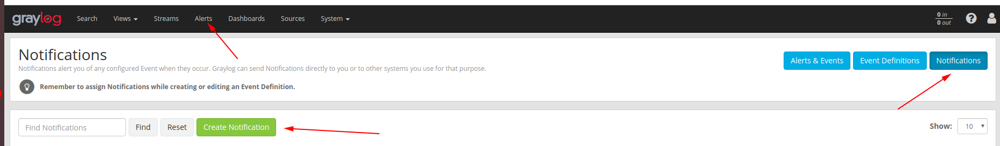
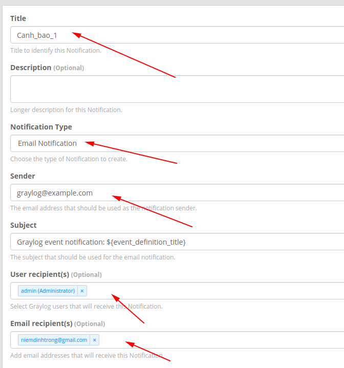
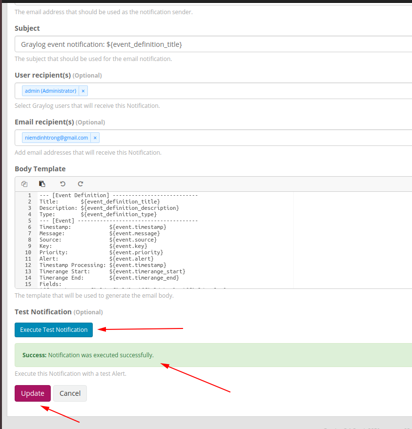
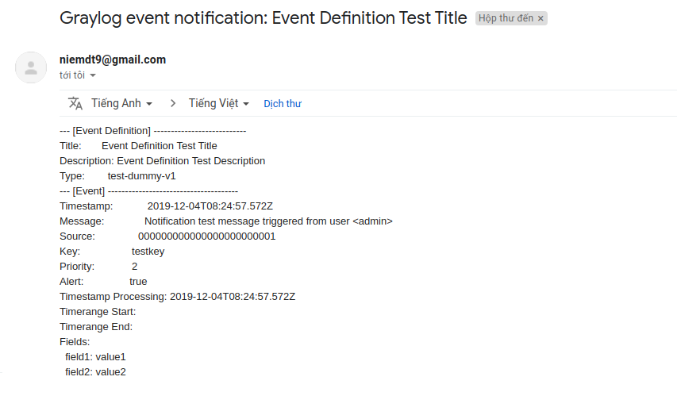

# Cấu hình gửi cảnh báo mail

## Sửa file cấu hình trên graylog server

Sửa file `/etc/graylog/server/server.conf`

```
transport_email_enabled = true
transport_email_hostname = smtp.gmail.com
transport_email_port = 587
transport_email_use_auth = true
transport_email_auth_username = your_mail@gmail.com
transport_email_auth_password = password_your
transport_email_subject_prefix = [graylog]
transport_email_from_email = your_mail@gmail.com
transport_email_use_tls = true
transport_email_use_ssl = false
```

Sau đó lưu lại và restart dịch vụ `graylog-server`

## Cấu hình trên web

Click `Alerts -> Notifications -> Create Notification`



Điền thông tin



Chú ý `Email recipient` là địa chỉ của email nhận cảnh báo.

Có thể thay đổi nội dung cảnh báo trong phần `Body Template`

Ta có thể gửi thử cảnh báo bằng cách click `Execute Test Notification` Nếu thấy thông báo Success nghiã là đã thành công



Kiểm tra mail 



Sau đó chọn `Update` để lưu lại