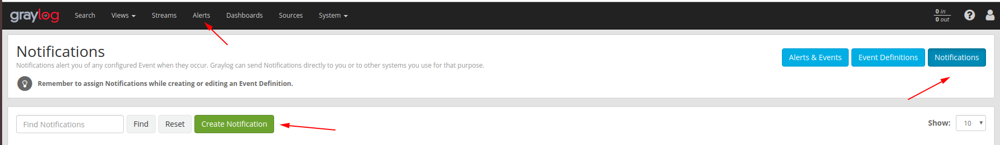
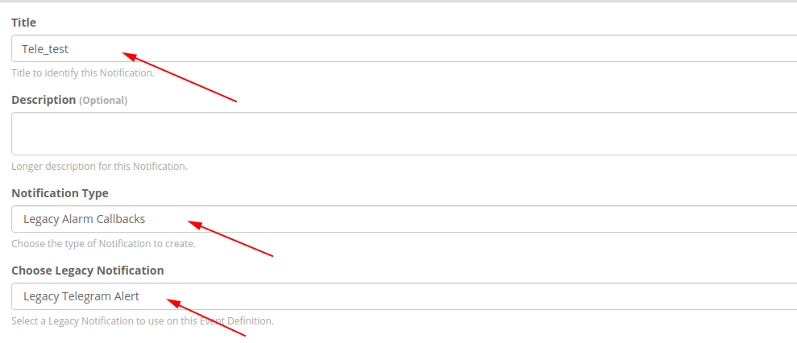
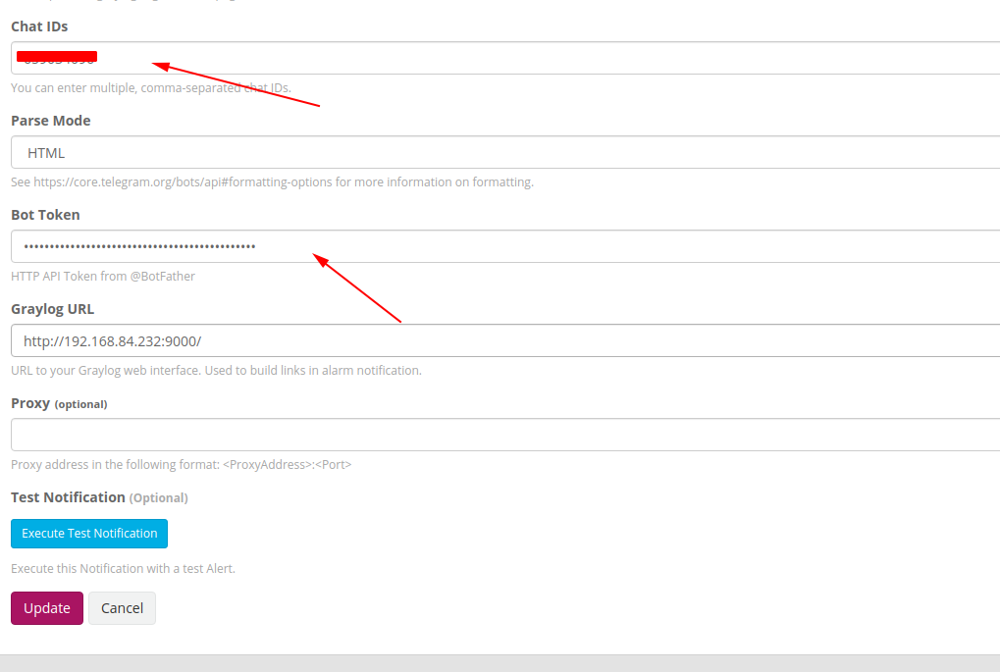
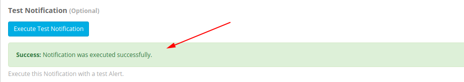

# Cấu hình gửi cảnh báo qua telegram

Thao tác trên graylog server

Vào thư mục chứa plugin của graylog. Mặc định thư mục này sẽ là `/usr/share/graylog-server/plugin/` nếu thay đổi thì bạn có thể kiểm tra lại trong file `server.conf`

```
cd /usr/share/graylog-server/plugin/
```

Dowload file flugin

```
wget https://github.com/irgendwr/TelegramAlert/releases/download/v2.2.0/telegram-alert-2.2.0.jar
```

Restart graylog-server

```
systemctl restart graylog-server
```

## Thao tác trên web

Click `Alerts -> Notifications -> Create Notification`





Khai báo thông tin telegram



`Chat IDs`: chat id của user của nhận message
`Bot Token`: Token của bot gửi message (Bạn cần tạo một con bot tele trước)

Click `Execute Test Notification` để gửi thử

Thấy như này là đã thành công




Sau đó chọn `Update` để lưu lại