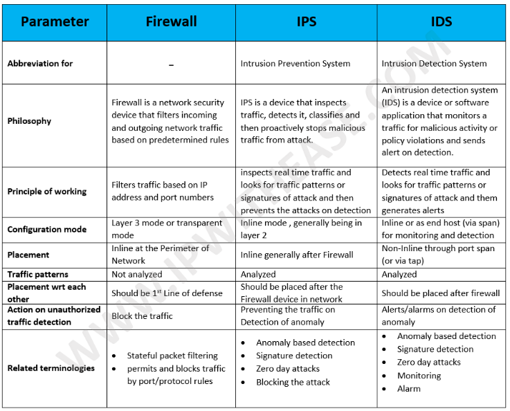

# Giới thiệu tổng quan về IDS và IPS

## IDS

IDS-Intrusion Detection System là một hệ thống có chức năng phát hiện xâm nhập. Dựa vào vị trí đặt trong mạng ta chia thì ta chia IDS thành 2 loại. Host based IDS (HIDS) và Network based IDS (NIDS)

### Network based IDS

Được đặt trước một vùng mạng vì vậy nó có thể phát hiện được các tấn công vào bất kỳ host nào trong vùng mạng đó. Để bắt được tất cả các traffic đi vào mạng thì ta cần xác định vị trí đặt IDS cho phù hợp.

Có 2 cách phát hiện tấn công:
 * Statistical anomaly IDS (Dựa vào dữ liệu bất thường)
 * Pattern matching IDS (Khớp mẫu có sẵn)

Với cách phát hiện dựa vào dữ liệu bất thường hệ thống IDS sẽ thu thập dữ liệu của user và hệ thống trong thời gian nó hoạt động bình thường để tạo thành một profile. Khi nó thấy có dữ liệu khác thường so với lúc hệ thống hoạt động bình thường mà nó thu thập được trước đó thì nó sẽ cảnh báo. Với cách phát hiện này sẽ có một vài ưu điểm và nhược điểm:
 * Có thể phát hiện được những cuộc tấn công chưa xảy ra
 * Khả năng cảnh báo sai là lớn (có thể có tấn công mà ko có cảnh báo)

Với cách phát hiện bằng cách khớp mẫu có sẵn thì hệ thống IDS sẽ có một database lưu trữ thông tin của các cuộc tấn công trên. Khi phân tích dữ liệu mà thấy matching với dữ liệu trong DB thì sẽ có cảnh báo. Bằng cách này cũng cũng nó một số ưu điểm và nhược điểm:
 * Hạn chế được những cảnh báo sai
 * Không phát hiện được những cuộc tấn công mà chưa có thông tin trong DB
 * Như vậy cần phải update liên tục DB để có thông tin về những cách tấn công mới nhất.

Ví dụ:
 * Real Secure
 * SecureNet
 * Snort

### Host based IDS

Nó được cài đặt trực tiếp tại host và nó có thể monitor tất cả dữ liệu vào ra trên con host đó. Ngoài traffic vào ra trên host nó còn có thể phân tích được chi tiết hơn như các file system, user active, running process,...

Có một số ưu điểm hơn của HIDS so với NIDS:
 * Nó có thể xác định cuộc tấn công đã xảy ra thành công trên máy đó chưa. Với NIDS chỉ có thể cảnh báo cuộc tấn công.
 * Monitor được các user đang active
 * Xác định được các tấn công xuất phát từ bên trong con host đó

Nhưng với hệ thống naỳ nó sẽ tiêu tốn một phần tài nguyên của hệ thống.

Ví dụ:
 * PortSentry

## IPS

Một hệ thống IPS có tính năng tương tự như IDS nhưng nó có thêm tính năng ngăn chặn các tấn công.

Cũng có 2 kiểu là Host based IPS và Network based IPS.

Với Host based IDS nó tương tự như phần mềm antivirus

Với hệ thống IDS nó chỉ phân copy dữ liệu đi qua mạng ra để phân tích và cảnh báo nên không ảnh hưởng đến tốc độ còn với hệ thống IPS dữ liệu phải đi qua hệ thống này để thực hiện phân tích nên nếu phát hiện tấn công sẽ ngăn chặn nên tốc độ có thể có đôi chút ảnh hưởng.

## So sánh Firewall và IPS

Với một hệ thống có cả Firewall và IPS thì IPS có thể được đặt trước firewall hoặc sau firewall.
 * Nếu triển khai IPS trước firewall thì đảm bảo được an toàn cho toàn bộ hệ thống phía sau IPS bao gồm cả firewall nhưng với cách này thì sẽ có rất nhiều log và công việc của IPS là lớn hơn rất nhiều.
 * Nếu triển khai IPS sau firewall (thường được sử dụng) việc này sẽ tận dụng được khả năng của firewall để giảm thiểu công việc trên IPS. Nó cũng phòng tránh được các cuộc tấn công thông qua VPN.