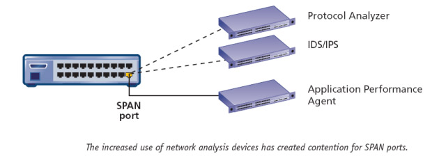
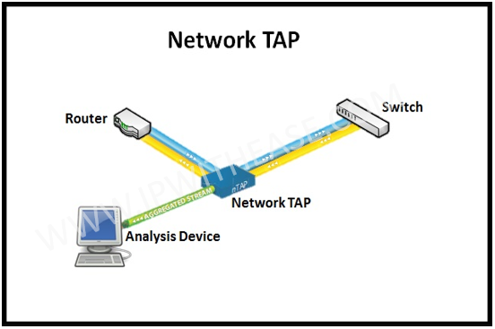

## Spanport

SPAN(Switched Port Analyzer): hay còn được gọi là `Port mirror` nó được cấu hình để copy toàn bộ lưu lượng trên các port về 1 hoặc 2 port để phục vụ cho việc phân tích lưu lượng qua mạng. 

* Local Span: Cả source port và destination port đều nằm trên một switch. Source port là một port hay nhiều port trên switch đó.
* Vlan-Based Span (VSPAN): Source có thể là cả một VLAN
* Remote Span (RSPAN): Source port và destination port nằm ở các switch khác nhau. Bản copy của các packet sẽ được gửi cho một VLAN đặc biệt chạy trên kết nối trunk và gửi về cho destination.

Cần lưu ý tốc độ giữa các port. Nếu các source port là Gib còn destination là Fast thì có thể dẫn đến tình trạng lưu lượng đổ về destination port lớn. Nếu trong trường hợp des port không xử lý kịp traffic sẽ được đưa vào hàng đợi. Khi hàng đợi đầy thì các trafic đến sẽ bị drop.

## TAP

TAP(Test Access Point) là một thiết bị phần cứng dùng để bắt traffic trên mạng. Thường được sử dụng để monitor traffic giữa 2 ponit trên network. Nó sẽ copy dữ liệu của đường truyền ra một kênh riêng biệt. 

Ta thấy TAP sẽ có 3 point, 2 point được sử dụng cho 2 đầu cần kết nối, 1 point được sử dụng để chuyển dữ liệu ra đây để phục vụ cho việc phân tích(port này chỉ có chức năng để nhận dữ liệu copy trên đường truyền chứ không có chức năng đẩy và nhận dữ liệu từ port này). Nó thường được dùng để giám sát lưu lượng trên đường truyền có lưu lượng lớn. Ví dụ như trên đường trunk.
