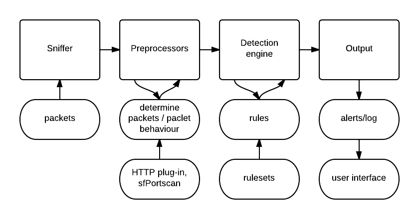

# Một số giải pháp IDS/IPS

## Snort

Snort là một giải pháp phát hiện xâm nhập mạng (NIDS). Nó được kết hợp với firewall để tạo thành giải pháp IPS. Nó phát hiện các xâm nhập bằng cách phân tích lưu lượng mạng theo thời gian thực. Được thiết kế trên module để kiểm tra các gói dữ liệu vào và ra bằng cách tạo ra các rule được thiết lập sẵn dựa vào những dấu hiệu, giao thức và sự khác thường được lưu trong file và có thể chỉnh sửa nhằm phát hiện ra những dữ liệu bất thường. Bạn cần update các rule này thường xuyên.

Có một vài nhược điểm: Snort chạy đơn luồng nên tốc độ xử lý sẽ chậm hơn, giao diện chưa thân thiện với người dùng.

## Suricata

Suricata cũng là một giải pháp open-source khác để phát hiện xâm nhập mạng (NIDS). Nó cũng phân tích lưu lượng mạng theo thời gian thực. Nó được phát triển từ Snort nên nó cũng dựa trên các tập lệnh của snort. Vì vậy ta cũng có thể sử dụng chính tập luật của Snort. Suricata sử dụng input và output là các file YAML và JSON nên ta cũng dễ dàng thao tác. 

Suricata có giao diện thân thiện hơn snort.

Tốc độ xử lý của suricata cũng được cải thiện hơn nhờ khả năng xử lý đa luồng.

## Zeek

Tên gọi trước đây của nó là BroIDS. Đây cũng là một giải pháp NIDS nguồn mở. Nó không chỉ có chức năng phát hiện xâm nhập mà nó còn cung cấp thêm tính năng giám sát. Nó ghi log tất cả các gói tin nó bắt được và sau đó phân tích các lưu lượng này. Vì vậy nó được sử dụng làm các IDS truyền thống. Phù hợp để phát hiện các mối đe dọa và ghi lại log. Không giống với các NIDS khác là dựa vào profile để phát hiện bất thường, Zeek phân tích chi tiết các gói tin để tìm ra các mối đe dọa với hệ thống. Chính vì vậy Zeek mất nhiều tài nguyên và thời gian hơn Snort và Sricata trong quá trình phân tích lưu lượng mà nó bắt được. Một điểm nữa là nó khác khó sử dụng cho dù cộng đồng đang cố gắng phát triển nó để trở nên thân thiện hơn.