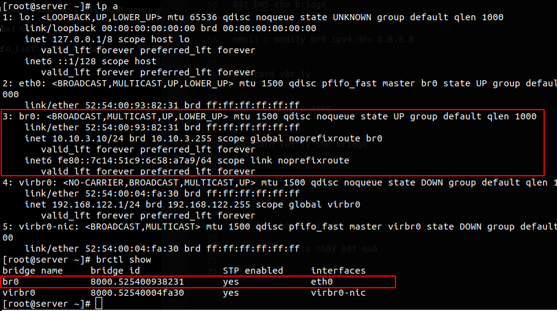

# Hướng dẫn cài đặt KVM và cấu hình linux bridge trên Centos7

## Cài đặt KVM

Kiểm tra CPU có support

```
egrep -c "svm|vmx" /proc/cpuinfo
```

Cài đặt KVM và các gói liên quan

```
yum install qemu-kvm libvirt bridge-utils virt-manager -y
```

Cài đặt X11 nếu muốn sử dụng `virt-manager`

```
yum install "@X Window System" xorg-x11-xauth xorg-x11-fonts-* xorg-x11-utils -y
```

Start libvirt

```
systemctl start libvirtd
systemctl enable libvirtd
```

## Cấu hình linux bridge

Tạo bridge có tên br0

```
nmcli c add type bridge autoconnect yes con-name br0 ifname br0
```

Đặt địa chỉ cho bridge

```
nmcli c modify br0 ipv4.addresses 10.10.3.10/24 ipv4.method manual
```

Đặt gateway cho bridge

```
nmcli c modify br0 ipv4.gateway 10.10.3.1
```

Đặt DNS cho bridge

```
nmcli c modify br0 ipv4.dns 8.8.8.8
```

Xóa card vật lý

```
nmcli c delete eth0
```

Gán card vật lý cho bridge

```
nmcli c add type bridge-slave autoconnect yes con-name eth0 ifname eth0 master br0
```

Sau đó reboot lại máy

Kiểm tra lại ta thấy kết quả

