# Hướng dẫn tạo máy ảo với cobbler

Click `Computes` sau đó chọn KVM muốn tạo máy ảo trên đó

Click `Storages`

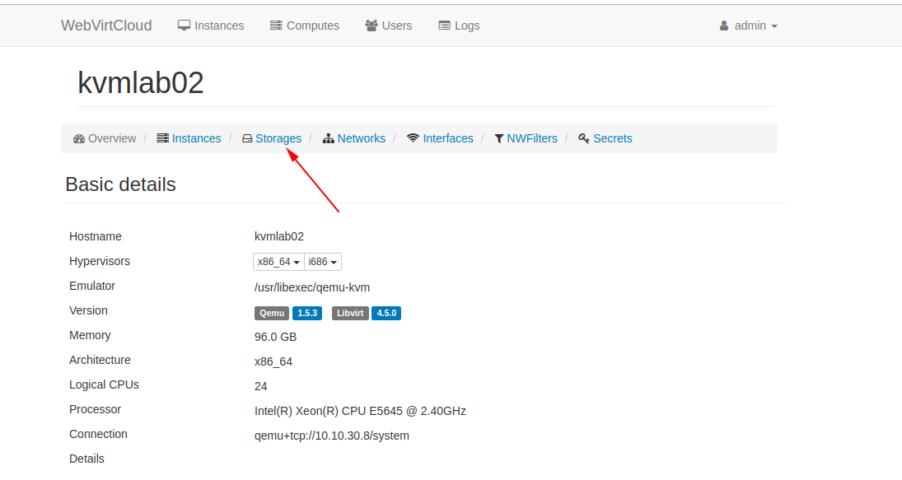

Chọn thư mục chứa images của VM

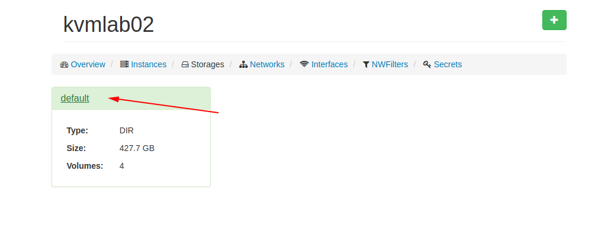

Chọn dấu cộng để tạo images cho VM

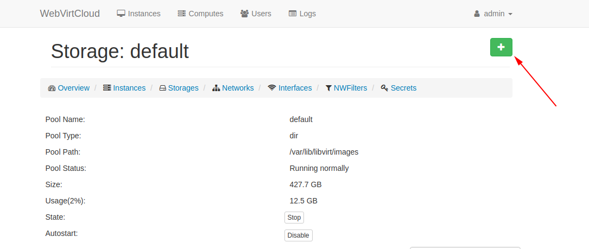

Khai báo tên images và size sau đó chọn `Create`

Lưu ý:
 * Tên images để trùng với tên VM
 * Format để `qcow2`

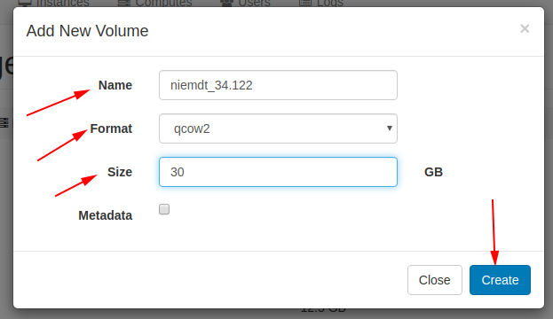

Sau đó vào `Instances`

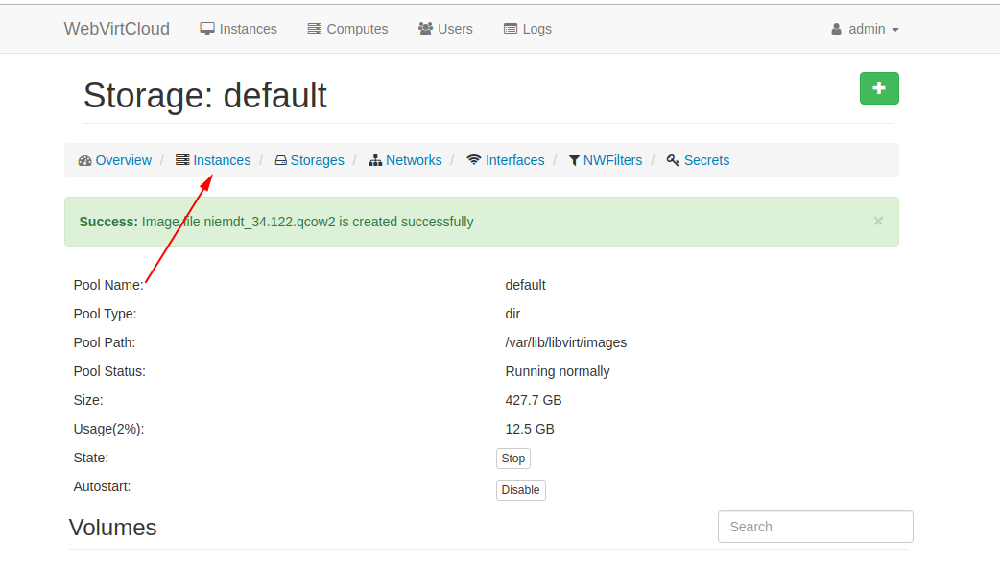

Click vào dấu cộng để add VM

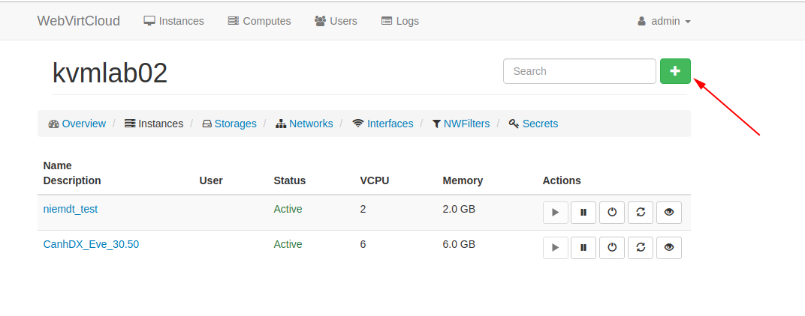

Chọn `Custom`

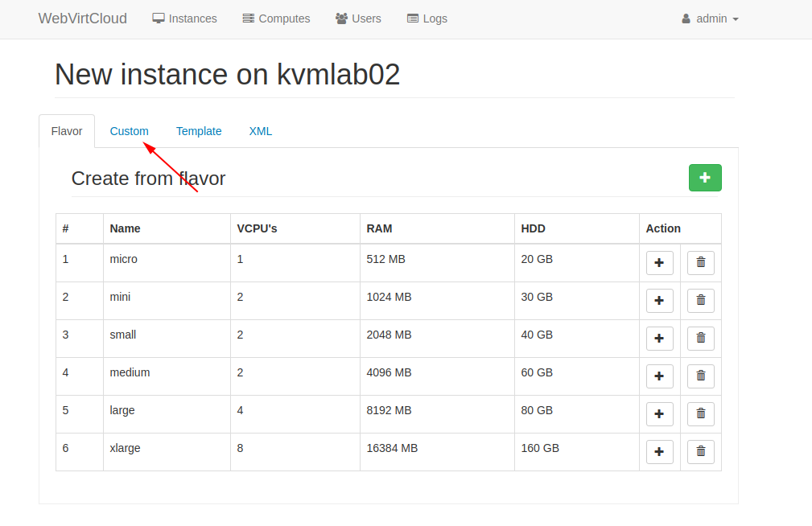

Khai báo các thông số của VM

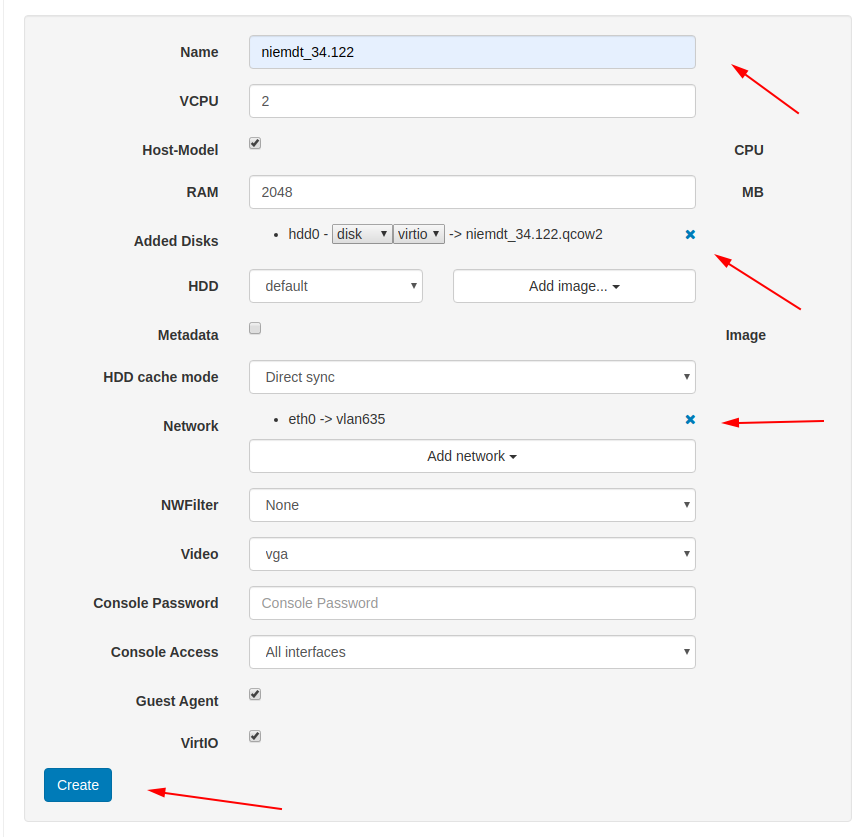

Tối thiểu 2G RAM và 2 CPU để tạo được máy với cobbler.

Add disk là images ta vừa tạo.

Network add `vlan635` để tạo được máy bằng cobbler

Sau đó click `Create`

Tạo bản snapshot đầu tiên

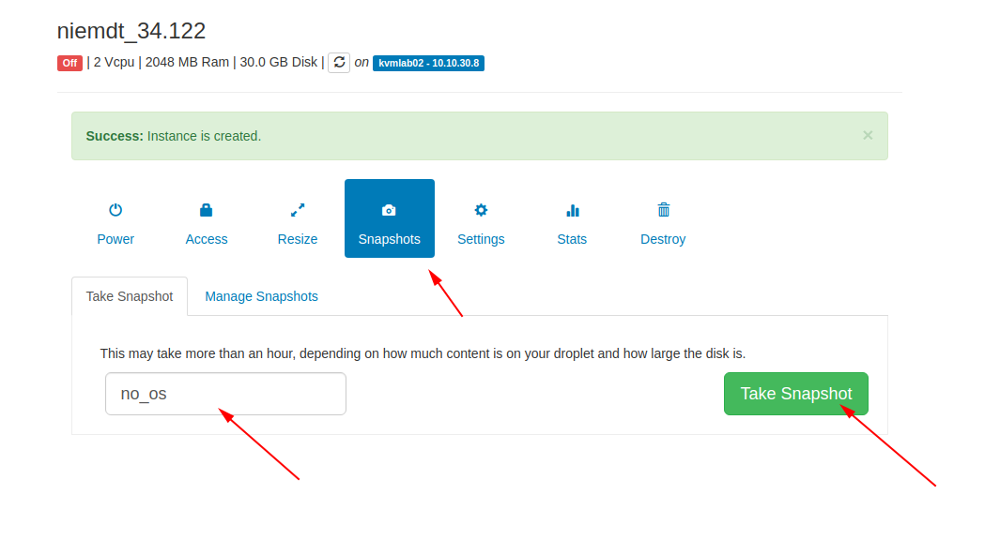

Chọn boot bằng card mạng

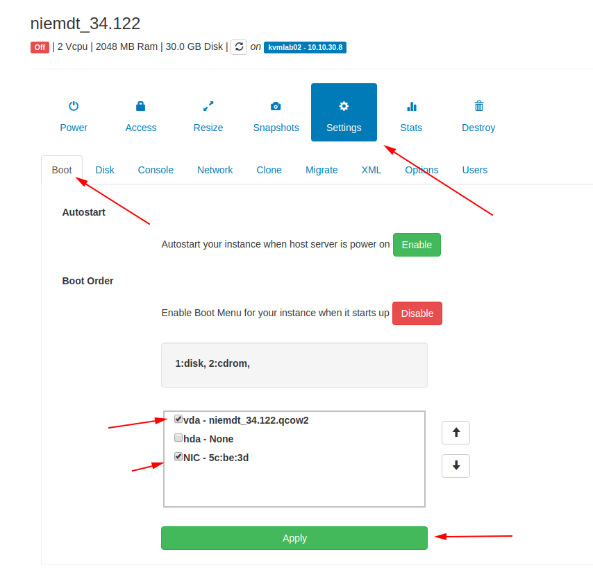

Bật máy

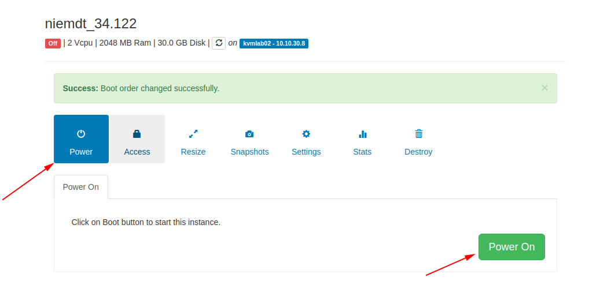

Vào console

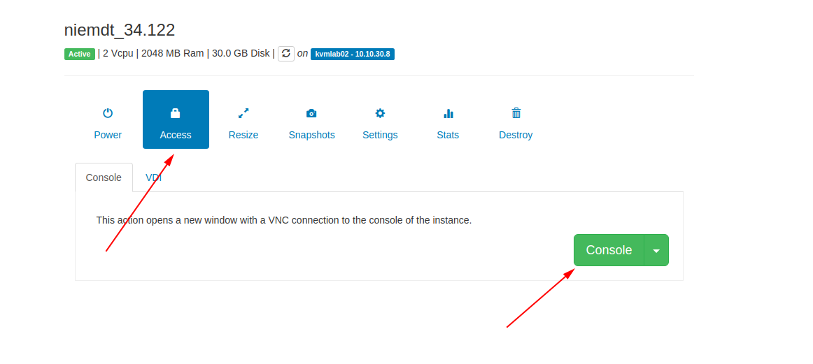

Chọn OS

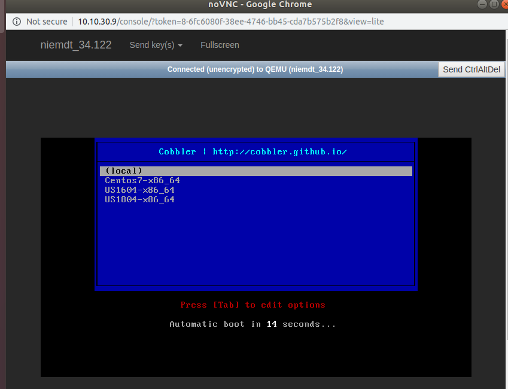

Ok giờ ngồi chơi đợi máy cài xong

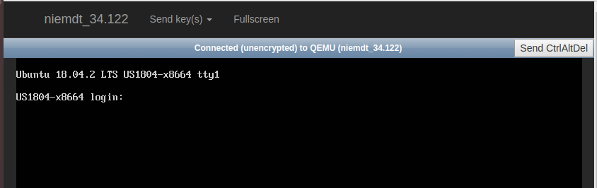

Login với tài khoản root. Password là pass mặc định của VM được note trong file Excel.

Vào đặt lại passwork.

Lúc này máy chỉ có 1 card mạng của dải cobbler. Bây giờ phải đổi sang dải mạng được cấp. 

Tắt máy sau đó vào `Settings` -> `Network`

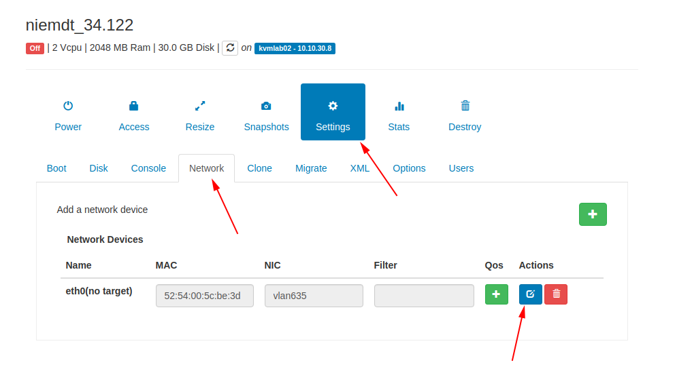

Chọn VLAN được cấp

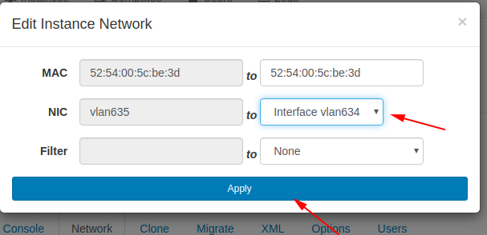

Bật lại máy và vào cấu hình IP tĩnh là ok.