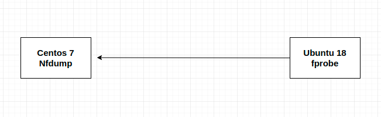

# Hướng dẫn cài đặt Nfdump và fprobe



Như mô hình:
 * Centos 7 sẽ cài đặt nfdump để làm collector thu thập traffic từ các sensor gửi đến
 * Ubuntu 18 sẽ là một sensor sử dụng fprobe để capture traffic tại chính nó sau đó gửi đến máy collector là máy cài nfdump. Có thể có nhiểu sensor gửi dữ liệu về collector

## Cài đặt nfdump

Nfdump là một tập hợp các công cụ dùng để thu thập và phân tích dữ liệu netflow. Nó bao gồm các công cụ sau:

 * nfcapd: được sử dụng để capture và ghi dữ liệu netflow từ các sensor gửi đến vào file
 * nfdump: dùng để đọc dữ liệu từ file
 * nfprofile: đọc dữ liệu từ một file có sử dụng filter sau đó ghi dữ liệu vào một file khác
 * nfreplay: đọc dữ liệu netfloư từ file sau đó gửi nó đến một node khác
 * nfclean.pl: là một script để xóa dữ liệu cũ
 * ft2nfdump: đọc và convert dữ liệu

### Cài đặt

Cài đặt các gói cần thiết

```
yum update -y
yum install gcc bison flex make rpm-devel rrdtool-devel wget -y
```

Download nfdump

```
wget http://sourceforge.net/projects/nfdump/files/stable/nfdump-1.6.13/nfdump-1.6.13.tar.gz
```

Giải nén và cài đặt

```
tar -zxvf nfdump-1.6.13.tar.gz
cd nfdump-1.6.13
./configure --prefix=/usr/local --sysconfdir=/etc --mandir=/usr/share/man --enable-nfprofile --enable-nftrack --enable-sflow --enable-nsel
make
make install
```

Kiểm tra xem nfdump đã được cài đặt

```
nfdump -V
```

Kết quả như sau:

```
[root@nfdump ~]# nfdump -V
nfdump: Version: NSEL-NEL1.6.13
```

Nếu bạn cài đặt nfsen thì nó sẽ tự động khởi chạy nfcap để ghi dữ liệu (sẽ hướng dẫn ở bài sau). Nhưng ở đây tôi sử dụng chạy lệnh thủ công để ghi dữ liệu từ sensor gửi đến.

Tạo thư mục chứa dữ liệu thu thập

```
mkdir /tmp/nfcap-test
```

Sử dụng nfcap để ghi dữ liệu

```
nfcapd -p 555 -l /tmp/nfcap-test/
```

Như lệnh trên sẽ lắng nghe trên port `555` và dữ liệu gửi đến sẽ được lưu thành các file trong thư mục `/tmp/nfcap-test/`.

## Cài đặt fprobe

fprobe hoạt động như một sensor. Nó sẽ thu thập traffic trên interface sau đó gửi nó đến collector.

### Cài đặt

Install fprobe trên Ubuntu

```
apt-get install -y fprobe
```

Khai báo cấu hình trong file config

```
vi /etc/default/fprobe
```

Khai báo ví dụ như sau

```
INTERFACE="eth0"
FLOW_COLLECTOR="localhost:555"
OTHER_ARGS="-fip"
```

Trong đó:
 * INTERFACE: dòng này dùng khai báo interface mà bạn muốn thu thập traffic. Bạn có thể dùng "any" để thu thập trên tất cả interface có trên máy
 * FLOW_COLLECTOR: là địa chỉ IP và port của máy mà bạn muốn gửi dữ liệu mà bạn thu thập đến. Lưu ý trên máy collector phải đang lắng nghe trên port này.
 * OTHER_ARGS: chỉ ra option. Như ví dụ bên trên nó sẽ chỉ capture những gói tin IP.

Restart lại dịch vụ.
Để start được dịch vụ thì trên collect phải listen port mà ta khai báo ở trên.

```
systemctl restart fprobe
systemctl enable fprobe
```

Bạn có thể kiểm tra fprobe đã hoạt động hay chưa bằng cách kiểm tra xem kết nối đến collectỏ đã được mở hay chưa

```
netstat -anpl | grep 555
```

## Sử dụng nfdump để đọc dữ liệu từ file

Như bên trên ta sử dụng nfcap để ghi dữ liệu từ collect gửi đến vào file. Bây giờ để đọc dữ liệu này ta sử dụng lệnh nfdump

```
nfdump -r file_name
```

Ví dụ 

```
[root@nfdump nfcap-test]# nfdump -r /tmp/nfcap-test/nfcapd.202005241803 
Date first seen          Event  XEvent Proto      Src IP Addr:Port          Dst IP Addr:Port     X-Src IP Addr:Port        X-Dst IP Addr:Port   In Byte Out Byte
2020-05-25 01:00:38.000 INVALID  Ignore UDP       10.10.35.126:47954 ->     10.10.35.127:555            0.0.0.0:0     ->          0.0.0.0:0          692        0
2020-05-25 01:03:13.000 INVALID  Ignore UDP       10.10.35.126:47954 ->     10.10.35.127:555            0.0.0.0:0     ->          0.0.0.0:0          100        0
2020-05-25 01:03:40.775 INVALID  Ignore TCP      91.189.88.152:80    ->     10.10.35.126:32884          0.0.0.0:0     ->          0.0.0.0:0       159884        0
2020-05-25 01:03:40.213 INVALID  Ignore TCP       10.10.35.126:60352 ->    91.189.88.142:80             0.0.0.0:0     ->          0.0.0.0:0           60        0
2020-05-25 01:03:40.959 INVALID  Ignore TCP       91.189.91.38:80    ->     10.10.35.126:49658          0.0.0.0:0     ->          0.0.0.0:0           60        0
2020-05-25 01:03:40.714 INVALID  Ignore TCP       10.10.35.126:49658 ->     91.189.91.38:80             0.0.0.0:0     ->          0.0.0.0:0          100        0
2020-05-25 01:03:40.002 INVALID  Ignore UDP            8.8.8.8:53    ->     10.10.35.126:56495          0.0.0.0:0     ->          0.0.0.0:0          142        0
2020-05-25 01:03:40.463 INVALID  Ignore TCP       10.10.35.126:32884 ->    91.189.88.152:80             0.0.0.0:0     ->          0.0.0.0:0         4558        0
2020-05-25 01:03:39.979 INVALID  Ignore UDP       10.10.35.126:59590 ->          8.8.8.8:53             0.0.0.0:0     ->          0.0.0.0:0           78        0
2020-05-25 01:03:40.211 INVALID  Ignore UDP            8.8.8.8:53    ->     10.10.35.126:59590          0.0.0.0:0     ->          0.0.0.0:0          190        0
2020-05-25 01:03:39.978 INVALID  Ignore UDP       10.10.35.126:56495 ->          8.8.8.8:53             0.0.0.0:0     ->          0.0.0.0:0           78        0
2020-05-25 01:03:29.988 INVALID  Ignore TCP         10.10.35.1:53997 ->     10.10.35.126:22             0.0.0.0:0     ->          0.0.0.0:0         3964        0
2020-05-25 01:03:29.990 INVALID  Ignore TCP       10.10.35.126:22    ->       10.10.35.1:53997          0.0.0.0:0     ->          0.0.0.0:0         8060        0
Summary: total flows: 13, total bytes: 177966, total packets: 324, avg bps: 7556, avg pps: 1, avg bpp: 549
Time window: 2020-05-25 01:00:38 - 2020-05-25 01:03:46
Total flows processed: 13, Blocks skipped: 0, Bytes read: 848
Sys: 0.003s flows/second: 3716.4     Wall: 0.000s flows/second: 18309.9   
```

Chỉ hiển thị giao thức TCP

```
[root@nfdump nfcap-test]# nfdump -r /tmp/nfcap-test/nfcapd.202005241803 'proto tcp'
Date first seen          Event  XEvent Proto      Src IP Addr:Port          Dst IP Addr:Port     X-Src IP Addr:Port        X-Dst IP Addr:Port   In Byte Out Byte
2020-05-25 01:03:40.775 INVALID  Ignore TCP      91.189.88.152:80    ->     10.10.35.126:32884          0.0.0.0:0     ->          0.0.0.0:0       159884        0
2020-05-25 01:03:40.213 INVALID  Ignore TCP       10.10.35.126:60352 ->    91.189.88.142:80             0.0.0.0:0     ->          0.0.0.0:0           60        0
2020-05-25 01:03:40.959 INVALID  Ignore TCP       91.189.91.38:80    ->     10.10.35.126:49658          0.0.0.0:0     ->          0.0.0.0:0           60        0
2020-05-25 01:03:40.714 INVALID  Ignore TCP       10.10.35.126:49658 ->     91.189.91.38:80             0.0.0.0:0     ->          0.0.0.0:0          100        0
2020-05-25 01:03:40.463 INVALID  Ignore TCP       10.10.35.126:32884 ->    91.189.88.152:80             0.0.0.0:0     ->          0.0.0.0:0         4558        0
2020-05-25 01:03:29.988 INVALID  Ignore TCP         10.10.35.1:53997 ->     10.10.35.126:22             0.0.0.0:0     ->          0.0.0.0:0         3964        0
2020-05-25 01:03:29.990 INVALID  Ignore TCP       10.10.35.126:22    ->       10.10.35.1:53997          0.0.0.0:0     ->          0.0.0.0:0         8060        0
Summary: total flows: 7, total bytes: 176686, total packets: 314, avg bps: 86041, avg pps: 19, avg bpp: 562
Time window: 2020-05-25 01:00:38 - 2020-05-25 01:03:46
Total flows processed: 13, Blocks skipped: 0, Bytes read: 848
Sys: 0.003s flows/second: 3666.1     Wall: 0.000s flows/second: 29885.1   
```


