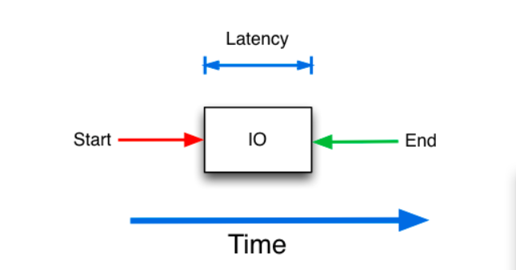
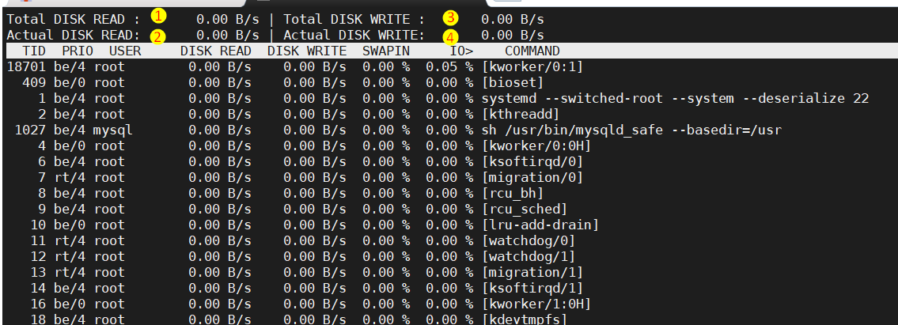
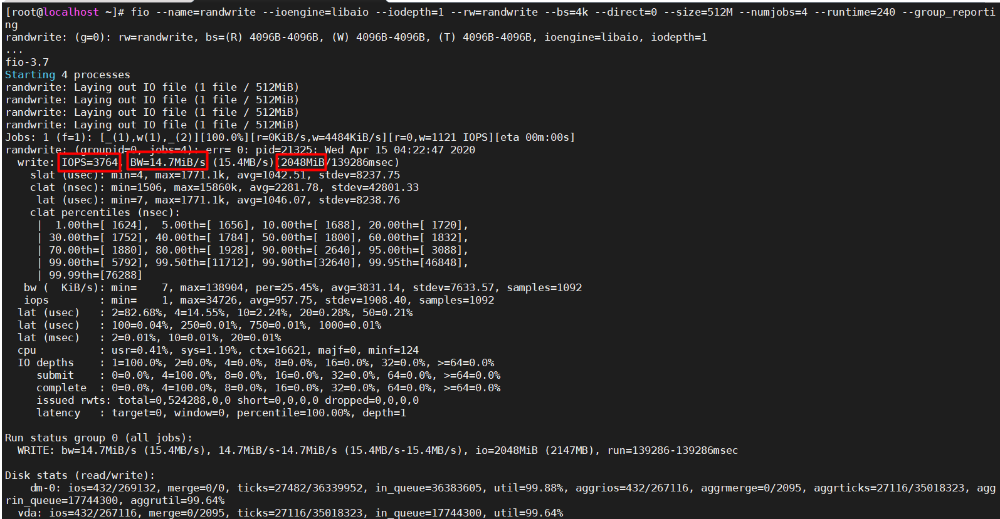
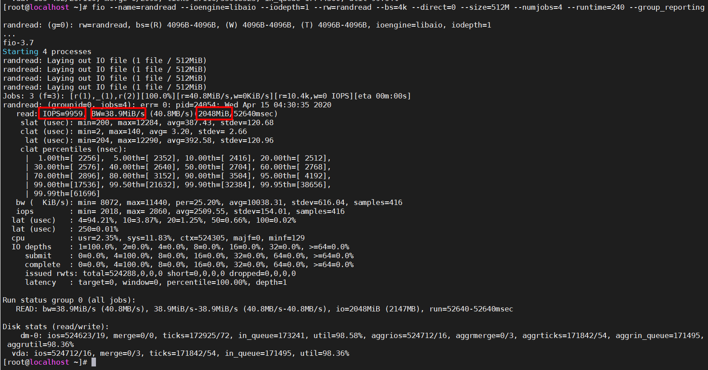
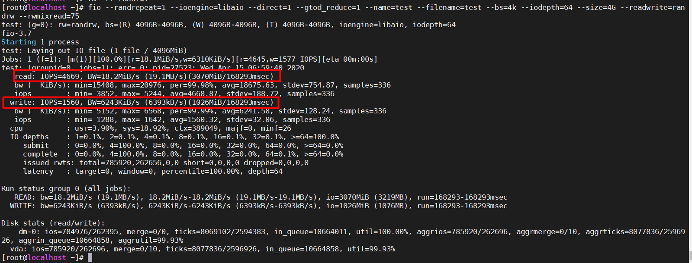

## Các thông số giám sát disk

**Disk latency**: Là khoảng thời gian phải đợi cho việc đọc hoặc ghi dữ liệu. Ví dụ với việc đọc dữ liệu thì đây
là khoảng thời gian tính từ lúc nó nhận yêu cầu và bắt đầu đọc dữ liệu cho đến khi dữ liệu được đọc xong và trả về cho nơi yêu cầu.



**IOPS**: (Input/Output operation Per Second) cho biết số lượng tác vụ đọc hoặc viết mà server có thể xử lý trong vòng 1 giây.
Nếu số lượng tác vụ chạm ngưỡng này thì nó sẽ điều tiết các tác vụ này vào hàng đợi. Thông số này sẽ được công bố do nhà sản xuất. Ta có thể sử dụng nhiều disk cho một hệ thống để tăng giá trị này.

**Throughput**: Tổng dung lượng có thể đọc/ghi trong một khoảng thời gian

Ta có thể thấy 3 giá trị trên liên quan rất mật thiết với nhau. Ta thấy nếu **IOPS** lớn là điều rất tốt nhưng giá trị **latency** cũng phải phù hợp, nếu giá trị **latency** cũng cao lúc này sẽ dẫn đến tình trạng nghẽn cổ chai.
Ví dụ nếu disk **IOPS** có giá trị là 5000 nhưng có **latencry** là 50ms chưa chắc đã tốt hơn 1 disk có **IOPS** là 1000 nhưng **latency** chỉ là 10ms.

**Read/Write operations**: số lượng hoạt động đọc ghi trung bình trên mỗi disk từ disk trong khoảng thời gian giám sát. 

**I/O Utilization**: xác định % sử dụng I/O

**Average Queue Length**: lượng dữ liệu được chuyển vào hàng đợi chờ xử lý

**I/O wait** là khoảng thời gian CPU chờ disk đọc hoặc ghi dữ liệu. Ví dụ để lấy 10000 dòng dữ liệu và xử lý một số thứ để cho ra kết quả trong MySQL mất 1 giây. Trong đó thời gian để lấy được 10000 dòng dữ liệu mất 700ms.
Trong thời gian này CPU sẽ đợi để lấy dữ liệu và nó chỉ xử lý trong 300ms còn lại. Như vậy I/O wait lúc này sẽ là 70%.

## Một số lệnh giám sát disk

### Lệnh iotop

Lệnh **iotop** sẽ kiểm tra được tốc độ đọc ghi thời điểm hiện tại và tổng dung lượng đọc/ghi trong 1s.

Lệnh này không có sẵn nên muốn dùng trước tiên bạn cần cài đặt nó

```
yum install -y iotop
```



Trong đó:
 * 1: tổng lượng dữ liệu được đọc giữa các tiến trình và các luồng của core khác trong 1s
 * 2: dung lượng dữ liệu đọc thực sự từ disk trong vòng 1s
 * 3: tổng lượng dữ liệu được ghi giữa các tiến trình và các luồng của core khác trong 1s
 * 4: dung lượng dữ liệu ghi thực sự xuống disk trong vòng 1s

Bên dưới là I/O của từng process:
 * **IO** hiển thị tỷ lệ phần trăm thời gian chờ sử dụng cho I/O (bao gồm chờ disk và trao đổi giữa các tiến trình).
 * **SWAPIN** hiển thị tý lệ phần trăm chờ cho I/O trao đổi dữ liệu giữa các tiến trình.

Một số option

 **-o** chỉ hiển thị những tiến thực sự đang thực hiện I/O
 **-b** nó sẽ không reload lại giá trị của các tiến trình đang chạy mà nó hiến thị kết quả mới tại thời điểm đó.
 **-u USER** chỉ hiển thị những tiến trình của người dùng muốn giám sát
 **-k** hiển thị dung lượng theo đơn vị kB thay vì B.
 **-t** giống với **-b** nhưng có thêm cột thời gian.

Tham khảo thêm một số option [tại đây](http://manpages.ubuntu.com/manpages/xenial/man8/iotop.8.html).

### Lệnh fio

Cài đặt

```
yum install -y epel-release
yum install fio -y
```

**Test write**

```
fio --name=randwrite --ioengine=libaio --iodepth=1 --rw=randwrite --bs=4k --direct=0 --size=512M --numjobs=4 --runtime=240 --group_reporting
```

Trong đó:
 * **--name** chỉ định tên công việc. 
 * **--ioengine** xác định cách thức công việc tạo ra I/O
 * **--iodepth** số tiến trình tạo ra để thực hiện công việc
 * **--rw=randwrite** sử dụng chỉ để test việc ghi dữ liệu
 * **--bs** kích thước blog sử dụng cho 1 đơn vị I/O Mặc định giá trị này là 4096.
 * **--direct** nếu giá trị này là 1 thì test I/O không sử dụng vùng đệm
 * **--size** dung lượng dữ liệu dùng để đọc hoặc ghi của 1 job
 * **--numjob** số lượng job
 * **--runtime** thời gian tối đa để chạy lệnh này
 * **--group_reporting** nhóm kết quả các job thành một báo cáo

Như ví dụ trên lượng dữ liệu được ghi sẽ là 2GiB.  512M/job * 4 job



**Test read**

```
fio --name=randread --ioengine=libaio --iodepth=1 --rw=randread --bs=4k --direct=0 --size=512M --numjobs=4 --runtime=240 --group_reporting
```



Kết quả:
 * IOPS: 9959
 * Tốc độ đọc trung bình 38.9MiB/s
 * Dung lượng dữ liệu được đọc là 2018 MiB

** Test cả đọc và ghi**

```
fio --randrepeat=1 --ioengine=libaio --direct=1 --gtod_reduce=1 --name=test --filename=test --bs=4k --iodepth=64 --size=4G --readwrite=randrw --rwmixread=75
```

Trong đó:
 * **--rwmixread** tỷ lệ công việc của việc đọc. Mặc định là tỷ lệ 50:50



[Tham khảo thêm các option tại đây](https://fio.readthedocs.io/en/latest/fio_doc.html)

### Đọc file /proc/diskstats

```
[root@localhost proc]# cat diskstats
 252       0 vda 2503348 27 22484678 9079686 929706 8469 39506116 111596893 0 871268 68701662
 252       1 vda1 137 0 9930 91 12 4 128 18 0 72 109
 252       2 vda2 2503181 27 22471660 9079572 929694 8465 39505988 111596875 0 873414 68961865
  11       0 sr0 0 0 0 0 0 0 0 0 0 0 0
 253       0 dm-0 2503038 0 22463012 9088600 938241 0 39505988 115188753 0 874246 124281306
 253       1 dm-1 88 0 4408 20 0 0 0 0 0 13 20
```

Ta thấy mỗi dòng đều có 14 field giá trị
  
 * 1- major number. Đây là số xác định cho từng loại thiết bị. Nó cho kernel biết nó thuộc loại thiết bị nào. Giá trị này nằm trong khoảng [0-255]
 * 2- minor mumber. Được dùng để đánh số thiết bị. Nếu là thiết bị gốc sẽ có giá trị là 0. 
 * 3- tên của thiết bị
 * 4- số lần đọc đã hoàn thành
 * 5- số đọc được merge. Những lần đọc gần nhau có thể được gộp lại cho hiệu quả hơn.
Ví dụ 2 lần đọc 4k dữ liệu có thể được gộp lại thành 1 lần đọc 8k trước khi thực hiện dưới disk như vậy nó chỉ được tính là 1 lần I/O.
 * 6- tổng số sector đã đọc thành công.
 * 7- tổng thời gian tính bằng mini giây tính cho tất cả các lần đọc
 * 8- Số lần viết đã hoàn thành
 * 9- số lần write được merge.
 * 10- tổng số sector đã viết thành công
 * 11- tổng thời gian tính bằng mini giây tính cho tất cả các lần viết
 * 12- số I/O hiện tại đang thực hiện. Giá trị của trường này thường là 0. Các tiến trình yêu cầu I/O. Khi thực hiện xong thì giá trị này lại trở về 0.
 * 13- tổng thời gian tính bằng ms tính cho tất cả thời gian I/O. Giá trị trường này vẫn sẽ tăng nếu giá trị trường 12 vẫn đang khác 0.
 * 14- tổng thời gian tính bằng ms tính cho tất cả thời gian I/O bao gồm cả thời gian của những I/O ko được hoàn thành

