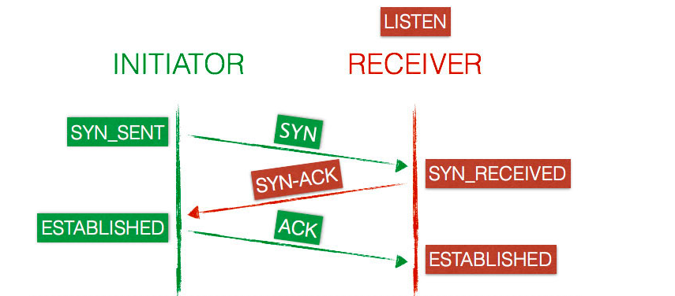
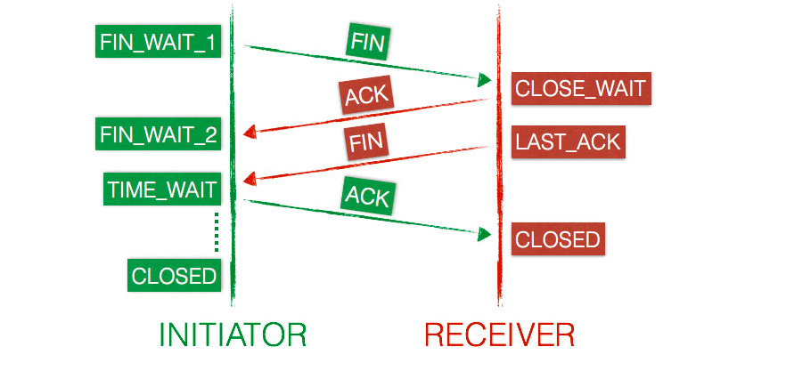

## Các trạng thái kết nối TCP

### Thiết lập kết nối

Trước khi một kết nối được thiết lập ta cần một máy đóng vai trò là máy gửi dữ liệu (client) và máy nhận (server). Trên server luôn lắng nghe kết nối đến trên một port cụ thể. Trạng thái lúc này trên server là **LISTEN**

Khi một kết nối mới TCP được mở, sau khi client gửi đi gói tin SYN tới server thì lúc này client sẽ update trạng thái của nó sẽ thành **SYN-SENT**

Nếu server nhận được gói tin SYN nó sẽ gửi lại gói tin SYN-ACK và sẽ update lại trạng thái của nó thành **SYN_RECEIVED**

Khi nhận được gói tin SYN-ACK thì client sẽ reply lại gói tin ACK. Lúc này nó sẽ chuyển trạng thái của nó thành **ESTABLISHED** và khi server nhận được gói tin ACK thì nó cũng chuyển trạng thái của nó thành **ESTABLISHED**. 

Lúc này client và server có thể trao đổi dữ liệu cho nhau.



### Đóng kết nối

Sau khi chuyển xong dữ liệu client sẽ gửi đi gói tin FIN và update trạng thái của nó thành **FIN_WAIT_1**

Server nhận được gói tin FIN sẽ trả lời lại gói tin ACK và update lại trạng thái của nó là **CLOSE_WAIT**

Khi client nhận được gói tin trả lời từ server thì nó sẽ chuyển trạng thái của nó thành **FIN_WAIT_2**

Đến đây đã đóng được kết nối theo hướng của client. Kết nối cần được đóng theo hướng của server. 

Server vẫn đang ở trạng thái **CLOSE_WAIT** nó sẽ gửi đi gói tin FIN và chuyển trạng thái của nó về **LAST_ACK**

Client nhận được gói tin FIN sẽ reply lại gói tin ACK và update lại trạng thái của nó là **TIME_WAIT**

Khi server nhận được gói tin ACK thì kết nối được đóng ngay lập tức và chuyển trạng thái của kết nối này thành **CLOSED**

Client sẽ ở trạng thái **TIME_WAIT** trong thời gian tối đa là 4 phút trước khi chuyển trạng thái của kết nối này thành CLOSED



### Lệnh kiểm tra trạng thái kết nối 

Ta có thể kiểm tra của các kết nối này bằng cách sử dụng lệnh `netstat` đối với centos hoặc `ss` đối với ubuntu

```
[root@localhost ~]# netstat -nat
Active Internet connections (servers and established)
Proto Recv-Q Send-Q Local Address           Foreign Address         State      
tcp        0      0 0.0.0.0:22              0.0.0.0:*               LISTEN     
tcp        0      0 127.0.0.1:25            0.0.0.0:*               LISTEN     
tcp        0      0 0.0.0.0:3306            0.0.0.0:*               LISTEN     
tcp        0     36 10.10.35.124:22         10.10.35.1:14303        ESTABLISHED
tcp6       0      0 :::22                   :::*                    LISTEN     
tcp6       0      0 ::1:25                  :::*                    LISTEN     
tcp6       0      0 :::6556                 :::*                    LISTEN     
tcp6       0      0 :::80                   :::*                    LISTEN     
tcp6       0      0 10.10.35.124:6556       10.10.35.121:50528      TIME_WAIT  
tcp6       0      0 ::1:80                  ::1:48614               TIME_WAIT  
tcp6       0      0 ::1:80                  ::1:48612               TIME_WAIT  
tcp6       0      0 10.10.35.124:6556       10.10.35.121:50522      TIME_WAIT  
```
