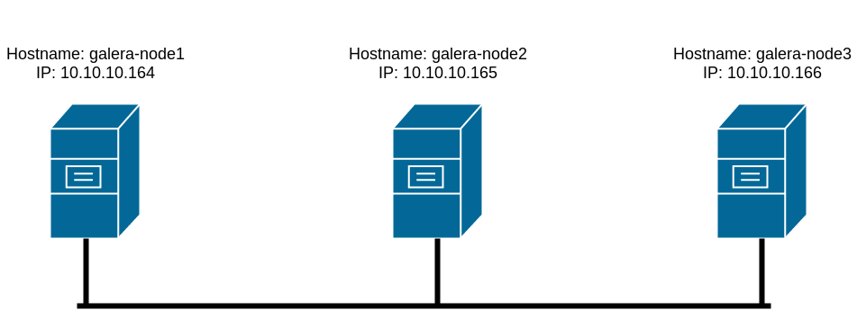

# Cài đặt galera MariaDB trên Ubuntu 16

Việc sử dụng cluster sẽ tăng tính sẵn sàng cho hệ thống. Dữ liệu sẽ được đồng bộ giữa tất cả các node trong cluster. Như vậy khi một node có vấn đề thì các node khác vẫn hoạt động. 

Có 2 kiểu cấu hình cluster là active-passive và active-active. Với kiểu active-passive thì trên các node passive ta chỉ có thể SELECT dữ liệu mà không thể INSERT. Việc INSERT chỉ thực hiện được ở trên node active. Còn đối với mô hình active-active thì ta có thể thực hiện INSERT và SELECT trên tất cả các node.

Trong bài viết này tôi sẽ cấu hình theo kiểu active-active và cluster gồm có 3 node, đây là mô hình tối thiểu của cluster.

## Mô hình 



## Cài đặt MariaDB trên tất cả các node

Thực hiện add repo

```
apt-key adv --recv-keys --keyserver hkp://keyserver.ubuntu.com:80 0xF1656F24C74CD1D8

add-apt-repository 'deb [arch=amd64,i386,ppc64el] http://nyc2.mirrors.digitalocean.com/mariadb/repo/10.1/ubuntu xenial main'

apt-get update
```

Cài đặt `mariadb-server`

```
apt-get install mariadb-server
```

Cài đặt gói `rsync`

```
apt-get install rsync
```

## Cấu hình trên node1

Tạo file `/etc/mysql/conf.d/galera.cnf`

```
vi /etc/mysql/conf.d/galera.cnf
```

Thêm vào những thông tin sau

```
[mysqld]
binlog_format=ROW
default-storage-engine=innodb
innodb_autoinc_lock_mode=2
bind-address=0.0.0.0

# Galera Provider Configuration
wsrep_on=ON
wsrep_provider=/usr/lib/galera/libgalera_smm.so

# Galera Cluster Configuration
wsrep_cluster_name="test_cluster"
wsrep_cluster_address="gcomm://first_ip,second_ip,third_ip"

# Galera Synchronization Configuration
wsrep_sst_method=rsync

# Galera Node Configuration
wsrep_node_address="this_node_ip"
wsrep_node_name="this_node_name"
```

Cần sửa thông tin ở các phần sau:

 * Ở phần `Galera Cluster Configuration` được sử dụng để định nghĩa ra cluster. Ta chỉ ra địa chỉ IP hoặc domain name của tất cả các node trong mục `wsrep_cluster_address`. Bạn cũng có thể thay đối tên của cluster trong mục `wsrep_cluster_name` hoặc không nhưng buộc phải sửa thông tin trong mục `wsrep_cluster_address`. Nếu máy bạn có IP private để giao tiếp giữa các node thì bạn khai báo nó ở đây.

 * Ở phần `Galera Node Configuration` chỉ ra thông tin của server bạn đang cấu hình. Mục `wsrep_node_address` điền địa chỉ IP của server bạn đang đứng. Mục `wsrep_node_name` bạn khai báo hostname của node bạn đang đứng để phân biệt với các node khác trong file log.

Với mô hình của tôi thì nội dung của file này sẽ như sau:

```
[mysqld]
binlog_format=ROW
default-storage-engine=innodb
innodb_autoinc_lock_mode=2
bind-address=0.0.0.0

# Galera Provider Configuration
wsrep_on=ON
wsrep_provider=/usr/lib/galera/libgalera_smm.so

# Galera Cluster Configuration
wsrep_cluster_name="test_cluster"
wsrep_cluster_address="gcomm://10.10.10.164,10.10.10.165,10.10.10.166"

# Galera Synchronization Configuration
wsrep_sst_method=rsync

# Galera Node Configuration
wsrep_node_address="10.10.10.164"
wsrep_node_name="galera-node1"
```

Khi sửa xong bạn copy lại nội dung của file sau đó lưu file và đóng file lại.

## Cấu hình trên các node còn lại

Trên từng node bạn cũng tạo ra file `/etc/mysql/conf.d/galera.cnf`

```
vi /etc/mysql/conf.d/galera.cnf
```

Sau đó paste thông tin từ file `galera.cnf` mà bạn vừa copy ở node trước vào đây. Nhưng chú ý sử lại nội dung ở 2 dòng sau để phù hợp với địa chỉ IP và hostname trên node bạn đang thao tác

```
# Galera Node Configuration
wsrep_node_address="this_node_ip"
wsrep_node_name="this_node_name"
```

Trên `node2` tôi sử 2 dòng này lại như sau:

```
# Galera Node Configuration
wsrep_node_address="10.10.10.165"
wsrep_node_name="galera-node2"
```

Còn trên `node3` thì thông tin trên 2 dòng này sẽ là như sau:

```
# Galera Node Configuration
wsrep_node_address="10.10.10.166"
wsrep_node_name="galera-node2"
```

## Mở port trên tất cả các node

Bạn cần kiểm tra trạng thái của Firewall

```
ufw status
```

Nếu Firewall đang được tắt thì bạn có thể bỏ qua bước này còn nếu firewall đang hoạt động thì bạn có thể tắt nó đi hoặc tiến hành mở port.

Nếu bạn chọn cách tắt firewall thì thực hiện command sau:

```
systemctl stop ufw
```

Nếu bạn chọn cách mở port thì galera sử dụng 4 ports: `3306`, `4567`, `4568`, `4444`. Để tắt nó ta thực hiện lệnh sau:

```
ufw allow 3306,4567,4568,4444/tcp

ufw allow 4567/udp
```

## Bật Cluster

Để bật Cluster trước tiên ta cần phải stop service `MariaDB` trên tất cả các node. 

**Stop MariaDB trên cả 3 node**

```
systemctl stop mysql
```

`Systemctl` không hiển thi kết quả trả về nên bạn không biết đã tắt thành công hay chưa. Để chắc chắn đã stop thành công service `MariaDB` ta dùng lệnh sau để kiểm tra:

```
systemctl status mysql
```

Nếu bạn thấy kết quả như sau thì service đã được tắt

```
. . .
Active: inactive (dead) since Thu 2019-06-27 08:39:51 +07; 13s ago
. . .
```

**Bật node đầu tiên**

Để bật node đầu tiên ta chạy lệnh sau. Lưu ý rằng nếu các service `MariaDB` vẫn đang chạy trên bất kỳ node nào thì câu lệnh bên dưới đây sẽ bị fail và sẽ không khởi tạo được cluster.

```
galera_new_cluster
```

Khi command chạy xong ta thực hiện câu lệnh sau để có thể thấy số node đã được join vào cluster.

```
mysql -u root -p -e "SHOW STATUS LIKE 'wsrep_cluster_size'"
```

Câu lệnh sẽ trả về như sau:

```
Output
+--------------------+-------+
| Variable_name      | Value |
+--------------------+-------+
| wsrep_cluster_size | 1     |
+--------------------+-------+
```

**Bật service trên 2 node còn lại**

Để join các node còn lại vào cluster ta chỉ cần start service trên các node đó.

```
systemctl start mysql
```

Sau khi start service trên 2 node còn lại ta kiểm tra lại trên một node bất kỳ sẽ thấy đã có 3 node join vào cluster

```
mysql -u root -p -e "SHOW STATUS LIKE 'wsrep_cluster_size'"
```

```
Output
+--------------------+-------+
| Variable_name      | Value |
+--------------------+-------+
| wsrep_cluster_size | 3     |
+--------------------+-------+
```

## Kiểm tra 

Bây giờ dữ liệu trên cả 3 node là như nhau.

Thực hiện tạo user và DB trên node1:

```
root@galera-node1:~# mysql -u root -p
Enter password: 
Welcome to the MariaDB monitor.  Commands end with ; or \g.
Your MariaDB connection id is 11
Server version: 10.1.40-MariaDB-1~xenial mariadb.org binary distribution

Copyright (c) 2000, 2018, Oracle, MariaDB Corporation Ab and others.

Type 'help;' or '\h' for help. Type '\c' to clear the current input statement.

MariaDB [(none)]> create database DB_test;
Query OK, 1 row affected (0.03 sec)

MariaDB [(none)]> grant all privileges on DB_test.* to "NiemDT"@"localhost" identified by "123123";
Query OK, 0 rows affected (0.03 sec)

MariaDB [(none)]> use DB_test;
Database changed
MariaDB [DB_test]> create table bang1 (id int, value varchar(20));
Query OK, 0 rows affected (0.02 sec)

MariaDB [DB_test]> insert into bang1 (id, value) values (1, "gia tri 1");
Query OK, 1 row affected (0.01 sec)

MariaDB [DB_test]> select * from bang1;
+------+-----------+
| id   | value     |
+------+-----------+
|    1 | gia tri 1 |
+------+-----------+
1 row in set (0.00 sec)

```

Dùng user vừa tạo login vào các node còn lại và insert dữ liệu vào DB:

```
root@galera-node3:~# mysql -u NiemDT -p
Enter password: 
Welcome to the MariaDB monitor.  Commands end with ; or \g.
Your MariaDB connection id is 9
Server version: 10.1.40-MariaDB-1~xenial mariadb.org binary distribution

Copyright (c) 2000, 2018, Oracle, MariaDB Corporation Ab and others.

Type 'help;' or '\h' for help. Type '\c' to clear the current input statement.

MariaDB [(none)]> use DB_test;
Reading table information for completion of table and column names
You can turn off this feature to get a quicker startup with -A

Database changed
MariaDB [DB_test]> insert into bang1 (id, value) values (2, "gia trị 2");
Query OK, 1 row affected, 1 warning (0.01 sec)

MariaDB [DB_test]> select * from bang1;
+------+-----------+
| id   | value     |
+------+-----------+
|    1 | gia tri 1 |
|    2 | gia tr? 2 |
+------+-----------+
2 rows in set (0.00 sec)
```