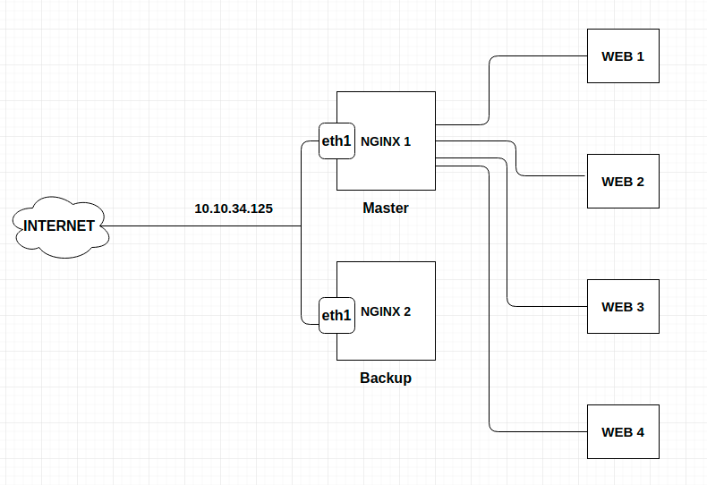
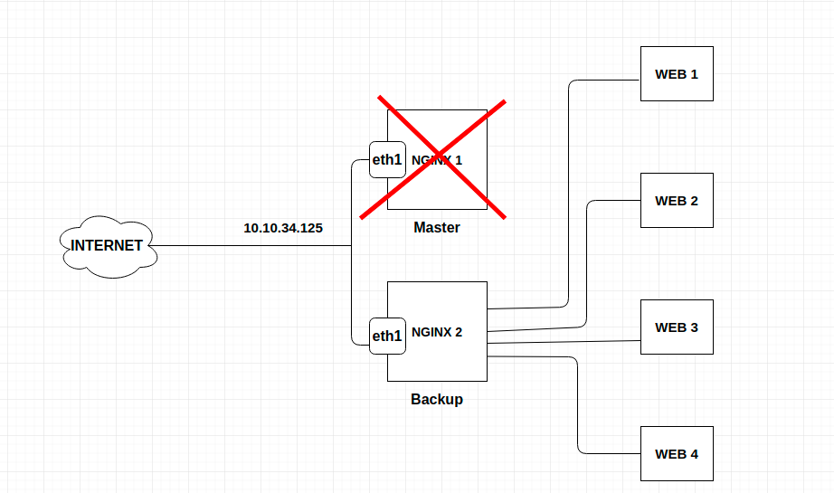

# Cấu hình keepalived cho Nginx

Mô hình 



| server | interface | IP |
| ------ | --------- | ---- |
| NGINX 1 | eth1 | 10.10.34.192 |
| NGINX 2 | eth1 | 10.10.34.121 |

Ta có 2 server làm nginx revert proxy để trỏ đến các web bên dưới. 2 server này cấu hình nginx tương tự nhau (xem bài trước)

Ta có 1 virtual IP `10.10.34.125`. Các domain được trỏ về IP này.

Thực hiện cấu hình keepalived để interface eth1 của cả 2 server nhận thêm IP `10.10.34.125`. Ban đầu IP sẽ được trao cho node master (NGINX 1), khi node master gặp vấn đề thì IP này được trao lại cho node backup (NGINX 2). Như vậy sẽ đảm bảo thông suốt cho các web site phía sau.



## Cấu hình keepalived

Cài đặt

```
yum install gcc kernel-headers kernel-devel
yum install keepalived
```

Cho phép gắn IP ảo lên card mạng và IP Forward

```
echo "net.ipv4.ip_nonlocal_bind = 1" >> /etc/sysctl.conf
echo "net.ipv4.ip_forward = 1" >> /etc/sysctl.conf
sysctl -p
```

Cấu hình trên node master (NGINX 1)

```
cat > /etc/keepalived/keepalived.conf << EOF
vrrp_script chk_nginx {
        script "killall -0 nginx"
        interval 2
        weight 4
}

vrrp_instance VI_1 {
    state MASTER
    interface eth1
    mcast_src_ip 10.10.34.192
    virtual_router_id 50
    priority 100
    advert_int 1
    authentication {
        auth_type AH
        auth_pass niemdinhtrong
    }
    virtual_ipaddress {
        10.10.34.125/24 dev eth1
    }
    track_script
    {
        chk_nginx
    }
}
EOF
```

Cấu hình trên node backup (NGINX 2)

```
cat > /etc/keepalived/keepalived.conf << EOF
vrrp_script chk_nginx {
        script "killall -0 nginx"     
        interval 2
        weight 4
}
 
vrrp_instance VI_1 {
    state BACKUP
    interface eth1
    mcast_src_ip 10.10.34.121
    virtual_router_id 50
    priority 98
    advert_int 1
    authentication {
        auth_type AH
        auth_pass niemdinhtrong
    }
    virtual_ipaddress {
        10.10.34.125/24 dev eth1
    }
    track_script 
    {
        chk_nginx
    }
}
EOF
```

**Lưu ý**: Thứ tự ưu tiên làm master xác định dựa vào thông số `priority`. Giá trị lớn hơn sẽ được ưu tiên làm master.

Khởi động vào enable keepalived trên cả 2 node

```
systemctl start keepalived
systemctl enable keepalived
```

Nếu ko tắt firewall thì mở firewall để cho phép dải địa chỉ multicast

```
iptables -I INPUT -i eth0 -d 224.0.0.0/8 -p vrrp -j ACCEPT
iptables -I INPUT -i eth0 -d 224.0.0.0/8 -p ah -j ACCEPT
iptables -I OUTPUT -o eth0 -s 224.0.0.0/8 -p vrrp -j ACCEPT
iptables -I OUTPUT -o eth0 -s 224.0.0.0/8 -p ah -j ACCEPT.
service iptables save
```

Kiểm tra ip trên node master (NGINX 1)

Trên NGINX 1

```
[root@nginxsrv ~]# ip a sh eth1
3: eth1: <BROADCAST,MULTICAST,UP,LOWER_UP> mtu 1500 qdisc pfifo_fast state UP group default qlen 1000
    link/ether 52:54:00:75:db:7c brd ff:ff:ff:ff:ff:ff
    inet 10.10.34.192/24 brd 10.10.34.255 scope global noprefixroute eth1
       valid_lft forever preferred_lft forever
    inet 10.10.34.125/24 scope global secondary eth1
       valid_lft forever preferred_lft forever
    inet6 fe80::33fa:f515:4bae:85a6/64 scope link noprefixroute 
       valid_lft forever preferred_lft forever
```

Tăt thử note master ta sẽ thấy VIP đã được chuyển cho node backup (NGINX 2)

```
[root@localhost ~]# ip a sh eth1
3: eth1: <BROADCAST,MULTICAST,UP,LOWER_UP> mtu 1500 qdisc pfifo_fast state UP group default qlen 1000
    link/ether 52:54:00:ca:ef:b8 brd ff:ff:ff:ff:ff:ff
    inet 10.10.34.121/24 brd 10.10.34.255 scope global noprefixroute eth1
       valid_lft forever preferred_lft forever
    inet 10.10.34.125/24 scope global secondary eth1
       valid_lft forever preferred_lft forever
    inet6 fe80::5054:ff:feca:efb8/64 scope link noprefixroute 
       valid_lft forever preferred_lft forever
```
