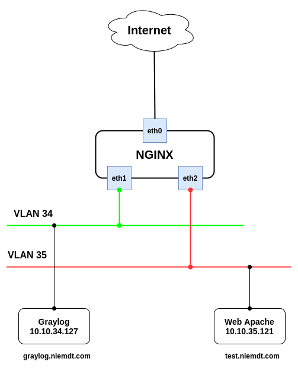

# Cài đặt nginx trên centos 7 làm revert proxy

## Cài đặt Nginx

```
rpm -ivh http://nginx.org/packages/centos/7/noarch/RPMS/nginx-release-centos-7-0.el7.ngx.noarch.rpm
yum -y install nginx
```

```
cp /etc/nginx/nginx.conf /etc/nginx/nginx.conf.bk
```

Khởi chạy dịch vụ

```
systemctl restart nginx
systemctl enable nginx
```

## Cấu hình làm reverse proxy



Thao tác trên Nginx

Mỗi site sẽ được khai báo tương ứng với 1 file nằm trong thư mục `/etc/nginx/conf.d`. Các file phải có phần mở rộng là `.conf`

### Site test.niemdt.com

```
cat > /etc/nginx/conf.d/test.niemdt.com.conf << EOF
server {
    server_name test.niemdt.com;
    client_max_body_size 1024M;

        location / {
            proxy_set_header X-Real-IP \$remote_addr;
            proxy_set_header X-Forwarded-For \$proxy_add_x_forwarded_for;
            proxy_set_header Host \$http_host;
            proxy_set_header X-NginX-Proxy true;
            proxy_pass http://10.10.35.121:80;
        }
}
EOF
```

Kiểm tra

```
[root@nginx-lab ~]# cat /etc/nginx/conf.d/test.niemdt.com.conf 
server {
    server_name test.niemdt.com;
    client_max_body_size 1024M;

        location / {
            proxy_set_header X-Real-IP $remote_addr;
            proxy_set_header X-Forwarded-For $proxy_add_x_forwarded_for;
            proxy_set_header Host $http_host;
            proxy_set_header X-NginX-Proxy true;
            proxy_pass http://10.10.35.121:80;
        }
}
```

Test và reload lại trạng thái Nginx

```
[root@nginx-lab ~]# nginx -t
nginx: the configuration file /etc/nginx/nginx.conf syntax is ok
nginx: configuration file /etc/nginx/nginx.conf test is successful
[root@nginx-lab ~]# nginx -s reload
```

Có thể truy cập domain trên web để kiểm tra.

### Site graylog.niemdt.com

```
cat > /etc/nginx/conf.d/graylog.niemdt.com.conf << EOF
server {
    server_name graylog.niemdt.com;
    client_max_body_size 1024M;

        location / {
            proxy_set_header X-Real-IP \$remote_addr;
            proxy_set_header X-Forwarded-For \$proxy_add_x_forwarded_for;
            proxy_set_header Host \$http_host;
            proxy_set_header X-NginX-Proxy true;
            proxy_pass http://10.10.34.127:9000;
        }
}
EOF
```

Kiểm tra

```
[root@nginx-lab conf.d]# cat /etc/nginx/conf.d/graylog.niemdt.com.conf 
server {
    server_name graylog.niemdt.com;
    client_max_body_size 1024M;

        location / {
            proxy_set_header X-Real-IP $remote_addr;
            proxy_set_header X-Forwarded-For $proxy_add_x_forwarded_for;
            proxy_set_header Host $http_host;
            proxy_set_header X-NginX-Proxy true;
            proxy_pass http://10.10.34.127:9000;
        }
}
```

Test và reload lại trạng thái Nginx

```
[root@nginx-lab conf.d]# nginx -t
nginx: the configuration file /etc/nginx/nginx.conf syntax is ok
nginx: configuration file /etc/nginx/nginx.conf test is successful
[root@nginx-lab conf.d]# nginx -s reload
```
