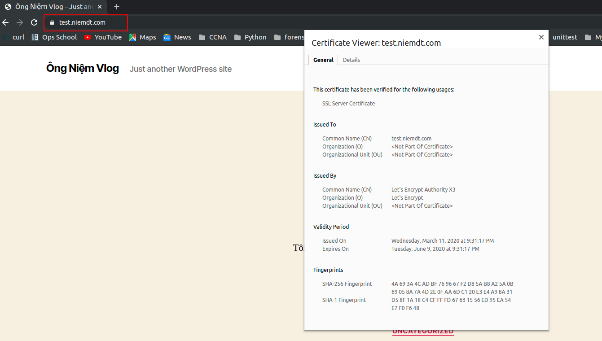

# Cấu hình ssl cho site wordpress dùng let's encrypt

## Sinh SSL

```
certbot --nginx -d test.niemdt.com
```

Thêm 2 dòng sau vào block `location` trong file config của nginx

```
proxy_set_header X-Forwarded-Host $host;
proxy_set_header X-Forwarded-Proto $scheme;
```

Kết quả

```
[root@nginx-lab ~]# cat /etc/nginx/conf.d/test.niemdt.com.conf 
server {
    server_name test.niemdt.com;

        location / {
            proxy_set_header X-Forwarded-Host $host;
            proxy_set_header X-Forwarded-Proto $scheme;
            proxy_pass http://10.10.35.123;
        }


    listen 443 ssl; # managed by Certbot
    ssl_certificate /etc/letsencrypt/live/test.niemdt.com/fullchain.pem; # managed by Certbot
    ssl_certificate_key /etc/letsencrypt/live/test.niemdt.com/privkey.pem; # managed by Certbot
    include /etc/letsencrypt/options-ssl-nginx.conf; # managed by Certbot
    ssl_dhparam /etc/letsencrypt/ssl-dhparams.pem; # managed by Certbot

}
server {
    if ($host = test.niemdt.com) {
        return 301 https://$host$request_uri;
    } # managed by Certbot


    server_name test.niemdt.com;
    listen 80;
    return 404; # managed by Certbot


}
```

Kiểm tra và reload lại nginx

```
[root@nginx-lab conf.d]# nginx -t
nginx: the configuration file /etc/nginx/nginx.conf syntax is ok
nginx: configuration file /etc/nginx/nginx.conf test is successful
[root@nginx-lab conf.d]# nginx -s reload
```

## Sửa file wp-config.php trên máy cài wordpress

Thêm những dòng sau

```
if ($_SERVER['HTTP_X_FORWARDED_PROTO'] == 'https'){
$_SERVER['HTTPS']='on';
}
if (isset($_SERVER['HTTP_X_FORWARDED_HOST'])) {
$_SERVER['HTTP_HOST'] = $_SERVER['HTTP_X_FORWARDED_HOST'];
}
```

File config như sau

```
[root@localhost html]# cat wp-config.php 
<?php
/**
 * The base configuration for WordPress
 *
 * The wp-config.php creation script uses this file during the
 * installation. You don't have to use the web site, you can
 * copy this file to "wp-config.php" and fill in the values.
 *
 * This file contains the following configurations:
 *
 * * MySQL settings
 * * Secret keys
 * * Database table prefix
 * * ABSPATH
 *
 * @link https://codex.wordpress.org/Editing_wp-config.php
 *
 * @package WordPress
 */
if ($_SERVER['HTTP_X_FORWARDED_PROTO'] == 'https'){
$_SERVER['HTTPS']='on';
}
if (isset($_SERVER['HTTP_X_FORWARDED_HOST'])) {
$_SERVER['HTTP_HOST'] = $_SERVER['HTTP_X_FORWARDED_HOST'];
}
// ** MySQL settings - You can get this info from your web host ** //
/** The name of the database for WordPress */
define( 'DB_NAME', 'wordpress' );

/** MySQL database username */
define( 'DB_USER', 'niemdt' );

/** MySQL database password */
define( 'DB_PASSWORD', '123456' );

/** MySQL hostname */
define( 'DB_HOST', 'localhost' );

/** Database Charset to use in creating database tables. */
define( 'DB_CHARSET', 'utf8' );

/** The Database Collate type. Don't change this if in doubt. */
define( 'DB_COLLATE', '' );

/**#@+
 * Authentication Unique Keys and Salts.
 *
 * Change these to different unique phrases!
 * You can generate these using the {@link https://api.wordpress.org/secret-key/1.1/salt/ WordPress.org secret-key service}
 * You can change these at any point in time to invalidate all existing cookies. This will force all users to have to log in again.
 *
 * @since 2.6.0
 */
define( 'AUTH_KEY',         'put your unique phrase here' );
define( 'SECURE_AUTH_KEY',  'put your unique phrase here' );
define( 'LOGGED_IN_KEY',    'put your unique phrase here' );
define( 'NONCE_KEY',        'put your unique phrase here' );
define( 'AUTH_SALT',        'put your unique phrase here' );
define( 'SECURE_AUTH_SALT', 'put your unique phrase here' );
define( 'LOGGED_IN_SALT',   'put your unique phrase here' );
define( 'NONCE_SALT',       'put your unique phrase here' );

/**#@-*/

/**
 * WordPress Database Table prefix.
 *
 * You can have multiple installations in one database if you give each
 * a unique prefix. Only numbers, letters, and underscores please!
 */
$table_prefix = 'wp_';

/**
 * For developers: WordPress debugging mode.
 *
 * Change this to true to enable the display of notices during development.
 * It is strongly recommended that plugin and theme developers use WP_DEBUG
 * in their development environments.
 *
 * For information on other constants that can be used for debugging,
 * visit the Codex.
 *
 * @link https://codex.wordpress.org/Debugging_in_WordPress
 */
define( 'WP_DEBUG', false );

/* That's all, stop editing! Happy publishing. */

/** Absolute path to the WordPress directory. */
if ( ! defined( 'ABSPATH' ) ) {
	define( 'ABSPATH', dirname( __FILE__ ) . '/' );
}

/** Sets up WordPress vars and included files. */
require_once( ABSPATH . 'wp-settings.php' );

```

Restart lại httpd

```
systemctl restart httpd
```

Kiểm tra

