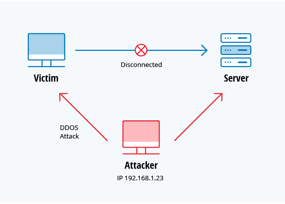

# Top các kiểu tấn công mạng phổ biến hiện nay

## 1. DoS và DDoS

DoS (Denial of service)-tấn công từ chối dịch vụ

DDoS (Distributed denial of service) từ chối dịch vụ phân phối.

Một tấn công DoS là cách tấn công vào tài nguyên của hệ thống làm cho hệ thống tiêu tốn tài nguyên và không thể phản hồi các request của phía client. Tấn công DDoS cũng giống như DoS nhưng nó được thực hiện từ nhiều máy khác nhau do kẻ tấn công có quyền điều khiển.

Với kiểu tấn công này kẻ tấn công sẽ không thu thập được bất kỳ thông tin gì chỉ đơn giản là làm cho các server bị treo không thể response lại các request của client. Hoặc kẻ tấn công có thể dựa vào tấn công này để thực hiện một tấn công khác.

Có các kiểu khác nhau của tấn công DoS và DDoS như TCP SYN flood attack, teardrop attack, smurf attack, ping-of-death attack and botnets.

**TCP SYN flood attack**

Với kiểu tấn công này kẻ tấn công sử dụng bộ đệm trong trong quá trình bắt tay 3 bước của TCP. Thiết bị của kẻ tấn công liên tục gửi đi các gói tin với cờ SYN được bật trong khi nó không nhận các lại các response từ phía server. Điều này khiến cho server bị time out trong khi đợi phản hồi từ phía thiết bị của kẻ tấn công. Lúc này sẽ khiến cho server bị treo.

**Teardrop attack**

Tất cả dữ liệu truyền đi trên mạng đều được chia thành các mảnh nhỏ ở nguồn và mỗi mảnh này sẽ có một trường offset để đánh dấu thứ tự của các mảnh để khi đến đích thì phía đích có thể dựa vào trường này để ghép các mảnh lại thành đoạn thông tin hoàn chỉnh. 

Với kiểu tấn công này các giá trị ở trường offset sẽ bị chồng chéo lên nhau. Như vậy khi đến đích thì server sẽ không thể sắp xếp lại được các gói tin này làm cho hệ thống tốn nhiều tài nguyên để xử lý. Nếu với số lượng lớn có thể làm cho server bị treo và có thể bị reboot.

**Smurf attack**

Với kiểu tấn công này liên quan đến việc giả mạo địa chỉ IP kết hợp với giao thức ICMP. Kẻ tấn công sẽ giả mạo IP của nạn nhân để gửi một gói tin ICMP echo requests đến một địa chỉ broadcast. Lúc này gói tin icmp request này sẽ được đến tất cả các địa chỉ trong dải địa chỉ broadcast đó. Và các địa chỉ này thấy có một gói tin icmp echo request được gửi đến thì nó sẽ reply lại bằng một gói tin icmp echo reply về địa chỉ máy nạn nhân (vì kẻ tấn ông giả đã giả mạo IP của máy nạn nhân để gửi đi gói tin icmp echo request). Lúc này máy nạn nhận nhận đồng thời một lượng rất lớn gói tin echo reply sẽ dẫn đến không thể đáp ứng được và nhanh chóng ngừng hoạt động.

**Ping of death attack**

Kẻ tấn công dùng chương trìng ping để tạo nên kích thước lớn cho gói tin ICMP (gói gọn trong một gói tin IP). Hacker thường dùng chương trình ping để gửi những gói tin có kích thước lớn hơn 65536 byte (vượt qua sự cho phép của gói tin IP).

Khi gói tin gửi đi với kích thước lớn hơn kích thước cho phép là 65536 bytes. Gói tin sẽ bị chia nhỏ thành các phần và khi server ráp lại thì do gói tin quá lớn so với buffer của server nên hệ thống không thể quản lý nổi sẽ dẫn đến bị treo hoặc reboot.

**Botnets**

Botnets là một lượng lớn máy tính bị nhiễm một phần mềm độc hại và chúng được quản lý bởi hacker. Hacker sẽ sử dụng những máy tính này để thực hiện tấn công DDoS. Hacker có thể tận dụng hệ thống này để truy cập vào một trang web dẫn đến tình trạng nghẽn mạng, hệ thống không xử lý kịp làm cho server có thể bị treo hoặc reboot.

## 2. Man in the middle (MitM) attack

Tấn công MitM là kiểu tấn công mà hacker sẽ chen vào giữa client và server. Có một vài kiểu tấn công MitM:

**Session hijacking**

Đây là hình thức tấn công vào phiên làm việc giữa client và server. Khi client đang giao tiếp với server kẻ tấn công lúc này sẽ giả mạo IP của client để giao tiếp với server và server sẽ tưởng rằng nó đang giao tiếp với client. Giả sử cuộc tấn công sẽ như sau:

 * Máy client kết nối đến server
 * Kẻ tấn công chiếm quyền điều khiển máy client
 * Thực hiện ngắt kết nối giữa client và server
 * Kẻ tấn công thay thế địa chỉ IP của khách hàng bằng địa chỉ IP của nó để giả mạo client.
 * Lúc này kẻ tấn công tiếp tục giao tiếp với server và server tin rằng nó vẫn đang giao tiếp với client.

**IP Spoofing**

IP spoofing được kẻ tấn công sẽ sử dụng một địa chỉ đáng tin cậy với địa chỉ của máy nạn nhân để gửi đến máy nạn nhân một gói tin. Lúc này máy nạn nhân sẽ nghĩ đây là địa chỉ tin cậy và sẽ thực hiện theo nhưng gì mà kẻ tấn công yêu cầu bên trong gói tin.

**Replay**

Tấn công attack là tấn công mà kẻ tấn công sẽ thực hiện chặn và lặp lại việc truyền tải một đoạn dữ liệu hợp lệ đi vào trong mạng lưới. Nhờ có tính hợp kệ của dữ liệu ban đầu nên nó giống như truyền tải một dữ liệu thông thường. Do các tệp tin ban đầy đã bị chặn và được truyền tải nguyên văn nên hacker không cần giải mã chúng.

## 4. Password attack

Password là kiểu xác thực rộng rãi để xác thực user với một hệ thống. Tấn công để có được password là kiểu tấn công phổ biến và hiệu quả. Kẻ tấn công có thể có được password của nạn nhân bằng nhiều cách khác nhau. Chúng có thể nghe ngóng trên những trang web mà nạn nhân tham gia mà ko mã hóa password để lấy password. Hoặc thu thập thông tin của nan nhân để từ đó dự đoán password. Hoặc tìm các vào database để lấy password. 

 * Dò password một cách ngẫu nhiên: Chúng thử các password ngẫu nhiên để tìm kiếm password của nạn nhân dựa vào các thông tin chúng có.
 * Tấn công từ điển: Người dùng hay đặt các mật khẩu đơn giản và như vậy hacker sẽ thu thập tất cả các mật khẩu hay được dùng. Hacker sẽ thử tất cả các password này để thử login.

## 5. SQL injection attack

SQL injection đã trở thành vấn đề phổ biến với các website sử dụng database. Nó xảy ra khi thực hiện một truy vấn đến cơ sở dữ liệu với thông tin được nhập vào từ client. Câu lệnh SQL được sử dụng để insert vào database từ người dùng (có thể là form đăng nhập với user và password) với một câu lệnh SQL được xác định từ trước. Nếu khai thác thành công SQL injection hacker có thể đọc các dữ liệu nhạy cảm, chỉnh sửa (insert, update hoặc delete) dữ liệu trong database. Hacker có thể tận dụng điều này để thao tác với database như có thẻ tắt database hoặc có thể thực hiện các việc khác nữa.

Ví dụ với một cho người dùng sẽ yêu cần điền tên của user để từ đó lấy ra thông tin của user đó trong database bằng cách sử dụng câu lệnh SQL như sau:

*“SELECT * FROM users WHERE account = ‘“ + userProvidedAccountNumber +”’;”*

Điều này để cho người dùng nhập vào user của họ. Nó sẽ xảy ra lỗ hổng để cho hacker có thể tận dụng. Ví dụ nếu ai đó cung nhập vào một tài khoản như "or'1'='1'" thì kết quả của câu lệnh SQL sẽ là:

*“SELECT * FROM users WHERE account = ‘’ or ‘1’ = ‘1’;”*

Vì '1'='1' luôn trả về gía trị là TRUE nên database sẽ trả về thông tin của tất cả các user thay vì một user cụ thể. 

Đây là một lỗ hổng cho hacker tấn công không kiểm soát input đầu vào của user. Vì thế SQL injection thường xảy ra đối với các trang web sử dụng các câu truy vấn động dựa theo input nhập vào. 

## 6. Cross-site scripting (XSS) attack

Tấn công XSS sử dụng tài nguyên web của bên thứ 3 để chạy script trên máy của nạn nhân. Sau đó đoạn mã độc sẽ lấy được thông tin sesion của người dùng với web server sau đó gửi thông tin này đến hacker. Hacker chiếm được session này và thực hiện giao dịch với web server.

## 7. Tấn công dựa vào các lỗ hổng đã biết

Ví dụ một trang web chạy trên một nền tảng nào đó. Mà nền tảng đó sẽ có các lỗ hổng có thể khai thác. Khi đó hacker sẽ dựa vào các lỗ hổng này để tấn công vào website chạy các nền tảng này nếu người quản trị không chịu update các bản vá lỗi kịp thời.

