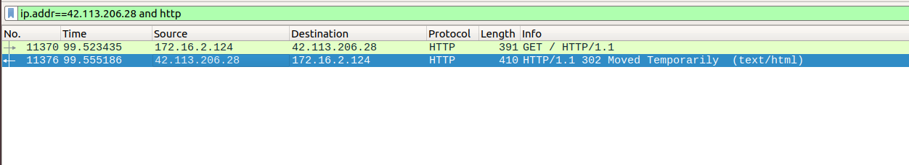
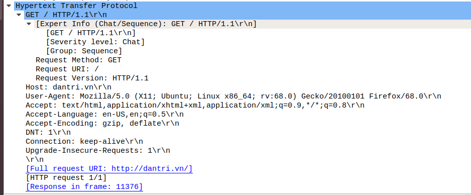
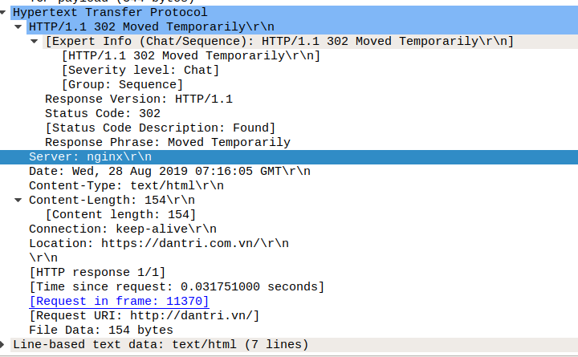
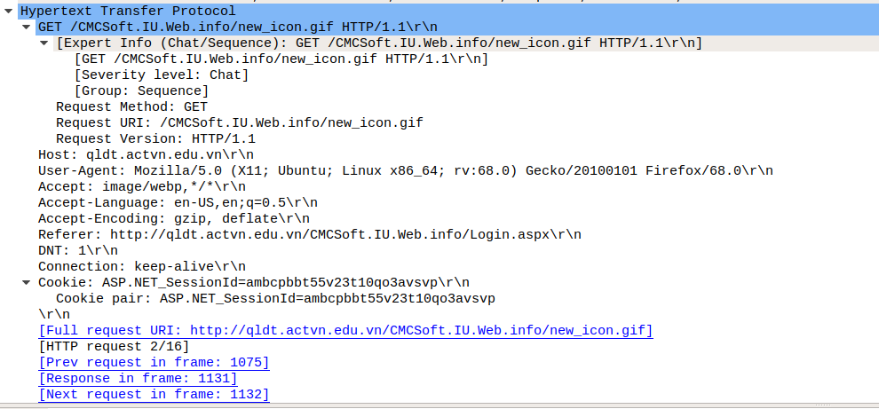
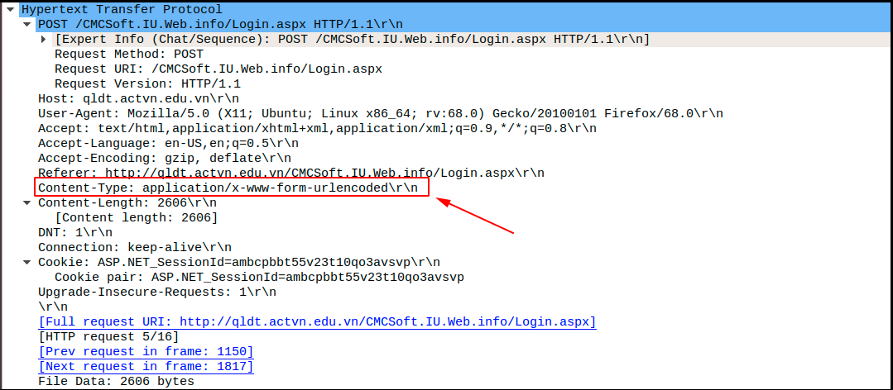
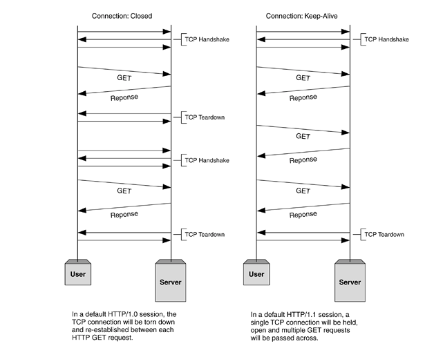

# Phân tích gói tin http

Sử dụng tcpdump để bắt gói tin và dùng wireshark để phân tích gói tin http

## Http request

*GET / HTTP/1.1\r\n* xác định method được sử dụng ở đây là `GET` và version của của http là 1.1

*Host: dantri.vn\r\n* Địa chỉ của web server

*User-Agent: Mozilla/5.0 (X11; Ubuntu; Linux x86_64; rv:68.0) Gecko/20100101 Firefox/68.0\r\n* Thông tin của client (OS là ubuntu và trình duyệt web là firefox) để dựa vào đó web server có thể format định dạng phù hợp.

*Accept: text/html,application/xhtml+xml,application/xml;q=0.9,*/*;q=0.8\r\n*  client nói với web server những định dạng mà nó accept.

*Accept-Language: en-US,en;q=0.5\r\n* Ngôn ngữ accept

*Accept-Encoding: gzip, deflate\r\n* kiểu encode được accept

*DNT: 1\r\n* Do Not Track không cho theo dõi người dùng

*Connection: keep-alive\r\n* Loại kết nối mong muốn (thường là keep-alive hoặc close)

*Upgrade-Insecure-Requests: 1\r\n*  cho phép tự động chuyển hướng từ http sang https

## Http response

*HTTP/1.1 302 Moved Temporarily\r\n* version http là 1.1, status_code 302: bạn đã được server điều hướng đến một URL mới

*Server: nginx\r\n* web server đang chạy là nginx

*Date: Wed, 28 Aug 2019 07:16:05 GMT\r\n* Thời gian trên server

*Content-Type: text/html\r\n* nội dung được biểu thị dưới dạng

*Content-Length: 154\r\n* Độ dài của nội dung(ở đây tính bằng bytes)

*Location: https://dantri.com.vn/\r\n* Địa chỉ của web server

## POST và GET

Thông thường GET được dùng để lấy thông tin về từ server còn POST được dùng để đẩy dữ liệu lên server. Nhưng ta cũng có thể sử dụng GET để đẩy dữ liệu và dùng POST để lấy dữ liệu.

Method GET

Method POST

Ta có thể thấy phần header của 2 method này có chút khác biệt. Đối với method POST có thêm trường `Content-Type` để encode dữ liệu cần truyền đi. Còn đối với method GET thì không có trường này.

MỘt số khác biệt khác

|   GET     |   POST    |
|--------------|--------------------|
|không có vấn đề khi load lại | Dữ liệu sẽ được gửi lại lần nữa |
| Có thể bookmark | Không thể bookmark |
| Có thể được lưu trong bộ nhớ cached | Không lưu trong cached |
| Bị hạn chế độ dài dữ liệu khi gửi | Không hạn chế |
| Dữ liệu có thể thấy trên URL | Không thấy trên URL |

## Các version của http

Cho đến nay đã có 4 version của http là HTTP/0.9, HTTP/1.0, HTTP/1.1 và HTTP/2.0. Các version 0.9 và 1.1 đã ít được sử dụng. HTTP/1.1 đang được sử dụng phổ biến còn HTTP/2.0 đang dần được áp dụng

**HTTP/0.9**

Đây là version sơ khai của HTTP. 
 * Request đơn giản chỉ là method + đường dẫn đến file request. 
 * Method support: GET
 * Response type: chỉ hypertext 
 * Kết nối được đóng ngay sau khi nhận được response
 * Không có HTTP headers, không có status_code,...

**HTTP/1.0**

Version 1.0 được phát triển thêm của version 0.9
 * Giao thức thân thiện với trình duyệt web
 * Đã có trường header cho cả request và response (HTTP version, status code, content type)
 * Response: Không còn chỉ là hypertext, nó cho phép gửi các dữ liệu khác không chỉ các file html mà còn có thể được như stylesheets, media
 * Method supported: GET, HEAD, POST
 * Kết nối được đóng khi nhận response

Như vậy 2 version đầu tiên thì đều cần phải thiết lập một kết nối mới cho mỗi request. Như vậy khá mất thời gian vì chúng sử dụng TCP để truyền nên để thiết lập được 1 kết nối nó phải trải qua quá trình bắt tay 3 bước. Hạn chế này đã được khắc phục ở các version sau.

**HTTP/1.1**

Đây là version đang được sử dụng phổ biến

 * Khắc phục nhược điểm của các version trước nên cải tiến được hiệu năng(giữ đường truyền cho nhiều request).
 * Support sử dụng cache
 * Method support: GET, HEAD, POST, PUT, DELETE, TRACE, OPTIONS
 * Kết nối keep-alive

**HTTP/2.0**

 * HTTP/2.0 sử dụng dữ liệu nhị phân thay vì dạng text như HTTP/1.1
 * Header của HTTP/2.0 được nén
 * HTTP/1.1 server sẽ response các requests theo thứ tự lần lượt nó nhận được còn với HTTP/2.0 thì bất đồng bộ
 * Sử dụng multiplex: Chỉ cần một kết nối client có thể tải toàn bộ dữ liệu cần thiết. HTTP/2.0 cho phép client và server chia nhỏ dữ liệu thành các frame độc lập với nhau. Chúng có thể được gửi và nhận song song, xen kẽ và sẽ được ghép lại thành một message hoàn chỉnh khi đến đích.
 * Cơ chế server push. Thông thường khi trình duyệt truy cập đến một trang web, server trả về HTML và trình duyệt phân tích HTML để tải tiếp và JS, CSS,.. nếu thấy cần thiết. Nhưng với server push server không cần chờ trình duyệt requests mà tự quyết định những gì quan trọng (thường dựa vào cache) và thực hiện push luôn cho trình duyệt. Như vậy sẽ tận dụng được cache ở phía client.