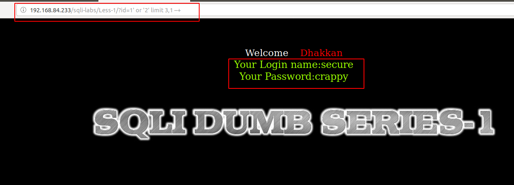

## Less-1

Ta thấy ở đây là error based


Yêu cầu truyền vào một ID


Đây là lỗi error based nên thử truyền vào các id khác nhau


Dự đoán câu query để hiển thị name và password là:

```
select name, password from table where id = $ID
```
Tiếp tục thử ta thấy đã xuất hiện lỗi


Dự đoán câu query lúc này sẽ là

```
select name, password from table where id = '$ID' limit 0,1
```

Tiếp tục thử tiếp


Ta thấy vẫn lỗi vì câu query lúc này nó đang thực thi là

```
select name, password from table where id = '1'' limit 0,1
```

Thử comment những gì phía sau `'1'` lại để câu truy vấn chỉ còn:

```
select name, password from table where id = '1'
```


Dựa vào đây ta có thể show toàn bộ user và password trong table đó bằng cách tăng dần số giá trị ở trong `limit`




