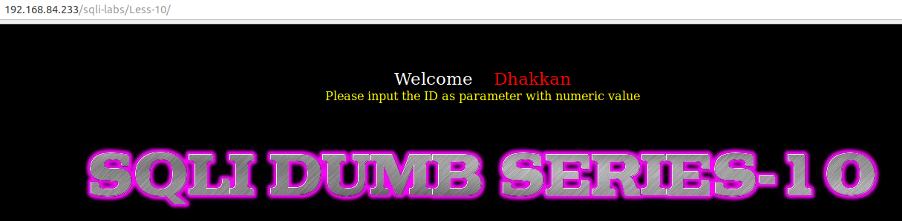
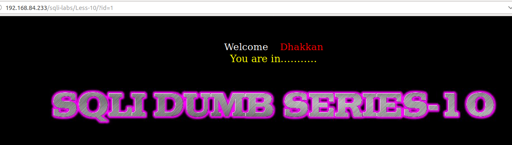
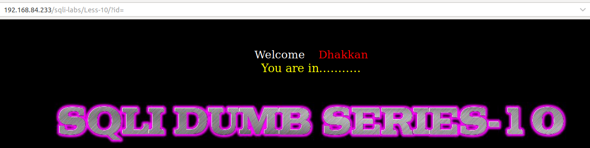
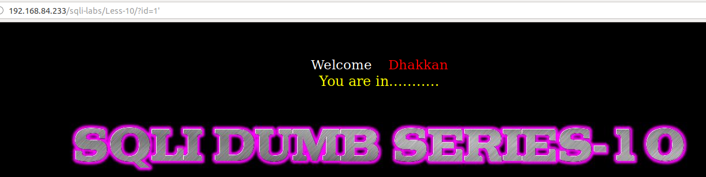
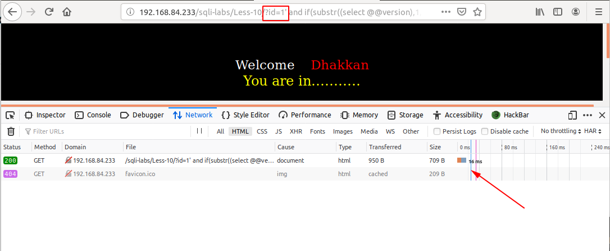
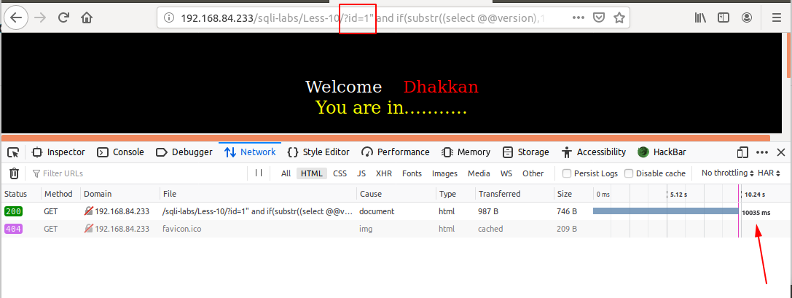

# Less 10

Đề bài yêu cầu nhập vào một giá trị

Nhập thử một vài giá trị

Ta có thể thấy ở đây dù nhập đúng hay sai thì cũng chỉ trả về một kết quả. Như vậy thì ta không thể error based hoặc boolean based để khai thác được gì từ DB. Nhưng ở đây ta có thể sử dụng time based để khai thác dữ liệu của DB giống như [Less-9](Less-9.md)

