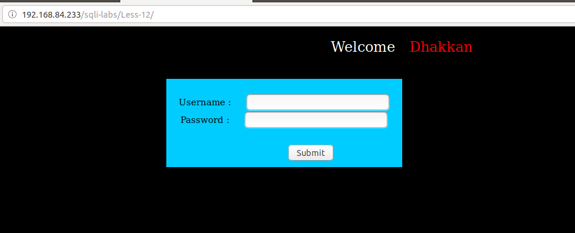
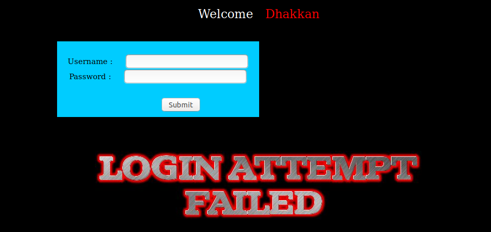
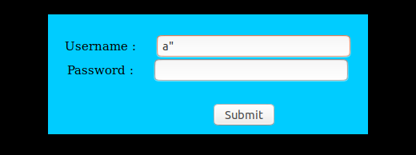
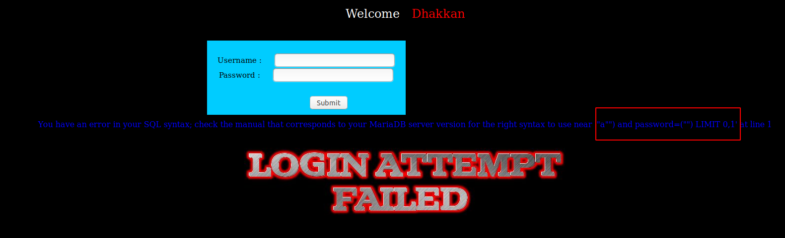
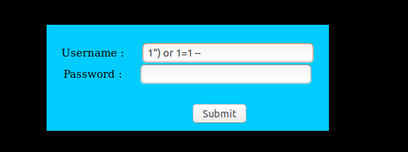
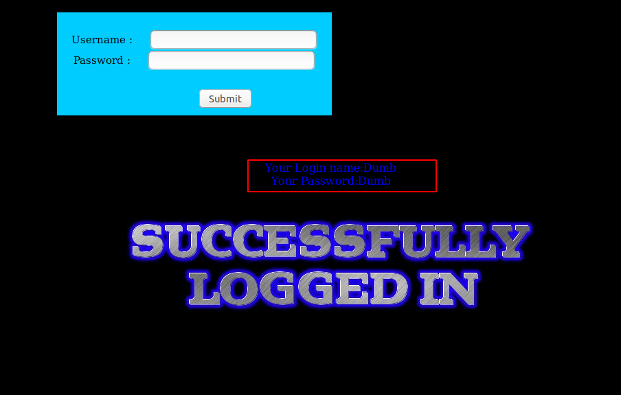

# Less 12

Ta thấy một khung đăng nhập



Thử đăng nhập



Sau nhiều lần thử tôi nhập vào



Thì lỗi hiển thị ra màn hình như sau:



Ta có thể nhận định câu query có thể là 

```
select * from table where user=("$user") and password=("$passwd") limit 0,1
```

Tôi có thể thử lại xem nhận định liệu có đúng



Kết quả tôi đã pass qua được màn đăng nhập



Như vậy có thể phần so sánh điều kiện của tôi có thể đúng. Dựa vào đây tôi có thể khai thác thông tin như [Less-11](Less-11.md)