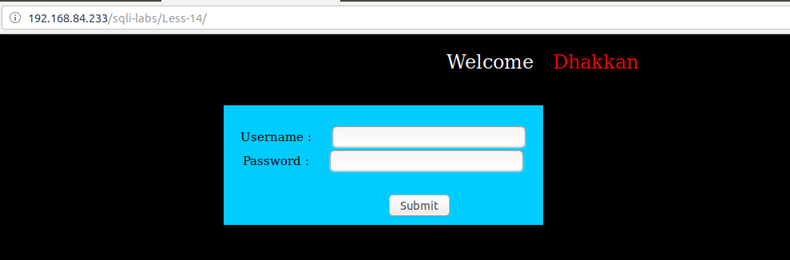
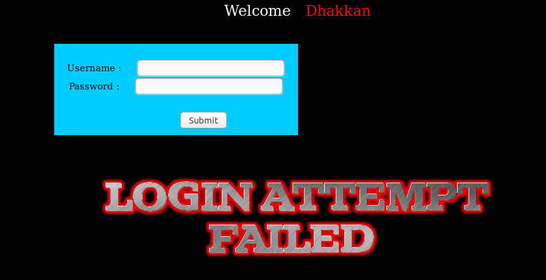
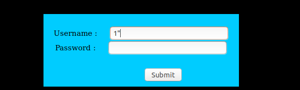
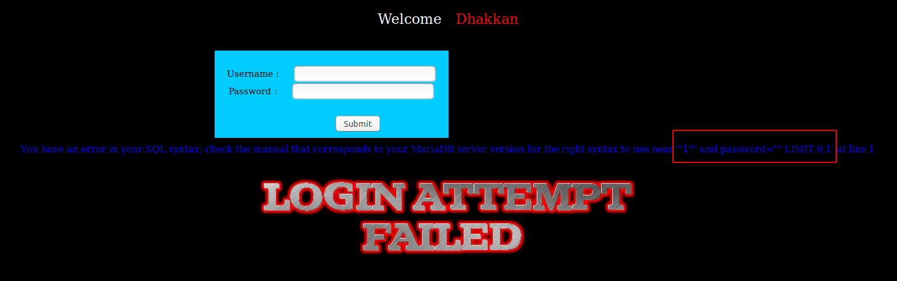
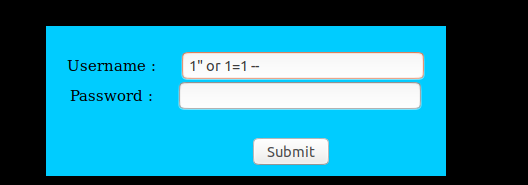
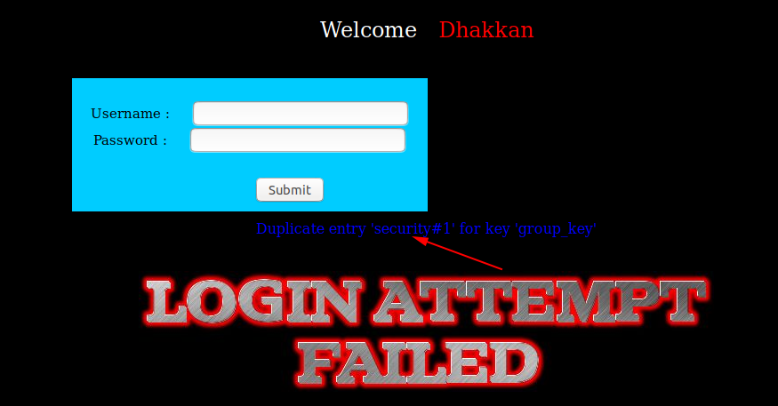

# Less 14

Đề bài vẫn cho khung đăng nhập



Đăng nhập thử



Sau nhiều lần thử khi tôi nhập vào như sau



Tôi thấy có lỗi hiển thị ra màn hình như sau



Dựa vào đây tôi có thể phán đoán câu query như sau

```
select * from table where user="$user" and password="$passwd" limit 0,1
```

Dựa vào đây tôi có thể thử login



Tôi đã login thành công mà không cần đến username và password


Dựa vào đây tôi cũng có thể show các thông tin trong database như những bài trước và thực hiện thêm đoạn code PHP vào server

