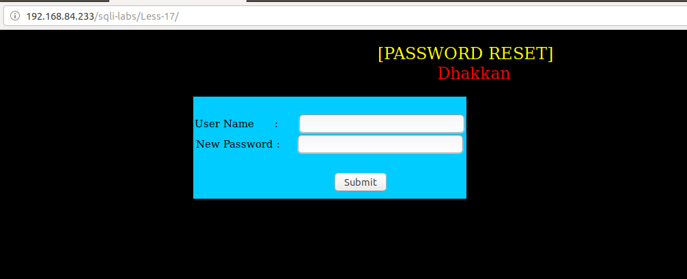
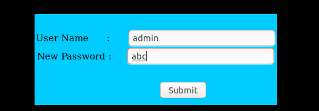
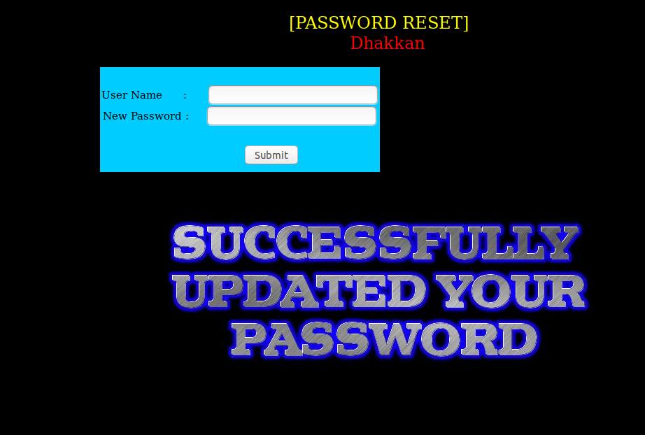
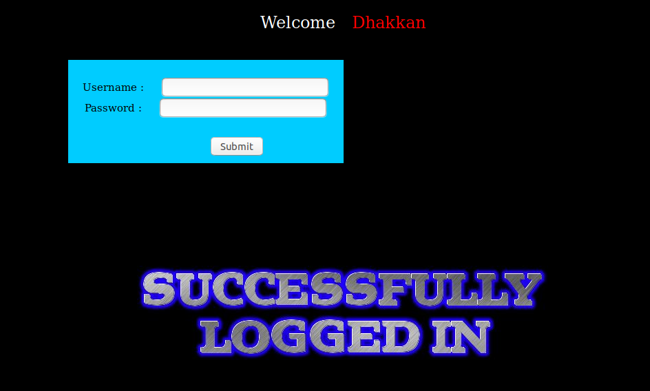
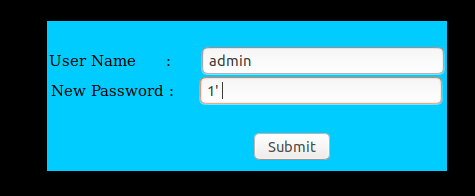
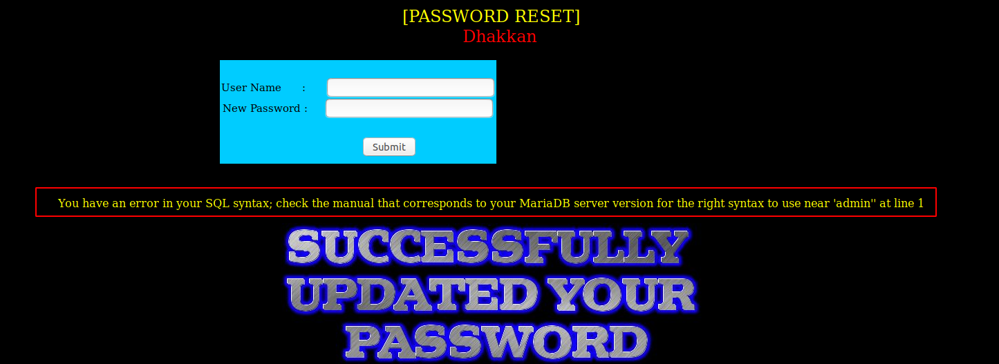
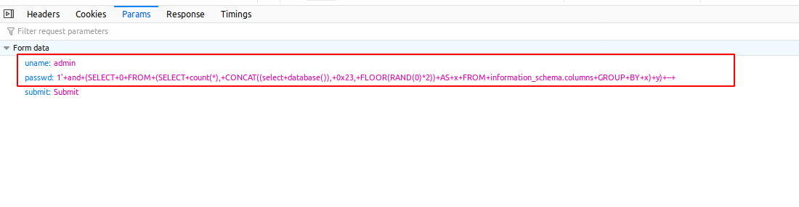
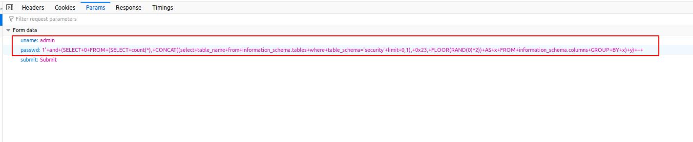
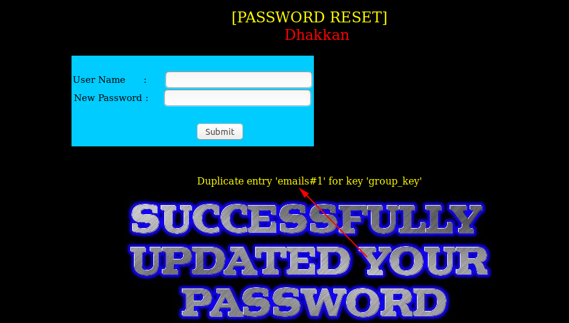

# Less 17

Ta thấy có một khung để reset mật khẩu

Tôi nhập linh tinh thử vào đây thì thấy 

Tiếp tục thử thì khi tôi nhập vào là

Thì thấy thông báo reset pass thành công

Tôi thử dùng username và password này để đăng nhập vào bài trước thì thấy đăng nhập thành công

Chứng tỏ rằng ở bài này sẽ thực hiện update lại password của user khi chúng ta chỉ cần chỉ ra tên của user và truyền vào cho nó một password mới.

Tôi tiếp tục thử xem có gì mới xuất hiện hay không. Ban đầu tôi nhập linh tinh vào khung username thì tôi không thấy nó xuất hiện gì. Nhưng khi tôi sử dụng một username đúng(user admin như tôi thử được ở bên trên) và sau đó tôi thử nhập linh tinh vào `New Password`. Sau nhiều lần đăng thử thì khi tôi đăng nhập vào như sau:

Thì tôi thấy có lỗi của SQL hiển thị ra màn hình

Như vậy ta có thể tận dụng vào đây để khai thác các thông tin trong DB

Show tên DB

Show bảng trong DB

Tương tự như vậy ta cũng có thể khai thác các thông tin khác giống như những bài trước.
