# Less 18

Ta thấy có khung đăng nhập

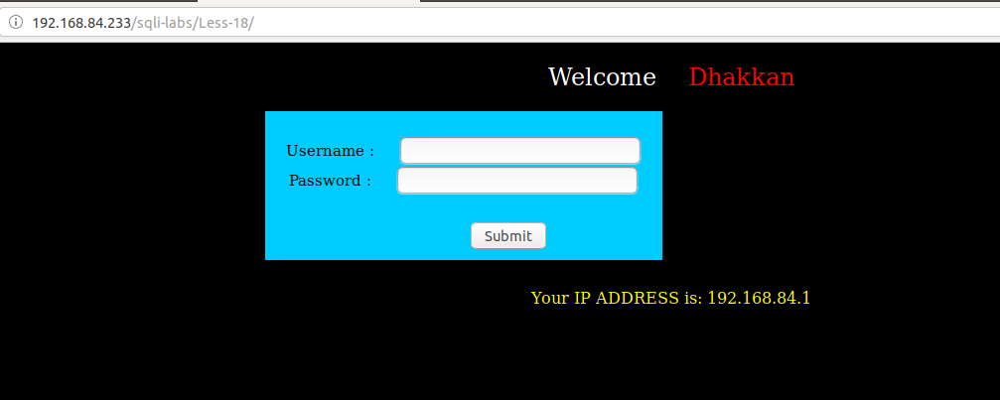

Tôi thử đăng nhập không đúng

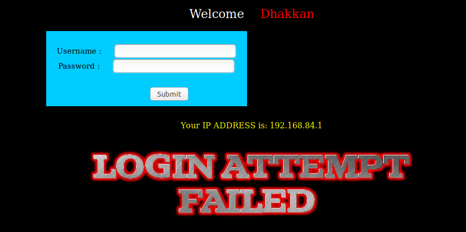

Tôi thử nhập linh tinh xem có thể pass qua được màn đăng nhập như những bài trước hay không. Tôi thử nhiều cách nhưng không thể pass qua được.

Tôi sử dụng một tài khoản để đăng nhập

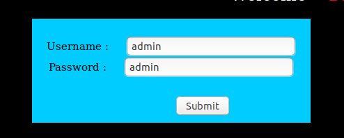

Khi đăng nhập thành công thì thấy in ra mà hình user agent của tôi

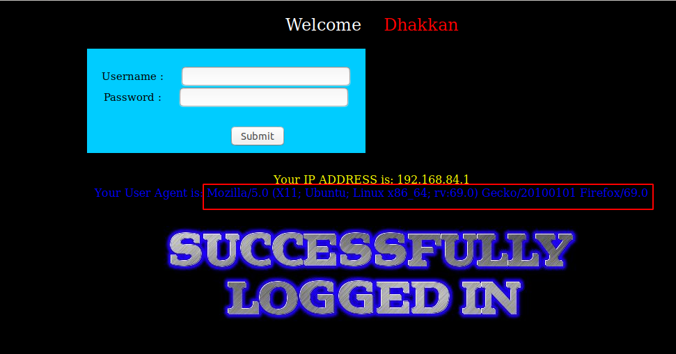

Tôi thấy trường này giống với trường `User-Agent` ở trong request header của 

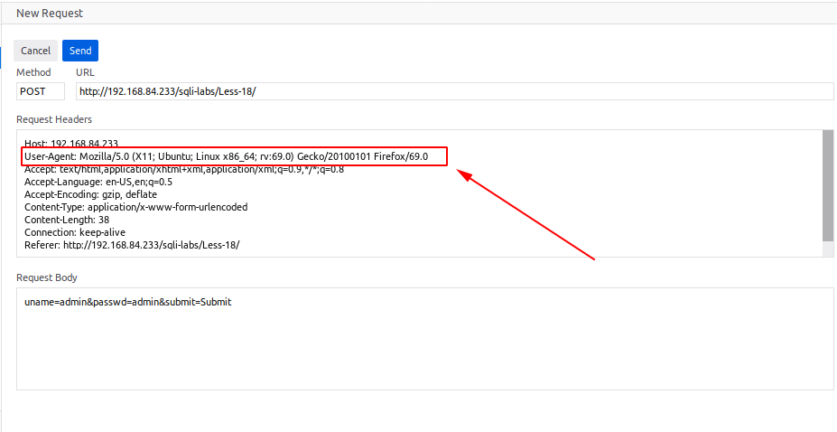

Tôi thử sửa cái trường này trong request header

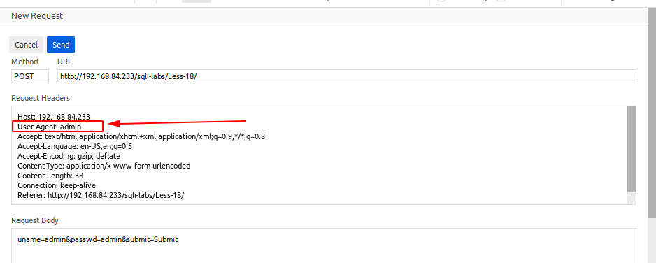

Thì tôi thấy đã hiển thị được nó lên màn hình

Tôi thử truyền vào một số giá trị đặc biệt ở đây

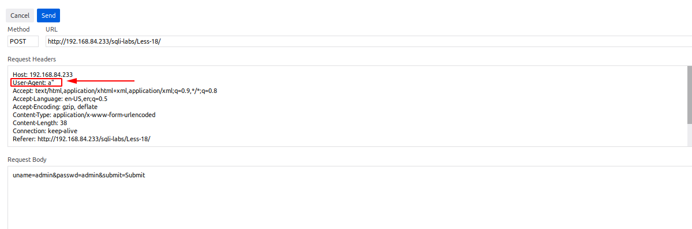

Vẫn thấy in kết quả 

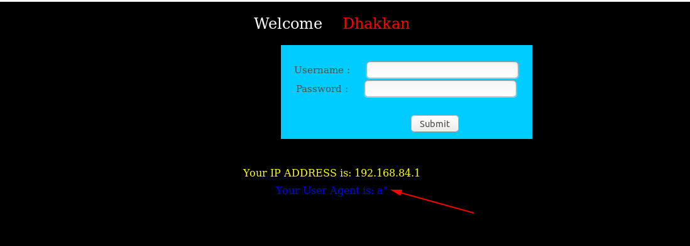

Tiếp tục thử. Đến khi tôi truyền vào 

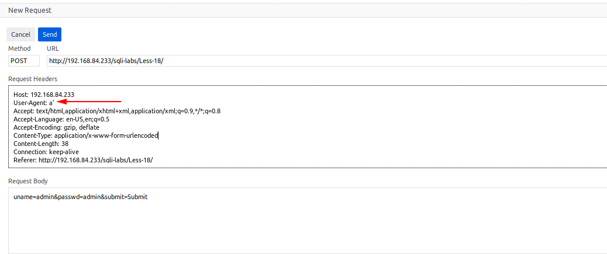

Thì tôi thấy

Tôi thấy ở đây có lỗi SQL hiển thị ra ngoài màn hình. Chứng tỏ rằng dữ liệu lấy ở `user-agent` được truyền vào một câu lệnh SQL. Câu lệnh ở đây có thể là câu lệnh `insert` hoặc `update` vì ta thấy sau giá trị của `user-agent` còn giá trị `IP` và `username`

Tận dụng đây ta có thể show các thông tin trong DB

Show tên DB

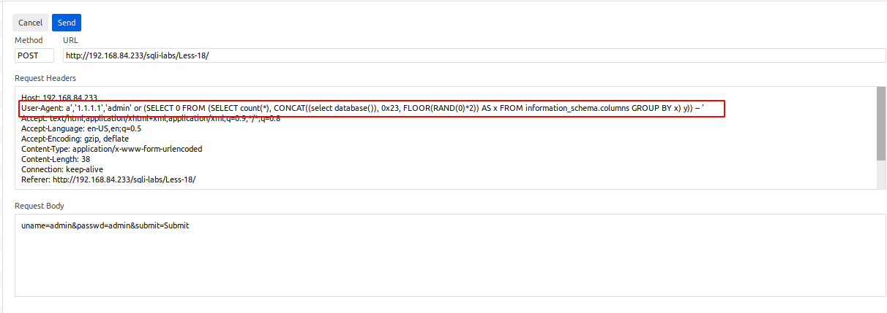

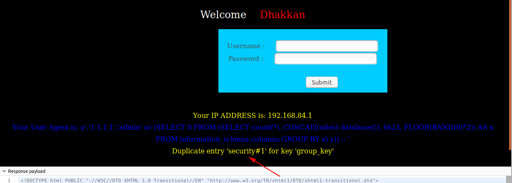

Show thông tin trong một bảng

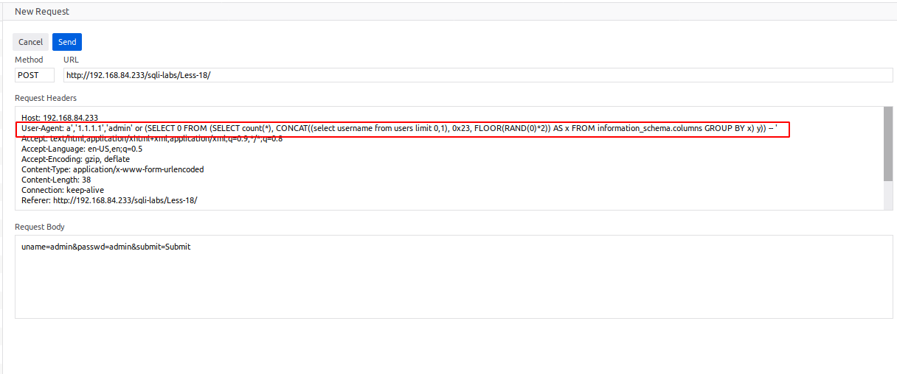

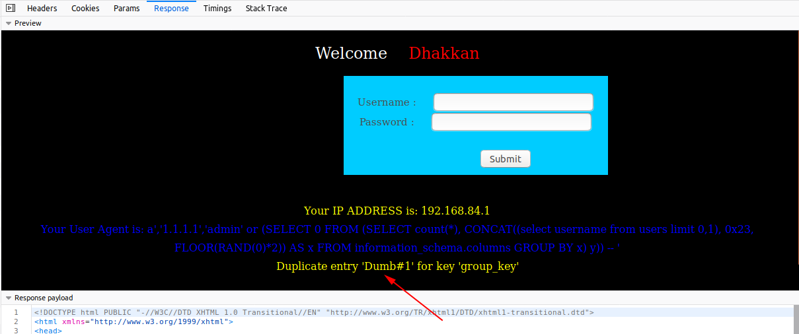